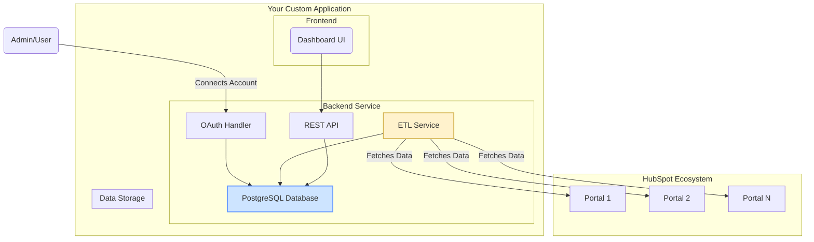
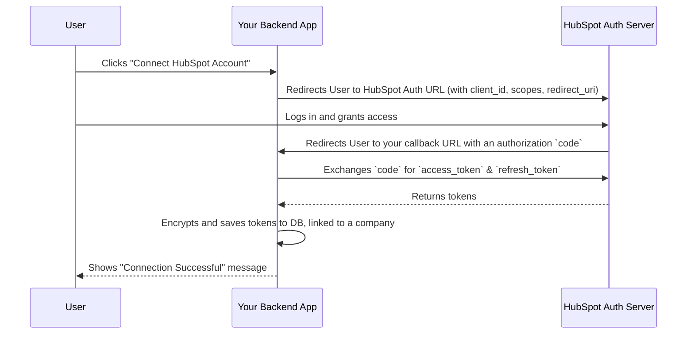

###### (Markdown document prompted by Lawrence Ham via Gemini-Pro)

---

## **Blueprint: Custom Multi-Account HubSpot Dashboard**

This document outlines the architecture and development steps for creating a custom application to aggregate and display data from multiple HubSpot portals.

*   **Backend Tech Stack:** Node.js, Fastify.js, TypeScript
*   **Database:** PostgreSQL
*   **ORM:** TypeORM (or Prisma)
*   **HubSpot Interaction:** `@hubspot/api-client` (Official HubSpot Node.js SDK) https://www.npmjs.com/package/@hubspot/api-client

### 🔑 **Understanding Authentication: OAuth 2.0 is Key**

The cornerstone of any multi-account application is a secure and scalable authentication method. For connecting to multiple HubSpot portals, OAuth 2.0 is the non-negotiable standard.

> #### 🤔 **Why not API Keys?**
> HubSpot's traditional API keys are being deprecated for many uses. More importantly, they are tied to a single portal and offer less granular control. They are not suitable for a secure, multi-tenant application where you need to manage access for different clients independently.

> #### ✨ **Why OAuth 2.0?**
> OAuth 2.0 is the modern, secure industry standard. It allows your central application to be granted access to **each HubSpot portal individually** by a user from that portal. Your application will then store a unique `access_token` and `refresh_token` for each connected company. This mechanism allows your app to pull data on their behalf *without* ever needing to store or handle their sensitive user passwords.

---

### 🎯 **Action: First Steps**

Before writing a single line of code or connecting any service, you must create a HubSpot Developer Account.

1.  Navigate to the [HubSpot Developer Portal](https://developers.hubspot.com/).
2.  Create a new **Private App**.
3.  From the app's "Auth" settings page, you will get your `Client ID` and `Client Secret`. These are the keys to initiating the OAuth 2.0 flow.

---


## Question(s) for JY: 

### Any specific KPIs to focus on? 

## 📊 **Identifying Key Performance Indicators (KPIs)**

A dashboard needs data! Before you build, you must define *what* you need to measure. This critical step determines which HubSpot API endpoints you will need to access.

#### **🚀 Common Marketing KPIs**

*   `👤` **New Contacts/Leads** (segmented by source)
*   `✅` **Marketing Qualified Leads (MQLs)**
*   `💰` **Customer Acquisition Cost (CAC)**
*   `🌐` **Website Sessions & Traffic Sources**
*   `📧` **Email Campaign Performance** (Open Rate, CTR)
*   `📋` **Form Submissions**

#### **📈 Common Sales KPIs**

*   `🆕` **New Deals Created** (by pipeline)
*   `⏳` **Deal Velocity** / Sales Cycle Length
*   `🏆` **Win Rate (%)**
*   `💲` **Total Pipeline Value**
*   `📞` **Sales Activities Logged** (Calls, Meetings)

#### **🛠️ Common Service KPIs**

*   `🎟️` **Tickets Created vs. Closed**
*   `⏱️` **Average Ticket Response Time**
*   `⭐` **Customer Satisfaction (CSAT) Scores**

---

### 🗃️ **Data Aggregation Strategy**

To compare performance across different companies, you must pull data from disparate sources (Portal A, Portal B, Portal C) into one unified location. This central repository is what enables true "apples-to-apples" comparison and reporting.

*   **Custom-Build Approach:** This central store would be a dedicated database that you control, such as **PostgreSQL**, or a cloud data warehouse like **Google BigQuery**.

*   **Low-Code/BI Tool Approach:** The Business Intelligence tool (like Databox, Looker Studio, etc.) handles the aggregation internally through a feature often called "data blending." You connect each portal as a separate data source, and the tool combines them for you in the visualization layer.

### **Phase 1: High-Level Architecture & Project Setup**

First, let's visualize the complete system architecture. Data flows from individual HubSpot portals, through our backend service, into a central database, and is finally served to a front-end for visualization.



#### **Steps:**

1.  **Initialize Project:**
    ```bash
    # Create project directory
    mkdir hubspot-dashboard-backend && cd hubspot-dashboard-backend

    # Initialize Node.js project and Git
    npm init -y
    git init

    # Install core dependencies
    npm install express dotenv @hubspot/api-client pg typeorm reflect-metadata
    
    # Install development dependencies
    npm install -D typescript @types/node @types/express ts-node-dev
    ```

2.  **Configure TypeScript:**
    *   Create a `tsconfig.json` file.
        ```bash
        npx tsc --init
        ```
    *   Modify your `tsconfig.json` to enable decorators for TypeORM and set output directories:
        ```json
        {
          "compilerOptions": {
            "target": "es6",
            "module": "commonjs",
            "outDir": "./dist",
            "rootDir": "./src",
            "strict": true,
            "esModuleInterop": true,
            "experimentalDecorators": true, // For TypeORM
            "emitDecoratorMetadata": true,  // For TypeORM
            "skipLibCheck": true,
            "forceConsistentCasingInFileNames": true
          }
        }
        ```

3.  **Project Structure:**
    ```
    /hubspot-dashboard-backend
    ├── src/
    │   ├── api/             // Express routes and controllers
    │   ├── services/        // Business logic (ETL, OAuth)
    │   ├── entities/        // TypeORM database entities
    │   ├── config/          // Database, environment config
    │   └── server.ts        // Express server entry point
    ├── .env                 // Environment variables
    ├── tsconfig.json
    └── package.json
    ```

---

### **Phase 2: The OAuth 2.0 Authentication Flow**

This is the most critical part for connecting multiple accounts securely. Your app will act as a central authenticator.

#### **OAuth Dance Visualization:**



#### **Steps:**

1.  **Create HubSpot Developer App:**
    *   Go to your [HubSpot Developer Account](https://developers.hubspot.com/apps).
    *   Create a new **private app**.
    *   Go to the "Auth" tab. Note down your **Client ID** and **Client Secret**.
    *   Set your **Redirect URL** to `http://localhost:3000/auth/hubspot/callback` (for local development).
    *   Define the **Scopes** you need (e.g., `crm.objects.contacts.read`, `crm.objects.deals.read`). Start with the minimum required scopes.

2.  **Create a Database Entity for Connections:**
    *   In `src/entities/PortalConnection.ts`:
    ```typescript
    import { Entity, PrimaryGeneratedColumn, Column, CreateDateColumn } from 'typeorm';

    @Entity('portal_connections')
    export class PortalConnection {
        @PrimaryGeneratedColumn()
        id: number;

        @Column({ unique: true })
        portalId: number; // HubSpot's Hub ID

        @Column()
        companyName: string;

        // IMPORTANT: These should be encrypted in a real app!
        @Column({ type: 'text' })
        accessToken: string;

        @Column({ type: 'text' })
        refreshToken: string;

        @Column()
        expiresAt: Date;

        @CreateDateColumn()
        createdAt: Date;
    }
    ```
    > **Security Note:** Never store tokens as plain text. Use Node's built-in `crypto` module to encrypt/decrypt them before saving to and after reading from the database.

3.  **Implement OAuth Express Routes:**
    *   In a new file, e.g., `src/api/authRoutes.ts`:
    ```typescript
    import { Router } from 'express';
    import { HubSpotClient } from '../services/hubspotClient'; // A service you'll create

    const router = Router();
    const REDIRECT_URI = 'http://localhost:3000/auth/hubspot/callback';

    // 1. Route to initiate the OAuth flow
    router.get('/hubspot', (req, res) => {
        const authUrl = HubSpotClient.getAuthorizationUrl(REDIRECT_URI);
        res.redirect(authUrl);
    });

    // 2. Callback route where HubSpot redirects the user
    router.get('/hubspot/callback', async (req, res) => {
        const code = req.query.code as string;
        if (!code) {
            return res.status(400).send('Missing authorization code.');
        }

        try {
            // 3. Exchange code for tokens
            const tokens = await HubSpotClient.exchangeCodeForTokens(code, REDIRECT_URI);
            
            // 4. Save tokens securely to your database
            await HubSpotClient.saveNewConnection(tokens);
            
            res.send('<h1>HubSpot Account Connected Successfully!</h1>');
        } catch (e) {
            console.error(e);
            res.status(500).send('Error connecting account.');
        }
    });

    export default router;
    ```

---

### **Phase 3: Data Extraction (ETL Service)**

This service will run on a schedule, fetch data from all connected portals, and standardize it for storage.

#### **Steps:**

1.  **Create a HubSpot API Client Service:**
    *   This service will manage token refreshing and API calls. In `src/services/hubspotClient.ts`:
    ```typescript
    // (Simplified Example)
    import { Client } from '@hubspot/api-client';
    import { PortalConnection } from '../entities/PortalConnection';
    
    // ... repository and encryption logic ...

    export async function getApiClientForPortal(connection: PortalConnection): Promise<Client> {
        let accessToken = decrypt(connection.accessToken);

        // Check if the token is expired
        if (new Date() >= connection.expiresAt) {
            console.log(`Token expired for portal ${connection.portalId}. Refreshing...`);
            const refreshedTokens = await hubspotSdkClient.oauth.tokensApi.createToken(
                'refresh_token',
                undefined,
                undefined,
                process.env.HUBSPOT_CLIENT_ID,
                process.env.HUBSPOT_CLIENT_SECRET,
                decrypt(connection.refreshToken)
            );
            // Update the connection in the DB with new tokens
            await updateConnectionTokens(connection.id, refreshedTokens);
            accessToken = refreshedTokens.accessToken;
        }
        
        return new Client({ accessToken });
    }
    ```

2.  **Develop the Main ETL Logic:**
    *   In `src/services/etlService.ts`:
    ```typescript
    import { getRepository } from 'typeorm';
    import { PortalConnection } from '../entities/PortalConnection';
    import { Deal } from '../entities/Deal'; // Another entity for your deals data
    import { getApiClientForPortal } from './hubspotClient';

    export async function runFullSync() {
        console.log('Starting full data sync...');
        const connectionRepo = getRepository(PortalConnection);
        const connections = await connectionRepo.find();

        for (const conn of connections) {
            console.log(`Syncing data for portal: ${conn.portalId}`);
            try {
                await syncDealsForPortal(conn);
                // await syncContactsForPortal(conn);
                // ... etc. for other objects
            } catch (e) {
                console.error(`Failed to sync portal ${conn.portalId}`, e);
            }
        }
        console.log('Full data sync complete.');
    }

    async function syncDealsForPortal(connection: PortalConnection) {
        const apiClient = await getApiClientForPortal(connection);
        const dealRepo = getRepository(Deal);

        const hubspotDeals = await apiClient.crm.deals.basicApi.getPage(
            100, undefined, ['dealname', 'amount', 'closedate', 'pipeline']
        );

        for (const hsDeal of hubspotDeals.results) {
            const standardizedDeal = new Deal();
            standardizedDeal.hubspotId = hsDeal.id;
            standardizedDeal.name = hsDeal.properties.dealname;
            standardizedDeal.amount = parseFloat(hsDeal.properties.amount);
            standardizedDeal.closeDate = new Date(hsDeal.properties.closedate);
            standardizedDeal.portal = connection; // Link back to the portal connection

            // Use 'save' to perform an "upsert" (insert or update)
            await dealRepo.save(standardizedDeal);
        }
    }
    ```

---

### **Phase 4: Scheduling & Execution**

To automate the ETL, you need a scheduler.

1.  **Simple (In-Process):** Use a library like `node-cron`.
    *   `npm install node-cron @types/node-cron`
    *   In your main `server.ts`:
        ```typescript
        import cron from 'node-cron';
        import { runFullSync } from './services/etlService';

        // Schedule to run at 2 AM every day
        cron.schedule('0 2 * * *', () => {
            console.log('Running scheduled ETL job...');
            runFullSync();
        }, {
            timezone: "America/New_York" // Set your timezone
        });
        ```

2.  **Robust (Production):** For production, it's better to use an external trigger to run your ETL script as a separate process.
    *   **Cloud Solution:** Use AWS Lambda + EventBridge Cron or Google Cloud Scheduler + Cloud Function. This is highly reliable and scalable.
    *   **Server Solution:** Use a system `cron` job that executes a Node.js script (`node dist/run-etl.js`).

---

### **Phase 5: Visualization API & Frontend**

Finally, create API endpoints for your dashboard to consume.

1.  **Create API Endpoints:**
    *   In `src/api/dashboardRoutes.ts`, create routes that query *your* aggregated database.
    ```typescript
    import { Router } from 'express';
    import { getRepository } from 'typeorm';
    import { Deal } from '../entities/Deal';

    const router = Router();

    // Example: Get total deal value per company
    router.get('/deals/value-by-company', async (req, res) => {
        const results = await getRepository(Deal)
            .createQueryBuilder('deal')
            .leftJoinAndSelect('deal.portal', 'portal')
            .select('portal.companyName', 'companyName')
            .addSelect('SUM(deal.amount)', 'totalValue')
            .groupBy('portal.companyName')
            .getRawMany(); // Use getRawMany for aggregated data

        res.json(results);
    });

    export default router;
    ```

2.  **Frontend Implementation:**
    *   **Hybrid Approach (Recommended):** Connect a BI tool like **Google Looker Studio**, **Tableau**, or **Power BI** directly to your **PostgreSQL** database. This is the fastest way to get powerful, interactive visualizations without building a UI from scratch.
    *   **Fully Custom Approach:** Use a frontend framework (React, Vue, Angular) and a charting library (Chart.js, D3.js) to call the API endpoints you just created and render the data. This offers maximum control but requires significant frontend development.
