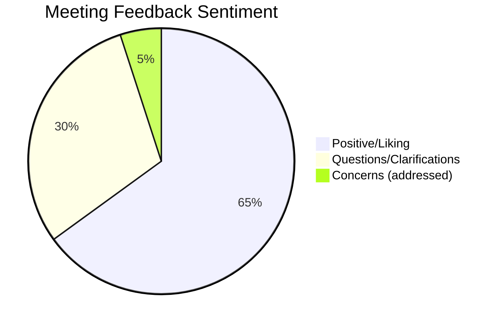

# 📅 Timecard Project Demo #2 Meeting Summary

## 🗓️ Meeting Details

*   **Date:** Unspecified (Implied Nov/Dec 2025, based on earlier context)
*   **Time:** Approx. 27 minutes (based on transcript length)
*   **Attendees:**
    *   🧑‍💻 **Lawrence Ham** - Presenter (Dev Lead/Engineer)
    *   🗣️ **Daniel Russell** - Facilitator / Product Vision
    *   👥 **Sandra Vargas** - Payroll/User Stakeholder
    *   👥 **Elizabeth Garcia** - Payroll/User Stakeholder
    *   👤 **Yvette Rodriguez** - Payroll/User Stakeholder (limited participation)
    *   👤 **David Bolde** - (Tech/API Info Provider)
*   **Purpose:** To demonstrate the AI-powered timesheet processing system and gather user feedback, especially regarding workflow and integration with Bullhorn/BTE. 🎯

---

## 📝 Key Topics & Discussion Flow

### 1. Introduction & Initial Demo Walkthrough 💡
*   **Lawrence** introduces the system as processing incoming timesheet PDFs/scans (11 pages demoed). 📄
*   **Core Process:** AI + OCR + SQL database matching for users found in timecards. ✨
*   The system processes page-by-page, sending off more to be processed as each is completed. 🔄
*   **Data Extraction Demonstrated:** Pulling client names (e.g., "warehousing"), matching to Bullhorn placements via SQL, including placement IDs, start/end dates. 📋
*   **AI Reconciliation:** AI attempts to correct discrepancies (e.g., `lunchOut` after `timeOut`) without altering original extracted numbers. The focus is purely on extraction and internal reconciliation. 🧐
*   **Pay Code Logic:** The system correctly identified "REG" for all entries under 40 hours.

### 2. Current Manual Payroll Process & Visualization Gap 🧑‍💼
*   **Lawrence** expresses difficulty visualizing the current manual process for breaking down timesheets into Bullhorn, particularly due to a lack of Bullhorn front-end access. 🚧
*   Sandra and Yvette explain the current process:
    *   Manual calculations or using a timesheet calculator. 🧮
    *   For California clients, manual entry of punches into the VMS system (like HD Supply) or BTE.
    *   These systems *should* calculate hours, but manual sheets still require manual calculation on their end. 🖐️

### 3. Workflow & Queue Management Discussion 📈
*   Daniel probes for desired workflow:
    *   Is it helpful to deal with timesheets as they come in, or grouped by customer? (Folders exist by client). 📁
    *   Most hours are submitted in bulk by clients, but exceptions occur.
    *   **Proposed Workflow:** Automation brings PDFs from email inbox into the system. Users (Sandra, Elizabeth) would see a **work queue** of outstanding timecards. ✅
*   **Queue Functionality:**
    *   Most recent on top.
    *   Ability to select, review, apply rules/adjustments.
    *   A "finalize" or "approve" button. 👍
*   **Multi-user / Audit Log:**
    *   Users need to see what others are doing (a shared queue). 👀
    *   An audit log showing who validated/uploaded, etc. 📝
    *   User-based views/filtering (e.g., "Show me what Sandra has approved").

### 4. Integration with Bullhorn/BTE API 🔗
*   **Post-Approval Flow:** Sandra asks what happens after approval – should it flow into BTE, and then Bullhorn?
*   **Clarification of "BTE":** It's a section within Bullhorn where manual entries are made, and it has an API. 🖥️
*   **Decision:** The approved/finalized time should be pushed into BTE via its API, not directly into Bullhorn's time card creation API (which bypasses BTE). This avoids manual entry into BTE. 🎉
*   **Documentation Requirement:** The system should also push the approved PDF into client folders for reference/review. 📂

### 5. AI's Role in Generating Overtime Entries (Critical Discussion Point) 🤖
*   **Lawrence** introduces a new capability: the software **generates OT entries** for employees exceeding 40 hours, even if not explicitly on the timesheet. 🆕
    *   *Example:* 50 hours worked -> software generates a 5-hour OT entry.
*   **Key Question:** **Lawrence** asks, "Do we want the software generating extra entries here for the pay codes that don't exist on the time sheet, but do exist in the hours?" 🤔
*   **Lawrence** confirms he can pull payroll rules from Bullhorn but wants payroll input to double-check.

### 6. Final Feedback & Next Steps 🚀
*   **Sandra's Initial Feedback:** 👍
    *   Page navigation needs to display client name, employee name, file name.
    *   Crucially, need to search/filter by **Client ID or Client Name** because responsibilities are client-list based. (e.g., "I only want to see *my* APL timesheets").
    *   Reiterates the need for data to flow into BTE after approval.
*   **Action Items:**
    *   Daniel to wrap meeting into notes. 📝
    *   **Lawrence** to get BTE API documentation. 📖
    *   Schedule another call to continue discussions. 📞
    *   **Lawrence** confirms the system will be user-based.

---

## 🚀 Workflow & Integration Vision

```mermaid
graph TD
    A[Incoming Timesheet PDF Scan] --> B{AI + OCR + SQL Matching};
    B --> Z[System UI Work Queue (User A and User B...) 👀];
    Z --> C[Route to user based on client addressing Sandras concerns]
    C --> D{User Review and Validation};
    D -- "User Clicks Approve ✅" --> E[Push Data to BTE API];
    E --> F[Push PDF to Client Folder for Archive 📂];
    E --> G[BTE Processes Payroll];
    F --> H[System UI Completed Queue (Audit Log) 📜];
    G --> I[Bullhorn Records Approved Hours];
```

## 📊 Meeting Feedback Sentiment



The overall sentiment from the users (Sandra, Elizabeth) was positive, expressing enthusiasm for the direction the project is taking. Key questions revolved around workflow integration (queue management, BTE API) and how the AI handles the generation of new pay code entries, which are critical for payroll accuracy.

---

## ✅ Action Items & Open Questions

### Action Items:
*   **Lawrence (Self):**
    *   Obtain BTE API documentation from David Bolde or someone on the call. 📖
    *   Connect with someone in payroll to review and confirm specific payroll rules for OT/DT generation. 💬
    *   Implement user-based queues/views with client/employee/filename display and search functionality (Client ID, Client Name). 🧑‍💻
*   **Daniel Russell:**
    *   Schedule a follow-up meeting with the team. 📅
*   **All:**
    *   Further define the specific business rules for Overtime (OT) and Doubletime (DT) generation by the AI.

### Open Questions:
*   What are the exact rules for Doubletime (DT) calculation and generation? (Preamble mentions DT, but Step 10 only covers OT). 🤔
*   How should generated OT/DT entries handle time punch fields (e.g., `timeIn`, `timeOut`) in the JSON output? (Should they be `null` or copy the base entry's punches?)
*   What is the precise allocation strategy for generated OT/DT hours across multiple days if not specified by the document? (e.g., "latest day with hours").
