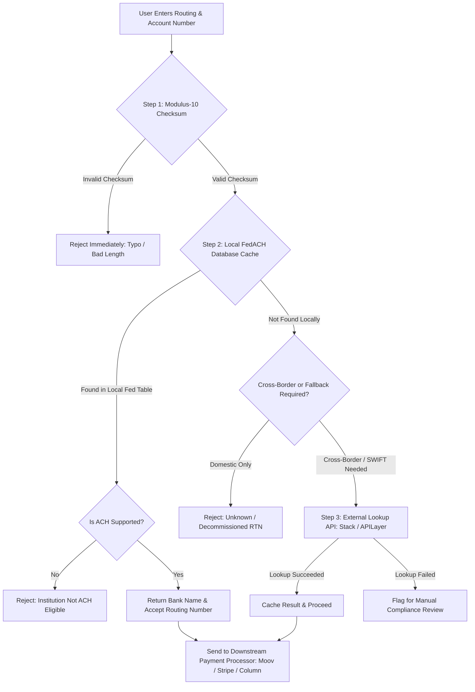
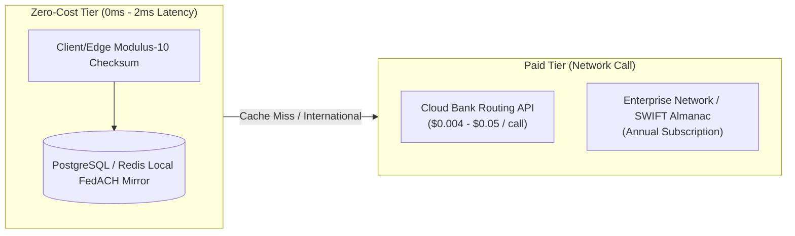

# Bank Routing Number & Directory Validation: Complete Cost & Architecture Guide

This guide breaks down cost models, API vendors, self-hosted alternatives, and implementation patterns for validating US ABA Routing Transit Numbers (RTNs) and financial directory lookups.

---

## 1. Cost Comparison Matrix by Approach

| Solution Type | Provider / Strategy | Monthly / Base Cost | Per-Lookup Cost | Key Capabilities & Trade-offs |
| :--- | :--- | :--- | :--- | :--- |
| **Client-Side Validation** | **Modulus-10 Checksum** | **$0** | **$0** | Rejects typos instantly in browser/backend. Format-only; cannot verify if the bank is active. |
| **Self-Hosted Authoritative** | **Federal Reserve E-Payments Flat Files** | **$0** | **$0** | Official FedACH/Fedwire database. High throughput, zero marginal cost; requires maintenance script. |
| **Dedicated Routing API** | **Stack Financial** | **$99 / month** | Flat rate (included) | Fast REST lookups for legal bank name, ACH eligibility, and office status. |
| **Dedicated Routing API** | **Zyla Labs Routing API** | **$49.99 – $199.99 / mo** | ~$0.004 – $0.013 / call | Tiered tiers (5k to 50k calls). Returns institution name, address, office code, Fedwire flag. |
| **Multi-Rail Bank Data API** | **APILayer Bank Data** | **$0 (100 calls)**<br>**$39.99 / mo (2.5k)**<br>**$139.99 / mo (25k)** | Tiered overages | Converts US ABA numbers to SWIFT/BIC and handles international IBAN/Sort Code validation. |
| **Enterprise Financial Data** | **Accuity / LexisNexis (Bankers Almanac)** | **$3,500 – $10,000+ / yr** | Custom contract | Comprehensive international directory: branch routing, settlement correspondent banks, sanctions/PEP. |
| **Global Settlement** | **SwiftRef (SWIFT)** | **€2,000 – €8,000+ / yr** | Enterprise tier | Direct BIC/IBAN directory for cross-border wire routing and enterprise multi-currency clearing. |

---

## 2. Monthly Spend by Request Volume

Depending on validation volume, hosting an internal copy of the Federal Reserve directory delivers near-zero operating costs compared to API pay-per-call tiers:

| Monthly Lookups | Modulus-10 + FedACH (Self-Hosted) | Dedicated API (Zyla / Stack) | Enterprise Directory (Accuity) |
| :--- | :--- | :--- | :--- |
| **1,000 / mo** | **$0** runtime API fees | **$49.99 / mo** (~$0.050 / call) | ~$300 – $800 / mo |
| **15,000 / mo** | **$0** runtime API fees | **$99.99 / mo** (~$0.007 / call) | ~$300 – $800 / mo |
| **50,000 / mo** | **$0** runtime API fees | **$199.99 / mo** (~$0.004 / call) | ~$300 – $800 / mo |
| **200,000+ / mo** | **$0** runtime API fees | **$499.99+ / mo** (custom) | Custom Enterprise contract |

---

## 3. High-Efficiency Multi-Tier Validation Pipeline

To eliminate unnecessary vendor API expenses and third-party network latency, route incoming account and routing details through a tiered validation flow:



---

## 4. Architectural Cost-Optimization Strategy



1. **Step 1: Client-Side Modulus-10**  
   Trap 95% of user entry errors (extra digits, transposed numbers) directly in the browser or mobile application using the standard ABA weighting formula:
   $$\big(3(d_1 + d_4 + d_7) + 7(d_2 + d_5 + d_8) + 1(d_3 + d_6 + d_9)\big) \pmod{10} = 0$$

2. **Step 2: Local Federal Reserve Replica**  
   Download the official FedACH Directory file directly from FRBservices.org. Load the data into a local PostgreSQL, Redis, or SQLite table. This provides instantaneous, zero-cost bank verification (`bank_name`, `state`, `ach_status`).

3. **Step 3: On-Demand Fallback for International Lookups**  
   Use metered APIs like APILayer or Stack Financial only for operations the Federal Reserve directory does not cover (e.g., resolving BIC/SWIFT identifiers or validating non-US wire structures).

---

## 5. Technical Implementation Details

### A. ABA Modulus-10 Checksum (TypeScript)

```typescript
export function isValidRoutingNumber(rtn: string): boolean {
  // Must be 9 numeric digits
  if (!/^\d{9}$/.test(rtn)) {
    return false;
  }

  const d = rtn.split('').map(Number);

  // ABA Modulus-10 weighting: 3, 7, 1
  const checksum =
    3 * (d[0] + d[3] + d[6]) +
    7 * (d[1] + d[4] + d[7]) +
    1 * (d[2] + d[5] + d[8]);

  return checksum % 10 === 0;
}
```

### B. Federal Reserve Local Database Schema (PostgreSQL)

```sql
CREATE TABLE fedach_directory (
    routing_number CHAR(9) PRIMARY KEY,
    office_code CHAR(1) NOT NULL,            -- 'O' for Main Office, 'B' for Branch
    servicing_frb_number CHAR(9) NOT NULL,
    record_type_code CHAR(1) NOT NULL,
    change_date VARCHAR(6),
    new_routing_number CHAR(9),
    customer_name VARCHAR(36) NOT NULL,
    address VARCHAR(36) NOT NULL,
    city VARCHAR(20) NOT NULL,
    state_code CHAR(2) NOT NULL,
    zip_code VARCHAR(5) NOT NULL,
    zip_extension VARCHAR(4),
    telephone_area_code CHAR(3),
    telephone_prefix CHAR(3),
    telephone_suffix CHAR(4),
    institution_status_code CHAR(1) NOT NULL, -- '1' for Receives Gov/Commercial ACH
    data_view_code CHAR(1) NOT NULL,
    updated_at TIMESTAMP WITH TIME ZONE DEFAULT CURRENT_TIMESTAMP
);

CREATE INDEX idx_fedach_routing ON fedach_directory(routing_number);
```

---

## 6. Decision Matrix

* **Choose Modulus-10 + FedACH Directory** if:
  * You operate primarily in the US on ACH or Fedwire.
  * You want zero ongoing API expenses and sub-millisecond validation response times.
* **Choose Dedicated APIs (Stack, Zyla, APILayer)** if:
  * You do not want to manage periodic database file syncing.
  * You require unified endpoints for US routing numbers, European IBANs, and international SWIFT codes.
* **Choose Enterprise Directories (Accuity / Bankers Almanac)** if:
  * You require sanctioned routing checks, multi-currency correspondent banking routes, or institutional compliance audit trails.
