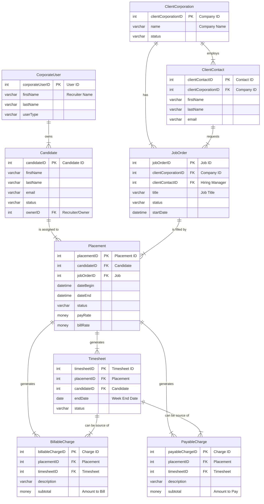

# 📂 Bullhorn Database Schema Visualization

*prompted and edited by Lawrence Ham*

This document provides a high-level overview and visualization of the main database tables based on the provided schema. The goal is to illustrate the core relationships that govern the staffing, placement, and billing processes.

Given the extensive number of tables, this analysis focuses on the central workflow: from the `Client` and `Candidate` to the `JobOrder`, through the `Placement`, and finally to financial transactions like `Timesheet` and `BillableCharge`/`PayableCharge`.

## 📊 Core Entity Relationship Diagram (ERD)

This diagram illustrates how the main tables are interconnected. The `Placement` table acts as the central hub, linking almost every key part of the workflow.

### Understanding the Relationships

*   A **`ClientCorporation`** (the client company) can have multiple **`JobOrder`** records.
*   A **`Candidate`** is the person being placed.
*   The **`Placement`** table is the most critical. It is the "join" that officially connects a `Candidate` to a `JobOrder`, creating an assignment.
*   Each `Placement` can generate multiple **`Timesheet`** records over its duration.
*   Financial transactions, such as **`BillableCharge`** (what the client owes) and **`PayableCharge`** (what the candidate is owed), are directly tied to a `Placement` and can also originate from a `Timesheet`.
*   A **`CorporateUser`** (a recruiter or salesperson) typically "owns" the `Candidate` record.

---

## 📋 Detailed Table Breakdowns

Here is a closer look at the key columns for each of the main tables.

> **Legend:**
> *   🔑 **PK** - Primary Key
> *   🔗 **FK** - Foreign Key

### 🏢 ClientCorporation
Stores information about a client company.

| Key | Column Name | Data Type | Description |
| :---: | :--- | :--- | :--- |
| 🔑 | `clientCorporationID` | `int` | The unique identifier for the company. |
| | `name` | `nvarchar(100)` | The legal name of the company. |
| | `status` | `nvarchar(30)` | The current status (e.g., 'Active', 'Prospect'). |
| | `branchID` | `int` | The internal branch associated with this client. |

### 👤 ClientContact
Stores information about an individual contact person at a ClientCorporation.

| Key | Column Name | Data Type | Description |
| :---: | :--- | :--- | :--- |
| 🔑 | `clientContactID` | `int` | The unique identifier for the contact. |
| 🔗 | `clientCorporationID` | `int` | **Links to `ClientCorporation.clientCorporationID`**. |
| | `firstName` | `nvarchar(50)` | The contact's first name. |
| | `lastName` | `nvarchar(50)` | The contact's last name. |
| | `email` | `nvarchar(100)` | The contact's email address. |
| 🔗 | `ownerID` | `int` | **Links to `CorporateUser.corporateUserID`**. |

### 👨‍💼 Candidate
Represents an individual job seeker or contractor in the system.

| Key | Column Name | Data Type | Description |
| :---: | :--- | :--- | :--- |
| 🔑 | `candidateID` | `int` | The unique identifier for the candidate. |
| | `firstName` | `nvarchar(50)` | The candidate's first name. |
| | `lastName` | `nvarchar(50)` | The candidate's last name. |
| | `email` | `nvarchar(100)` | The candidate's primary email. |
| | `status` | `nvarchar(100)` | Current status (e.g., 'New Lead', 'Placed'). |
| 🔗 | `ownerID` | `int` | **Links to `CorporateUser.corporateUserID`** (the recruiter). |

### 📄 JobOrder
Represents a specific job opening at a client company.

| Key | Column Name | Data Type | Description |
| :---: | :--- | :--- | :--- |
| 🔑 | `jobOrderID` | `int` | The unique identifier for the job. |
| 🔗 | `clientCorporationID` | `int` | **Links to `ClientCorporation.clientCorporationID`**. |
| 🔗 | `clientContactID` | `int` | **Links to `ClientContact.clientContactID`** (hiring manager). |
| | `title` | `nvarchar(100)` | The title of the job (e.g., 'Software Engineer'). |
| | `status` | `nvarchar(200)` | The status of the job (e.g., 'Open', 'Filled'). |
| | `startDate` | `datetime2` | The expected start date for the position. |

### 📌 Placement (The Core Hub)
This is the central table that connects a candidate to a job, creating a billable and payable assignment.

| Key | Column Name | Data Type | Description |
| :---: | :--- | :--- | :--- |
| 🔑 | `placementID` | `int` | The unique identifier for this specific assignment. |
| 🔗 | `candidateID` | `int` | **Links to `Candidate.candidateID`**. |
| 🔗 | `jobOrderID` | `int` | **Links to `JobOrder.jobOrderID`**. |
| | `dateBegin` | `datetime2` | The start date of the placement. |
| | `dateEnd` | `datetime2` | The end date of the placement. |
| | `status` | `nvarchar(30)` | Status of the assignment (e.g., 'Approved', 'Terminated'). |
| | `payRate` | `money` | The rate at which the candidate is paid. |
| | `billRate` | `money` | The rate at which the client is billed. |

### ⏰ Timesheet
A container for time entries for a specific candidate and placement, usually for a single week.

| Key | Column Name | Data Type | Description |
| :---: | :--- | :--- | :--- |
| 🔑 | `timesheetID` | `int` | The unique identifier for the timesheet header. |
| 🔗 | `placementID` | `int` | **Links to `Placement.placementID`**. |
| 🔗 | `candidateID` | `int` | **Links to `Candidate.candidateID`**. |
| | `endDate` | `date` | The week-ending date for this timesheet. |
| | `status` | `nvarchar(MAX)`| Approval status (e.g., 'New', 'Submitted', 'Approved'). |

### 💵 BillableCharge / PayableCharge
These tables track financial transactions that are not standard hourly work, such as expenses, bonuses, or other adjustments.

| Key | Column Name | Data Type | Description |
| :---: | :--- | :--- | :--- |
| 🔑 | `billableChargeID` | `int` | Unique ID for the billable transaction. |
| 🔑 | `payableChargeID` | `int` | Unique ID for the payable transaction. |
| 🔗 | `placementID` | `int` | **Links to `Placement.placementID`**. |
| 🔗 | `timesheetID` | `int` | (Optional) **Links to `Timesheet.timesheetID`** if from a timesheet. |
| | `description` | `nvarchar(MAX)` | A description of the charge (e.g., 'Travel Expense'). |
| | `subtotal` | `money` | The total amount of the charge. |
