# 🚀 Cloud Marketplace Strategy: Payroll Suite Deployment

This document outlines the roadmap for packaging and selling your payroll software suite as a **Single-Tenant Server Image** via major cloud marketplaces (AWS, Azure, GCP).

---

## 🏗️ High-Level Architecture
Instead of building a complex multi-tenant SaaS, you are distributing a **Pre-Configured Server Image**. This allows customers to own their data while you provide the "brain."

```mermaid
graph TD
    subgraph "Cloud Marketplace AWS Azure"
        A[Customer Clicks Deploy] --> B[Your Server Image / AMI]
        B --> C[Isolated Customer Instance]
    end

    subgraph "Customer Local Office"
        C -- Secure Polling --> D[Local Print Agent]
        D --> E[🖨️ Physical Check Printer]
    end

    subgraph "Developer Side"
        F[Your Build Pipeline] -- Updates --> B
        G[License Server] -- Validation --> C
    end
```

---

## 🚦 Viability Assessment

| Platform | Market Fit | Hacker Friendliness | Target Audience |
| :--- | :---: | :---: | :--- |
| **AWS Marketplace** | ⭐⭐⭐⭐⭐ | 🛠️🛠️🛠️🛠️🛠️ | Developers & Tech-Forward SMBs |
| **Azure Marketplace** | ⭐⭐⭐⭐ | 🛠️🛠️ | Enterprise Finance & HR Depts |
| **Google Cloud (GCP)**| ⭐⭐ | 🛠️🛠️🛠️ | Tech Startups |

---

## 🛠️ The "Hacker-to-Vendor" Roadmap

### 1. Image Hardening 🔒
*   **Zero-Knowledge:** Ensure no hardcoded credentials or your personal SSH keys exist in the image.
*   **Auto-Update:** Script a "phone home" mechanism to pull the latest tax tables/W2 schemas.
*   **Security Scanning:** Pass the marketplace's automated CVE (Common Vulnerabilities and Exposures) scans.

### 2. Printing Strategy (The "VPN" Bridge) 🖨️
Since cloud servers can't "see" local USB/Network printers:
1.  **Server:** Your software generates a secure PDF/Print Job and stores it in an encrypted queue.
2.  **VPN:** The server tries to contact the networked printer.
3.  **Device:** physical printer receives hand-off

### 3. Monetization Models 💸

*   **Hourly/Monthly:** A flat fee added to their cloud bill (e.g., +$0.20/hr).
*   **BYOL (Bring Your Own License):** Customer downloads the server for free but must buy a license key from your website to unlock "Print" and "W2" functions.
*   **Metered:** Integration with Marketplace APIs to charge **per W2 generated** or **per check printed**.

---

## ⚖️ Risks & Mitigations

| Risk | Description | Mitigation |
| :--- | :--- | :--- |
| **Tax Compliance** ⚖️ | IRS changes W2 formats or tax brackets. | Implement a mandatory "Tax Table Update" module. |
| **Liability** 🛡️ | Software bug leads to payroll errors. | Strict EULA: "User must verify all output before filing." |
| **Data Privacy** 🔑 | Handling PII (Social Security Numbers). | Single-tenant model means *they* own the DB, not you. |

---

## 🏁 Next Steps for the Programmer

1.  **Containerize:** Move the suite into **Docker** to ensure environment parity.
2.  **Automate:** Use **Packer** (by HashiCorp) to build machine images (AMIs) automatically.
3.  **Test:** Deploy your own image on a fresh, unrelated cloud account. If it requires you to SSH in to fix something, it’s not ready for the marketplace yet.
4.  **Register:** Apply for the **AWS Marketplace Seller** program (requires a US Tax ID/Business entity).

---
> **💡 Pro-Tip:** Focus on **AWS** first. Their "AMI" (Amazon Machine Image) ecosystem is the most mature and has the most documentation for independent developers.
