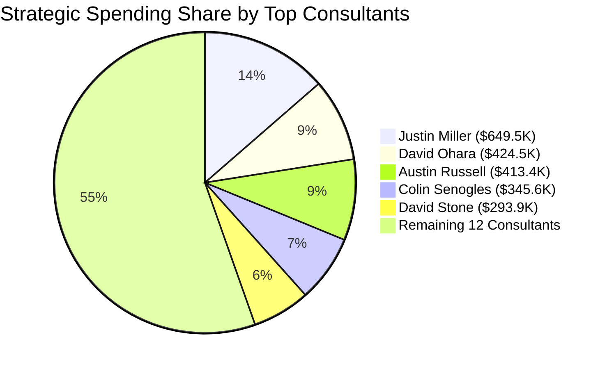
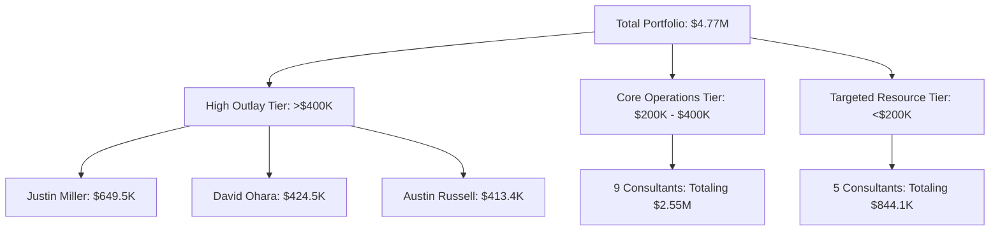

# 💼 Consultant Spending Report

## 📋 Executive Summary

The analyzed ledger encompasses **1,001 transaction entries** spanning across 17 consultants, reflecting a cumulative total expenditure of **$4,771,038.83**.

* **Primary Cost Driver:** **Justin Miller** represents the single highest project layout, capturing **$649,596.52** across 119 invoice adjustments.
* **Top Tier Cohort:** The top three billing consultants (**Justin Miller**, **David Ohara**, and **Austin Russell**) collectively comprise over **$1.48M** (roughly **31.2%**) of the overall workforce budget.

---

## 📈 Spend Distribution Overview

The Mermaid breakdown below highlights the share of overall expenditure captured by the top-tier workforce spend categories:

---

## 📊 Comprehensive Consultant Financial Matrix

The matrix below consolidates every identified profile ranked in descending order of total capitalized project spend.

| Rank | Consultant Name | Candidate ID | Total Outlay | Transaction Count | Avg. Spend / Entry |
| --- | --- | --- | --- | --- | --- |
| **1** | 🥇 **Justin Miller** | 4325586 | `$649,596.52` | 119 | `$5,458.79` |
| **2** | 🥈 **David Ohara** | 4457157 | `$424,589.72` | 59 | `$7,196.44` |
| **3** | 🥉 **Austin Russell** | 4457086 | `$413,452.52` | 66 | `$6,264.43` |
| **4** | **Colin Senogles** | 4337099 | `$345,600.00` | 55 | `$6,283.64` |
| **5** | **David Stone** | 4391145 | `$293,962.88` | 43 | `$6,836.35` |
| **6** | **Austin Anderson** | 4342342 | `$272,383.00` | 70 | `$3,891.19` |
| **7** | **Tom Gilmor** | 4381825 | `$254,009.00` | 93 | `$2,731.28` |
| **8** | **Kruze Robinson** | 4328186 | `$253,671.00` | 73 | `$3,474.95` |
| **9** | **Michael Brennan** | 4389160 | `$247,003.00` | 72 | `$3,430.60` |
| **10** | **Jacob Allen** | 4599561 | `$246,751.00` | 52 | `$4,745.21` |
| **11** | **Michael Harvey** | 4446562 | `$242,417.00` | 30 | `$8,080.57` |
| **12** | **Seth Bopp** | 4362534 | `$224,930.00` | 83 | `$2,709.99` |
| **13** | **Patrick Gilmor** | 4383626 | `$219,120.00` | 20 | `$10,956.00` |
| **14** | **Cory Peters** | 4324727 | `$211,472.00` | 62 | `$3,410.84` |
| **15** | **Steven Schmidt** | 4973280 | `$162,607.50` | 39 | `$4,169.42` |
| **16** | **Cheyenne Ayers** | 5013817 | `$159,022.50` | 36 | `$4,417.29` |
| **17** | **Jennifer Harvey** | 4557306 | `$150,451.19` | 29 | `$5,187.97` |
| 🧮 | **Combined Totals** | **—** | **`$4,771,038.83`** | **1,001** | **`$4,766.27`** |

---

## 📈 Spending Stratification Breakdown

To understand how individual contractors impact the budget dynamically, this flowchart group reflects where the operational outlays pool across the portfolio:

---

### 🔍 Key Operational Insights from the Data

1. **Invoice Density vs Invoice Size:** While **Justin Miller** has the highest volume of invoices submitted (119 total entries), **Patrick Gilmor** carries the highest specific resource invoice weight, averaging a massive **$10,956.00 per single billing occurrence** across 20 milestones.
2. **Efficiency Metrics:** Resources like **Tom Gilmor** and **Seth Bopp** offer high continuous project visibility with low single-ticket volatility, making them highly predictable overhead components for structural budgeting.

---

Would you like to examine a chronological breakdown for any of these specific consultants, or review specific ledger codes to see which internal teams are absorbing these costs?
