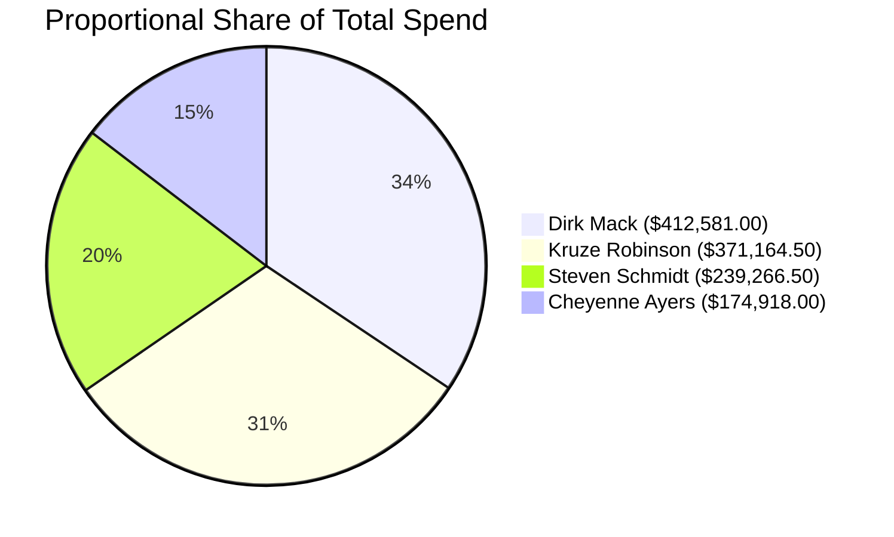
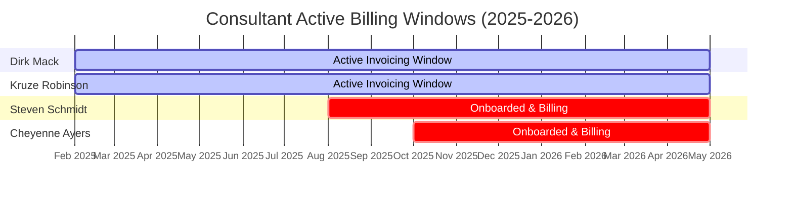

# 📋 Contractor & Consultant Spend Report
**Source File:** `payableChargesByCandidateID.xlsx`  
**Reporting Period:** February 2025 – May 2026  

---

## 📌 Executive Summary

An analysis of the structured ledger data reveals a total combined contingent workforce expenditure of **$1,197,930.00** across **321 total invoiced line items**. 

### 💡 Key Insights
* **Top Billing Earner:** **Dirk Mack** represents the highest individual contractor expense, totaling **$412,581.00** (34.4% of overall budget allocation).
* **Highest Average Invoice Impact:** **Cheyenne Ayers** holds the highest average single-transaction cost at **$4,164.71**, despite having the fewest total billing cycles due to a later onboarding timeline.
* **Onboarding Waves:** The workforce spend scales dynamically across two distinct phases—two foundational contractors billing from early 2025, and two additional resources scaling up mid-to-late 2025.

---

## 📈 Budget Distribution & Allocation

The donut allocation below demonstrates a heavy utilization weight toward longtime contractors, while late-year additions account for roughly one-third of the strategic spend.



### 📊 Metric Breakdown Matrix

| Consultant Name | Candidate ID | Total Outlay | Transaction Count | Avg. Check Size | Peak Single Invoice |
| --- | --- | --- | --- | --- | --- |
| 🥇 **Dirk Mack** | 4329452 | `$412,581.00` | 112 | `$3,683.76` | `$11,100.00` |
| 🥈 **Kruze Robinson** | 4328186 | `$371,164.50` | 109 | `$3,405.18` | `$11,320.50` |
| 🥉 **Steven Schmidt** | 4973280 | `$239,266.50` | 58 | `$4,125.28` | `$11,232.00` |
| 🎖️ **Cheyenne Ayers** | 5013817 | `$174,918.00` | 42 | `$4,164.71` | `$11,127.00` |
| 🧮 **Combined Portfolio** | — | **`$1,197,930.00`** | **321** | **`$3,731.87`** | — |

---

## 📅 Chronological Trend Progression

The chart below captures the month-over-month timeline trajectory of payroll subtotals parsed via explicit `periodEndDate` records.



### 📋 Monthly Financial Ledger (Cross-Tabulated)

> *Values indicate total capitalized spend rounded to the nearest cent.*

| Billing Month | Dirk Mack | Kruze Robinson | Steven Schmidt | Cheyenne Ayers | Combined Monthly |
| --- | --- | --- | --- | --- | --- |
| **Feb 2025** | `$6,637.50` | `$9,720.00` | `$0.00` | `$0.00` | **`$16,357.50`** |
| **Mar 2025** | `$34,491.00` | `$23,992.50` | `$0.00` | `$0.00` | **`$58,483.50`** |
| **Apr 2025** | `$20,521.50` | `$22,588.50` | `$0.00` | `$0.00` | **`$43,110.00`** |
| **May 2025** | `$33,000.00` | `$22,789.50` | `$0.00` | `$0.00` | **`$55,789.50`** |
| **Jun 2025** | `$23,634.00` | `$33,319.50` | `$0.00` | `$0.00` | **`$56,953.50`** |
| **Jul 2025** | `$25,449.00` | `$22,407.00` | `$0.00` | `$0.00` | **`$47,856.00`** |
| **Aug 2025** | `$30,598.50` | `$22,306.50` | `$23,898.00` | `$0.00` | **`$76,803.00`** |
| **Sep 2025** | `$25,560.00` | `$22,197.00` | `$22,809.00` | `$0.00` | **`$70,566.00`** |
| **Oct 2025** | `$26,283.00` | `$22,314.00` | `$22,674.00` | `$22,089.00` | **`$93,360.00`** |
| **Nov 2025** | `$28,924.50` | `$33,007.50` | `$33,885.00` | `$26,053.50` | **`$121,870.50`** |
| **Dec 2025** | `$19,686.00` | `$22,494.00` | `$11,712.00` | `$22,321.50` | **`$76,213.50`** |
| **Jan 2026** | `$25,569.00` | `$23,649.00` | `$21,639.00` | `$21,369.00` | **`$92,226.00`** |
| **Feb 2026** | `$27,717.00` | `$23,484.00` | `$34,003.50` | `$22,171.50` | **`$107,376.00`** |
| **Mar 2026** | `$30,415.50` | `$22,272.00` | `$22,284.00` | `$22,059.00` | **`$97,030.50`** |
| **Apr 2026** | `$26,601.00` | `$22,296.00` | `$22,464.00` | `$16,555.50` | **`$87,916.50`** |
| **May 2026** | `$27,493.50` | `$22,327.50` | `$23,898.00` | `$22,299.00` | **`$96,018.00`** |

---

## 📌 Timeline Dynamics & Observations

* **The Baseline Run-Rate (Q1–Q2 2025):** The account maintained a reliable rolling run-rate hovering around **$45K – $58K** monthly, solely supported by standard engineering/consulting iterations from Mack and Robinson.
* **Q3 2025 Scaledown & Surge:** Steven Schmidt's active onboarding in August triggered a permanent step-up, breaking the portfolio baseline past **$70K/month**.
* **Q4 Peak Inflow (November 2025):** Reached a comprehensive historic peak of **$121,870.50** driven by overlapping multi-week billing summaries across all four active profiles.
* **Current Operational Equilibrium (2026):** Moving into the first half of 2026, the portfolio displays highly controlled predictability, stabilizing around a narrow **$90K – $97K** bandwidth. This represents a solid, mature operational state for the project team.

---

```
---

```
