***

# A Deep Dive into Database Architectures

> **Original Question:** "Explain the differences between a relational database, nosql database and a vector database. Also, include any similarities and closest matching database compared to way human memory works"

This document explores three fundamental types of databases that power modern applications. We will examine their core structures, primary use cases, and conclude with an analogy comparing their retrieval methods to the fascinating way human memory works.

---

## 1. Relational Database (e.g., PostgreSQL, MySQL)

This is the traditional, highly structured foundation of the database world.

*   **Core Idea:** Organizes data into predefined tables consisting of rows and columns. It enforces strict data integrity through relationships between these tables.
*   **Data Structure:** A "schema-on-write" model, where you must define the table structure (the `schema`) *before* you can add data. Relationships between tables are managed using primary and foreign keys.
*   **Query Method:** **SQL (Structured Query Language)** is used to perform precise queries for data that matches exact criteria.
*   **Best Use Cases:** Financial systems, e-commerce stores, inventory management—any application where data consistency, reliability (ACID compliance), and a stable data model are critical.
*   **Analogy:** A library's **card catalog**. Meticulously organized and cross-referenced, allowing you to find a book by its exact title, author, or catalog number.

### Visualizing a Relational Model

This diagram shows two tables, `USERS` and `ORDERS`, linked by `UserID`. This structure ensures that an order cannot exist without a valid user.

---

## 2. NoSQL Database (e.g., MongoDB, Redis)

NoSQL ("Not Only SQL") databases were created to handle the scale, speed, and variety of modern web data that relational databases struggled with.

*   **Core Idea:** Offers flexibility by storing data in formats other than rigid tables, prioritizing scalability and performance.
*   **Data Structure:** A "schema-on-read" model. Data can be stored without a predefined structure. The most common model is the **Document Store**, which uses JSON-like documents. Other models include Key-Value, Column-family, and Graph.
*   **Query Method:** Varies by database, but often involves APIs or query languages that retrieve entire documents or key-value pairs.
*   **Best Use Cases:** Big data applications, real-time social media feeds, content management systems, and applications requiring rapid development and horizontal scaling.
*   **Analogy:** A set of **digital file folders**. Each folder (a document) can contain a different collection of items, and not all folders have to follow the same format.

### Visualizing a NoSQL Model

This diagram shows two documents within the same "collection." Note how they have different structures; `Document 2` has fields that `Document 1` lacks.

```mermaid
graph TD
    subgraph "Users Collection (MongoDB)"
        doc1("📄 Document 1 { _id: 1,
                            name: 'Alice',
                            interests: ['reading', 'hiking'] }")
        doc2("📄 Document 2 { _id: 2,
                            name: 'Bob',
                            city: 'New York',
                            has_pet: true }")
    end
```

---

## 3. Vector Database (e.g., Pinecone, Milvus, Chroma)

This new breed of database is purpose-built for the age of AI.

*   **Core Idea:** Organizes data based on its *semantic meaning* or *conceptual characteristics*, not its literal attributes.
*   **Data Structure:** It converts unstructured data (text, images, audio) into numerical representations called **vector embeddings** using an AI model. Data points with similar meanings are stored "close" to each other in a high-dimensional space.
*   **Query Method:** **Similarity Search**. Instead of an exact match, you provide a query (which is also converted to a vector), and the database finds the most similar items based on vector proximity.
*   **Best Use Cases:** The engine behind modern AI. Powers semantic search, image-to-image search, recommendation engines, and Retrieval-Augmented Generation (RAG) for LLMs.
*   **Analogy:** A **galaxy of stars**. Each star is a piece of data. To find something, you navigate to a region of space (a concept) and find the constellation of stars that are closest.

### Visualizing the Vector Database Workflow

This flowchart illustrates the two-phase process: indexing data and then performing a similarity search on a query.

---

## Comparison Summary & Similarities

| Feature | Relational Database | NoSQL Database | Vector Database |
| :--- | :--- | :--- | :--- |
| **Data Model** | Tables (Rows & Columns) | Documents, Key-Value, etc. | Vector Embeddings |
| **Schema** | Strict, defined upfront | Flexible, dynamic | Flexible, based on vector dimensions |
| **Primary Use** | Transactions, structured data | Web-scale apps, big data | AI, semantic search, similarity |
| **Query Type** | Exact matches (SQL) | Key lookups, document scans | Similarity search (ANN) |
| **Key Strength** | Consistency & Integrity | Scalability & Flexibility | Context & Meaning |

Despite their differences, all three are databases that provide **data persistence**, support **CRUD operations** (Create, Read, Update, Delete), and use **indexing** to accelerate queries.

---

## The Closest Match to Human Memory

Human memory is not a perfect, structured table. We recall information through **associative recall**—a network of connections based on context, feeling, and conceptual closeness.

*   A **Relational Database** is like our memory for hard facts ("What is your address?"). It's precise but lacks associative power.
*   A **NoSQL Graph Database** is a step closer, modeling explicit relationships ("Bob is friends with Alice").
*   A **Vector Database** is the **closest match to the *retrieval mechanism* of human associative memory.** It mimics our ability to find information based on a "vibe" or a collection of related concepts, rather than a direct query.

### Visualizing Associative Recall

This mind map shows how a chain of associated concepts leads to a specific memory, much like how a vector database uses a query vector to find the closest matches in its conceptual space.

## Into the Further:

***

### Understanding Vectors: The Language of Modern AI

This document explains the fundamental concept behind vector databases: what a vector is, and what it means to "convert" data into one.

---

#### Part 1: What is a Vector? (The Simple Analogy)

At its core, a **vector is just a list of numbers that represents a point in a space.**

We can start with a simple 2D map. To describe a location, we use two numbers—a vector—that represent coordinates on the X and Y axes.

This concept extends to any number of dimensions. A 3D space requires a vector with three numbers `[X, Y, Z]`. The vectors used in AI can have hundreds or even thousands of dimensions, representing a point in a vast, high-dimensional space.

---

#### Part 2: The Conversion - From Position to Meaning

This is the magic leap. When a vector database "converts something into a vector," it's not plotting a physical location. **It's plotting the data in a "meaning space."**

The numbers in the vector don't represent physical distance but **conceptual characteristics.**

##### A Simple "Meaning Space" for Fruit

Imagine we create a meaning space with just three dimensions:

1.  `Sweetness` (0.0 to 1.0)
2.  `Crunchiness` (0.0 to 1.0)
3.  `Sourness` (0.0 to 1.0)

We can now "convert" fruits into vectors that capture their features numerically:

| Fruit | Sweetness | Crunchiness | Sourness | Resulting Vector |
| :---- | :--- | :--- | :--- | :--- |
| **Apple** | High (0.8) | High (0.9) | Low (0.3) | `[0.8, 0.9, 0.3]` |
| **Banana** | High (0.9) | Low (0.1) | Low (0.1) | `[0.9, 0.1, 0.1]` |
| **Lemon** | Low (0.1) | Low (0.2) | High (0.9) | `[0.1, 0.2, 0.9]` |

This is the essence of the conversion. We've translated real-world concepts into a numerical format that a computer can understand and compare.

---

#### Part 3: The Engine of Conversion - The "Embedding Model"

This conversion isn't done manually. It's performed by a sophisticated AI called an **embedding model**.

The process is illustrated below:

1.  **Training:** The model is pre-trained on a massive corpus of text and images, learning the intricate relationships and contexts between words and concepts.
2.  **Conversion (Embedding):** When you provide data, the model uses its knowledge to process it.
3.  **Output:** It outputs a vector embedding. The dimensions in this vector are not simple labels like "sweetness," but abstract representations of concepts learned during training (e.g., "formality," "sentiment," "animal-relatedness").

Words and sentences with similar meanings will have similar numerical values across these abstract dimensions.

---

#### The Final "Meaning"

When a vector database *runs a query*:

> It uses a pre-trained AI model to transform a piece of data (like text or an image) into a list of numbers. This list, called a vector embedding, serves as a mathematical representation of the data's underlying meaning and context.
>
> Once the **query** is encoded into its vector embedding, a similarity search is performed to retrieve the data corresponding to the nearest neighboring vectors in the database.

***This is revolutionary because it allows us to perform mathematical operations on meaning itself. By calculating the "distance" between two vectors, a database can find similar concepts without ever matching keywords—it's finding a match based on the essence of the data.***
