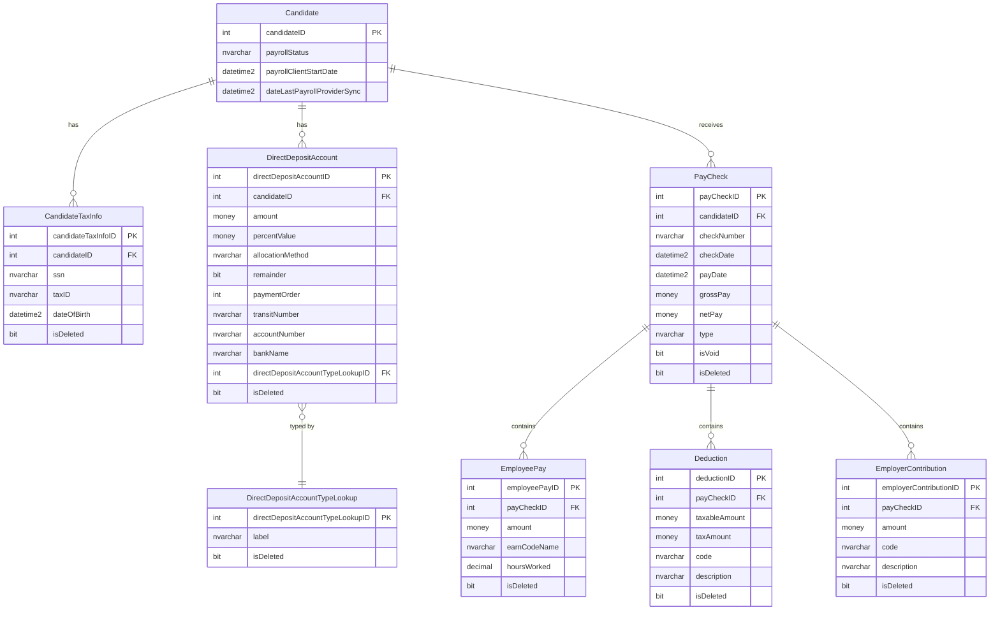
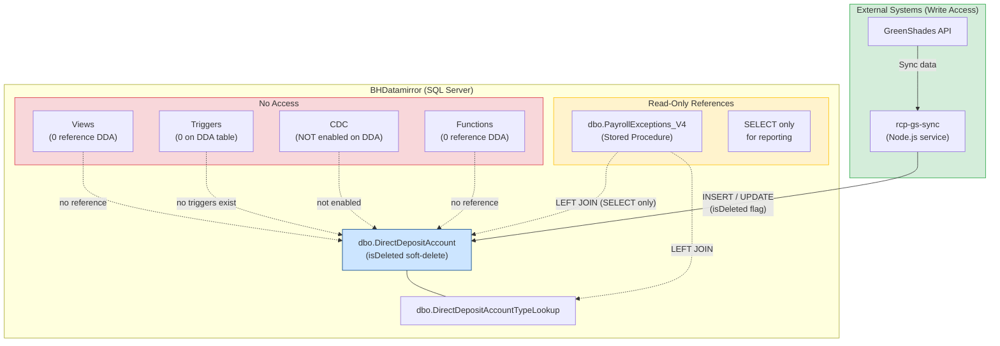
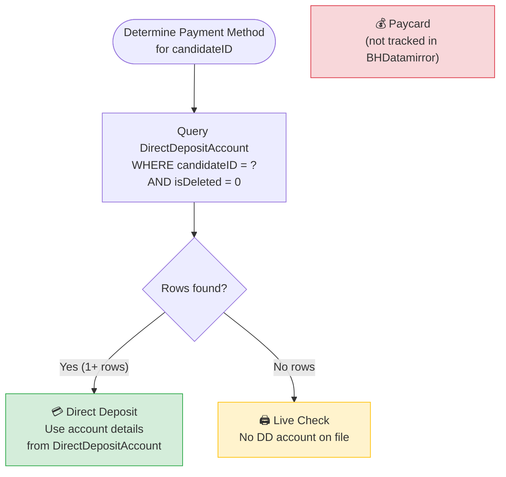

# BHDatamirror — Payroll Schema Reference

> **Database:** `BHDataMirror` on `10.202.0.7` (SQL Server 2022 RTM-CU25-GDR)  
> **Purpose:** Read-only Bullhorn mirror used by RCP Solutions for payroll reporting and sync.

---

## Table of Contents

1. [Table Schemas](#table-schemas)
2. [Entity Relationship Diagram](#entity-relationship-diagram)
3. [DirectDepositAccount Isolation](#directdepositaccount-isolation)
4. [Payment Method Logic](#payment-method-logic)
5. [CDC Status](#cdc-status)
6. [Key Findings](#key-findings)

---

## Table Schemas

### `dbo.DirectDepositAccount`

| Column | Type | Notes |
|---|---|---|
| `directDepositAccountID` | int | PK, clustered |
| `candidateID` | int | FK → Candidate |
| `amount` | money | Fixed dollar amount |
| `percentValue` | money | Percentage allocation |
| `allocationMethod` | nvarchar(MAX) | e.g. "Percent", "Amount" |
| `remainder` | bit | Catch-all remainder flag |
| `paymentOrder` | int | Priority order |
| `transitNumber` | nvarchar(MAX) | ABA routing number |
| `accountNumber` | nvarchar(MAX) | Likely encrypted |
| `bankName` | nvarchar(MAX) | Bank name |
| `institutionNumber` | nvarchar(MAX) | Institution identifier |
| `directDepositAccountTypeLookupID` | int | FK → DirectDepositAccountTypeLookup |
| `currencyUnitID` | int | FK → CurrencyUnit |
| `dateAdded` | datetime2 | Created timestamp |
| `dateLastModified` | datetime2 | Last modified timestamp |
| `dateLastSync` | datetime2 | Last sync from Bullhorn |
| `isDeleted` | bit | Soft-delete flag (default 0) |
| `deletedByUserID` | int | FK → CorporateUser |

**Soft-delete:** Rows are never physically removed. `isDeleted = 1` marks a deleted account.  
**Triggers:** None.  
**Indexes:** 8 non-clustered including `IX_DirectDepositAccount_isDeleted`, `IX_DirectDepositAccount_Merge_candidateID`.

---

### `dbo.Candidate`

263 columns total. Payment-relevant columns:

| Column | Type | Notes |
|---|---|---|
| `candidateID` | int | PK, clustered |
| `payrollStatus` | nvarchar(100) | Payroll enrollment status |
| `payrollClientStartDate` | datetime2 | Start date with payroll client |
| `dateLastPayrollProviderSync` | datetime2 | Last sync from payroll provider |

**No direct deposit, paycard, or live check columns on Candidate itself.**  
**Trigger:** `trigger_UpdateCTIFields_fromCandidate` — AFTER INSERT/UPDATE, syncs `ssn`, `dateOfBirth`, `dateI9Expiration`, `i9OnFile`, `taxID` → CandidateTaxInfo. Has recursion guard (`TRIGGER_NESTLEVEL() > 1 RETURN`). Not payment-related.

---

### `dbo.CandidateTaxInfo`

| Column | Type | Notes |
|---|---|---|
| `candidateTaxInfoID` | int | PK, clustered |
| `candidateID` | int | FK → Candidate |
| `ssn` | nvarchar(MAX) | Encrypted |
| `taxID` | nvarchar(MAX) | Encrypted |
| `taxIDIndicator` | nvarchar | Tax ID type |
| `dateOfBirth` | datetime2 | |
| `dateI9Expiration` | datetime2 | |
| `i9OnFile` | bit | |
| `militaryDomicileState` | nvarchar | |
| `militaryDomicileExpiration` | datetime2 | |
| `customText1–5` | nvarchar(MAX) | |
| `customInt1–3` | int | |
| `customDate1–3` | datetime2 | |
| `isDeleted` | bit | Soft-delete |
| `dateAdded` | datetime2 | |
| `dateLastModified` | datetime2 | |
| `dateLastSync` | datetime2 | |

**Trigger:** `trigger_UpdateCandidateFields_fromCTI` — AFTER INSERT/UPDATE, syncs `ssn`, `dateOfBirth`, `dateI9Expiration`, `i9OnFile`, `taxID` back → Candidate. Has recursion guard. Not payment-related.

---

### `dbo.PayCheck`

| Column | Type | Notes |
|---|---|---|
| `payCheckID` | int | PK, clustered |
| `candidateID` | int | FK → Candidate |
| `checkNumber` | nvarchar | |
| `checkDate` | datetime2 | |
| `payDate` | datetime2 | |
| `periodStartDate` | datetime2 | |
| `periodEndDate` | datetime2 | |
| `payPeriod` | nvarchar(50) | |
| `type` | nvarchar(50) | e.g. "Regular", "Void" |
| `grossPay` | money | |
| `netPay` | money | |
| `earnAmount` | money | |
| `otherEarnAmount` | money | |
| `hoursWorked` | decimal | |
| `taxAmount` | money | |
| `fitTaxableAmount` | money | |
| `employeeTotalDeduction` | money | |
| `isVoid` | bit | Voided check flag |
| `voucherID` | nvarchar(200) | |
| `externalPayrollEmployeeID` | nvarchar(200) | |
| `payExportBatchExternalID` | int | |
| `employeeID` | nvarchar(MAX) | |
| `workspaceID` | nvarchar(MAX) | |
| `globalPayRecord` | nvarchar(MAX) | Likely JSON blob |
| `isDeleted` | bit | Soft-delete (default 0) |
| `dateAdded` | datetime2 | |
| `dateLastModified` | datetime2 | |
| `dateLastSync` | datetime2 | |

**Triggers:** None.  
**CDC:** Enabled — `cdc.dbo_PayCheck_CT` tracks all changes.  
**Does NOT store disbursement method** (DD vs live check vs paycard).

---

### `dbo.EmployeePay`

| Column | Type | Notes |
|---|---|---|
| `employeePayID` | int | PK, clustered |
| `payCheckID` | int | FK → PayCheck |
| `amount` | money | Earnings amount |
| `earnCodeName` | nvarchar | Earn code |
| `hoursWorked` | decimal | |
| `hoursUnits` | nvarchar | |
| `unitRate` | money | |
| `chargeDate` | datetime2 | |
| `glCode` | nvarchar | GL account code |
| `shift` | nvarchar | |
| `jobCode` | nvarchar | |
| `workCompID` | int | FK → WorkersCompensation |
| `location` | nvarchar | |
| `department` | nvarchar | |
| `projPhase` | nvarchar | |
| `projWork` | nvarchar | |
| `isDeleted` | bit | Soft-delete (default 0) |
| `dateAdded` | datetime2 | |
| `dateLastSync` | datetime2 | |

**Triggers:** None. **Purpose:** Earnings lines (what was earned), not disbursement method.

---

### `dbo.Deduction` (child of PayCheck)

| Column | Type | Notes |
|---|---|---|
| `deductionID` | int | PK |
| `payCheckID` | int | FK → PayCheck |
| `taxableAmount` | money | |
| `taxAmount` | money | |
| `overLimitAmount` | money | |
| `code` | nvarchar | |
| `type` | nvarchar | |
| `description` | nvarchar | |
| `deductionCategoryLookupID` | int | FK → lookup |
| `unionID` | int | |
| `oneTimeSwitch` | bit | |
| `isDeleted` | bit | Soft-delete |
| `dateAdded` | datetime2 | |
| `dateLastSync` | datetime2 | |

---

### `dbo.EmployerContribution` (child of PayCheck)

| Column | Type | Notes |
|---|---|---|
| `employerContributionID` | int | PK |
| `payCheckID` | int | FK → PayCheck |
| `amount` | money | |
| `code` | nvarchar | |
| `description` | nvarchar | |
| `isDeleted` | bit | Soft-delete |
| `dateAdded` | datetime2 | |
| `dateLastSync` | datetime2 | |

---

## Entity Relationship Diagram

---

## DirectDepositAccount Isolation

> **Finding:** No stored procedure, trigger, view, or function in BHDatamirror writes to `DirectDepositAccount`. All writes come exclusively from the external sync process?.

---

## Payment Method Logic

| Payment Method | Table | Condition |
|---|---|---|
| **Direct Deposit** | `DirectDepositAccount` | Active rows exist: `isDeleted = 0` for `candidateID` |
| **Live Check** | `DirectDepositAccount` | No active rows for `candidateID` |
| **Paycard** | *(not in mirror)* | Not represented in BHDatamirror |

> Payment method is **inferred** — there is no explicit `paymentMethod` column on `Candidate` or `PayCheck`.

---

## CDC Status

| Table | CDC Enabled | Change Table | Notes |
|---|---|---|---|
| `PayCheck` | ✅ Yes | `cdc.dbo_PayCheck_CT` | Full change history available |
| `DirectDepositAccount` | ❌ No | — | No SQL Server audit trail |
| `EmployeePay` | ❌ No | — | No SQL Server audit trail |
| `Deduction` | ❌ No | — | No SQL Server audit trail |
| `EmployerContribution` | ❌ No | — | No SQL Server audit trail |

> **Implication:** To audit DDA changes, you must rely on the external sync source (GreenShades / other), not the database itself.

---

## Key Findings

1. **DirectDepositAccount is write-isolated within the database.** Zero stored procedures, triggers, views, or functions perform INSERT/UPDATE/DELETE on it. The only internal reference is a read-only SELECT in `PayrollExceptions_V4`.

2. **All DDA writes originate externally** from the GreenShades sync process?. The database is a mirror — it receives, not generates, DDA data.

3. **No CDC on DirectDepositAccount.** There is no built-in SQL Server change tracking for DDA edits. Audit trails must be sourced from the sync service logs or GreenShades itself.

4. **Payment method is inferred, not stored.** Neither `Candidate` nor `PayCheck` has a `paymentMethod` column. The presence/absence of active `DirectDepositAccount` rows determines DD vs live check.

5. **Soft-delete everywhere.** All key tables (`DirectDepositAccount`, `PayCheck`, `EmployeePay`, `CandidateTaxInfo`) use `isDeleted` bit flags. Rows are never physically removed — always filter `WHERE isDeleted = 0` for active records.

6. **Bidirectional trigger sync (Candidate ↔ CandidateTaxInfo).** Two triggers keep tax identity fields in sync between tables. Both have recursion guards. Neither is payment-related.

7. **PayCheck has CDC; child tables do not.** `cdc.dbo_PayCheck_CT` tracks paycheck-level changes, but `EmployeePay`, `Deduction`, and `EmployerContribution` have no change tracking.

--

### Refernces: Table Schemas, etc ###

#### So... What -is- on the data mirror? ####

> **References:**
> * [Data Dictionary Table](https://docs.google.com/spreadsheets/d/1-BpdPYj2i_T5glycmst6PXGrwi9SEdC90YEX_szBrL8/edit?gid=1313502510#gid=1313502510)
> * [Bullhorn Data Replication Schema Layout](https://help.bullhorn.com/article/Data-Replication-schema-layout)

Based on the referenced documentation, below are the tables containing information regarding employee pay methods, pay information, and related audit logs. 
 
Note: Table names are what Bullhorn API call Entities (and are usually aliased into something shorter). 
      *We need to be sure we can access that entity through the API. We cannot access them all (by design)*

---

### 1. Employee Pay Method

* **`DirectDepositAccount`** — Contains specific details regarding employee/candidate direct deposit configurations, including bank name, account number, routing numbers (`transitNumber`, `institutionNumber`), `allocationMethod`, and `paymentOrder`.
- **`isDeleted`** (`bit`, default `0`) — flip to `1` to logically delete; always filter `WHERE isDeleted = 0` for active records
- **`deletedByUserID`** (`int`) — audit trail recording which `CorporateUser` performed the logical delete
- No dedicated `deletedAt` timestamp column; infer deletion time from `dateLastModified` (the last write before `isDeleted` flipped to `1`)
  
* **`DirectDepositAccountTypeLookup`** — A lookup table defining the types of direct deposit accounts, including a flag indicating whether the method is a pay card (`isPayCard`).
---

### 2. Pay Information

* **`EmployeePay`** — Tracks detailed pay information per entry, including `amount`, `unitRate`, `hoursWorked`, `hoursUnits`, and the associated `earnCodeName`.
* **`PayCheck`** — Contains summary information for issued paychecks, including `grossPay`, `netPay`, `taxAmount`, `employeeTotalDeduction`, `payDate`, and `payPeriod` details.
* **`PayMaster` & `PayMasterTransaction`** — Manage the core financial transactions for payroll, recording details such as `rate`, `quantity`, `amount`, `payPeriodEndDate`, and transaction status.
* **`PayableCharge`** — Tracks charges that are ready to be paid out, including fields for `payGroup` and payroll readiness overrides.
* **`PayBillSetting`** — Stores configuration rules for payroll and billing, such as `overtimePayMultiplier` and `doubletimePayMultiplier`.
* **`PayBillCycle`** — Defines the processing schedules and cycles for evaluating pay and bill data.
* **`PayExportBatch` / `PayExportBatchExternal` / `PayExportBatchPayableCharge`** — Manage groups of payroll records bundled together for export to external payroll providers.

### 3. Logs and History

* **`PayServiceExportAuditLog`** — Logs the results of payroll exports to external systems, capturing fields like `isSuccess`, `responseStatusCode`, and `rawResponseMessage`.
* **`EditHistoryPayMasterTransaction` & `EditHistoryFieldChangePayMasterTransaction`** — Audit logs tracking any changes, modifications, or updates made to pay master transactions.
* **`EditHistoryPayBillSetting` & `EditHistoryFieldChangePayBillSetting`** — Audit logs tracking historical changes to organizational pay and bill settings.
* **`EditHistoryPayrollExportConfig` & `EditHistoryFieldChangePayrollExportConfig`** — Logs changes made to the configurations used for exporting payroll data.
* **`TimesheetEntryApprovalStatusLogEntry`** — Tracks the approval history and status changes of timesheet entries, which serve as the primary source log for generating pay.

---

# BHDatamirror — Candidate* Tables & EmployeePay: Payment-Related Analysis

#### dbo.DirectDepositAccount - Schema Reference
##### Columns (18 total)

| # | Column | Type | Nullable | Default | Notes |
|---|--------|------|----------|---------|-------|
| 1 | `amount` | `money(19,4)` | YES | — | Fixed dollar amount for this deposit split |
| 2 | `transitNumber` | `nvarchar(50)` | YES | — | Bank routing/transit number |
| 3 | `bankName` | `nvarchar(200)` | YES | — | Human-readable bank name |
| 4 | `directDepositAccountTypeLookupID` | `int` | YES | — | FK → `DirectDepositAccountTypeLookup` (e.g. Checking/Savings) |
| 5 | `accountNumber` | `nvarchar(MAX)` | YES | — | Bank account number (MAX — likely encrypted/long) |
| 6 | `dateAdded` | `datetime2` | YES | — | Record creation timestamp |
| 7 | `candidateID` | `int` | YES | — | FK → `Candidate.candidateID` (the employee/worker) |
| 8 | `percentValue` | `money(19,4)` | YES | — | Percentage-based allocation (used when `allocationMethod` = percent) |
| 9 | `dateLastModified` | `datetime2` | YES | — | Last update timestamp |
| 10 | `institutionNumber` | `nvarchar(50)` | YES | — | Canadian bank institution number (3-digit) |
| 11 | `paymentOrder` | `int` | YES | — | Priority order when multiple accounts exist |
| 12 | `directDepositAccountID` | `int` | **NOT NULL** | — | **Primary Key** — clustered |
| 13 | `remainder` | `bit` | YES | — | If `1`, receives whatever is left after other splits |
| 14 | `currencyUnitID` | `int` | YES | — | FK → `CurrencyUnit` (USD, CAD, etc.) |
| 15 | `isDeleted` | `bit` | YES | `0` | **Soft-delete flag** — set to `1` instead of physical delete |
| 16 | `dateLastSync` | `datetime2` | YES | — | Last sync timestamp from Bullhorn source system |
| 17 | `allocationMethod` | `nvarchar(MAX)` | YES | — | Split calculation method (`"Percent"`, `"Amount"`, `"Remainder"`) |
| 18 | `deletedByUserID` | `int` | YES | — | FK → `CorporateUser.corporateUserID` — who soft-deleted this record |
 
##### Primary Key
| Name | Type | Column |
|------|------|--------|
| `PK_DirectDepositAccount` | CLUSTERED | `directDepositAccountID` |

##### Indexes
| Index Name | Columns | Unique |
|------------|---------|--------|
| `IX_DirectDepositAccount_candidateID` | `candidateID` | No |
| `IX_DirectDepositAccount_currencyUnitID` | `currencyUnitID` | No |
| `IX_DirectDepositAccount_dateAdded` | `dateAdded` | No |
| `IX_DirectDepositAccount_dateLastSync` | `dateLastSync` | No |
| `IX_DirectDepositAccount_deletedByUserID` | `deletedByUserID` | No |
| `IX_DirectDepositAccount_directDepositAccountTypeLookupID` | `directDepositAccountTypeLookupID` | No |
| `IX_DirectDepositAccount_isDeleted` | `isDeleted` | No |
| `IX_DirectDepositAccount_Merge_candidateID` | `directDepositAccountID, candidateID` | No |

##### Foreign Keys
| FK Name | Column | References |
|---------|--------|------------|
| `FK_DirectDepositAccount_candidateID` | `candidateID` | `Candidate.candidateID` |
| `FK_DirectDepositAccount_currencyUnitID` | `currencyUnitID` | `CurrencyUnit.currencyUnitID` |
| `FK_DirectDepositAccount_directDepositAccountTypeLookupID` | `directDepositAccountTypeLookupID` | `DirectDepositAccountTypeLookup.directDepositAccountTypeLookupID` |
| `FK_DirectDepositAccount_deletedByUserID` | `deletedByUserID` | `CorporateUser.corporateUserID` |

##### Triggers
**None.** No triggers are defined on this table.

##### Soft-Delete Pattern
Records are never physically deleted. Instead:

---

# BHDatamirror — Candidate* Tables & EmployeePay: Payment-Related Analysis

## Scope

All 29 `Candidate*` sub-tables and `EmployeePay` were scanned for payment-related columns
(deposit, paycard, check, payment, bank, routing, transit, account, ach, wire),
triggers, and indexes.

---

## Candidate* Sub-Tables — Payment Column Scan

**Result: No payment-related columns found in any Candidate* sub-table.**

The only "account" hits were `candidateFileAttachmentID` columns in file attachment
tables — these are internal FK IDs, not financial account data.

---

## CandidateTaxInfo

**Purpose:** Stores tax identity fields (SSN, DOB, TaxID, I-9).
Synced bidirectionally with `Candidate` via triggers.

**Payment-relevant columns:** None. Tax identity only.

### Columns

| Column | Type | Nullable | Notes |
|---|---|---|---|
| `candidateTaxInfoID` | int | NO | PK |
| `candidateID` | int | YES | FK → Candidate |
| `ssn` | nvarchar(MAX) | YES | Likely encrypted |
| `taxID` | nvarchar(MAX) | YES | Likely encrypted |
| `taxIDIndicator` | nvarchar(100) | YES | |
| `dateOfBirth` | datetime2 | YES | |
| `dateI9Expiration` | datetime2 | YES | |
| `i9OnFile` | bit | YES | |
| `militaryDomicileState` | nvarchar(100) | YES | |
| `militaryDomicileExpiration` | datetime2 | YES | |
| `customText1–5` | nvarchar(100) | YES | |
| `customInt1–3` | int | YES | |
| `customDate1–3` | datetime2 | YES | |
| `isDeleted` | bit | YES | Soft-delete |
| `dateAdded` | datetime2 | YES | |
| `dateLastModified` | datetime2 | YES | |
| `dateLastSync` | datetime2 | YES | |

### Trigger: `trigger_UpdateCandidateFields_fromCTI` (ACTIVE)

- **Event:** AFTER INSERT, UPDATE on `CandidateTaxInfo`
- **Action:** Syncs `ssn`, `dateOfBirth`, `dateI9Expiration`, `i9OnFile`, `taxID`
  **back** to `Candidate` when those fields + `dateLastModified` change
- **Guard:** `TRIGGER_NESTLEVEL() > 1 RETURN` — prevents recursive loops
  with `trigger_UpdateCTIFields_fromCandidate` on the Candidate table
- **Payment-related:** No

### Indexes

| Index | Type | Columns |
|---|---|---|
| `PK_CandidateTaxInfo` | CLUSTERED PK | `candidateTaxInfoID` |
| `IX_CandidateTaxInfo_candidateID` | NONCLUSTERED | `candidateID` |
| `IX_CandidateTaxInfo_dateAdded` | NONCLUSTERED | `dateAdded` |
| `IX_CandidateTaxInfo_dateLastSync` | NONCLUSTERED | `dateLastSync` |
| `IX_CandidateTaxInfo_isDeleted` | NONCLUSTERED | `isDeleted` |
| `IX_CandidateTaxInfo_Merge_candidateID` | NONCLUSTERED | `candidateTaxInfoID, candidateID` |

**Soft-delete:** `isDeleted` bit column present.

---

## CandidateEncryptedData

**Purpose:** Stores up to 10 custom encrypted text fields per candidate.
No named payment fields — all generic `customEncryptedText1`–`customEncryptedText10`.

### Columns

| Column | Type | Nullable | Notes |
|---|---|---|---|
| `userID` | int | YES | |
| `customEncryptedText1` | nvarchar(MAX) | YES | Encrypted |
| `customEncryptedText2` | nvarchar(MAX) | YES | Encrypted |
| `customEncryptedText3` | nvarchar(MAX) | YES | Encrypted |
| `customEncryptedText4` | nvarchar(MAX) | YES | Encrypted |
| `customEncryptedText5` | nvarchar(MAX) | YES | Encrypted |
| `customEncryptedText6` | nvarchar(MAX) | YES | Encrypted |
| `customEncryptedText7` | nvarchar(MAX) | YES | Encrypted |
| `customEncryptedText8` | nvarchar(MAX) | YES | Encrypted |
| `customEncryptedText9` | nvarchar(MAX) | YES | Encrypted |
| `customEncryptedText10` | nvarchar(MAX) | YES | Encrypted |
| `isDecrypted` | smallint | YES | |

**Triggers:** None.
**Payment-relevant columns:** Potentially — encrypted fields *could* store payment data,
but no named columns indicate this.

---

## CandidateOnboardedDates

**Purpose:** Tracks onboarding dates. No payment relevance.

### Columns

| Column | Type | Nullable |
|---|---|---|
| `CandidateID` | int | NO |
| `Candidate_customDate10` | datetime2 | YES |
| `EdithistoryDate` | datetime2 | YES |
| `DateOnboarded` | datetime2 | YES |

**Triggers:** None. **Payment-relevant columns:** None.

---

## EmployeePay

**Purpose:** Stores individual pay line items linked to a paycheck (`payCheckID`).
This is **earnings/timesheet data**, not payment method data.

### Columns

| Column | Type | Nullable | Notes |
|---|---|---|---|
| `employeePayID` | int | NO | PK |
| `payCheckID` | int | YES | FK → paycheck record |
| `amount` | money | YES | Dollar amount of this pay line |
| `earnCodeName` | nvarchar(100) | YES | Earn code (REG, OT, etc.) |
| `hoursWorked` | money | YES | Hours worked |
| `hoursUnits` | money | YES | Units |
| `unitRate` | money | YES | Rate per unit |
| `chargeDate` | datetime2 | YES | Date of charge |
| `glCode` | nvarchar(100) | YES | GL code |
| `shift` | nvarchar(100) | YES | Shift |
| `jobCode` | nvarchar(100) | YES | Job code |
| `workCompID` | nvarchar(100) | YES | Workers comp ID |
| `location` | nvarchar(100) | YES | Location |
| `department` | nvarchar(100) | YES | Department |
| `projPhase` | nvarchar(100) | YES | Project phase |
| `projWork` | nvarchar(100) | YES | Project work |
| `isDeleted` | bit | YES | Soft-delete (default 0) |
| `dateAdded` | datetime2 | YES | |
| `dateLastSync` | datetime2 | YES | |

**Triggers:** None.

### Indexes

| Index | Type | Columns |
|---|---|---|
| `PK_EmployeePay` | CLUSTERED PK | `employeePayID` |
| `IX_EmployeePay_payCheckID` | NONCLUSTERED | `payCheckID` |
| `IX_EmployeePay_dateAdded` | NONCLUSTERED | `dateAdded` |
| `IX_EmployeePay_dateLastSync` | NONCLUSTERED | `dateLastSync` |
| `IX_EmployeePay_isDeleted` | NONCLUSTERED | `isDeleted` |

**Soft-delete:** `isDeleted` bit column present (default 0).

**Payment method relevance:** None. `EmployeePay` is earnings lines (what was earned),
not disbursement method (how it was paid out). The link to disbursement is via
`payCheckID` → a paycheck table (not yet examined).

---

## Trigger Cross-Reference: Candidate ↔ CandidateTaxInfo Sync

Two triggers form a bidirectional sync loop with recursion guards:

| Trigger | Table | Direction | Fields Synced |
|---|---|---|---|
| `trigger_UpdateCTIFields_fromCandidate` | `Candidate` | Candidate → CandidateTaxInfo | `ssn`, `dateOfBirth`, `dateI9Expiration`, `i9OnFile`, `taxID` |
| `trigger_UpdateCandidateFields_fromCTI` | `CandidateTaxInfo` | CandidateTaxInfo → Candidate | `ssn`, `dateOfBirth`, `dateI9Expiration`, `i9OnFile`, `taxID` |

Both fire AFTER INSERT/UPDATE and both have `TRIGGER_NESTLEVEL() > 1 RETURN` guards.
Neither is payment-related.

---

## Summary: Where Payment Method Lives

| Signal | Table | Column / Logic |
|---|---|---|
| **Direct Deposit** | `DirectDepositAccount` | Active rows (`isDeleted = 0`) for `candidateID` |
| **Live Check** | `DirectDepositAccount` | No active rows for `candidateID` |
| **Paycard** | *(not in this mirror)* | — |
| **Tax identity** | `CandidateTaxInfo` | `ssn`, `taxID`, `dateOfBirth` |
| **Earnings lines** | `EmployeePay` | `amount`, `earnCodeName`, `hoursWorked` |
| **Paycheck link** | `EmployeePay.payCheckID` | → paycheck table (not yet examined) |

**Conclusion:** No `Candidate*` sub-table contains direct deposit, paycard, or live check
data. All payment method determination flows through `DirectDepositAccount` alone.

---

# BHDatamirror — `dbo.PayCheck` Schema Reference

## Overview

`PayCheck` stores one row per paycheck issued to a candidate. It links to
`EmployeePay` (earnings lines) via `payCheckID` and to `Candidate` via `candidateID`.
Soft-delete via `isDeleted` (bit, default 0) — rows are never physically removed.

**Triggers:** None.

---

## Columns

| Column | Type | Nullable | Notes |
|---|---|---|---|
| `payCheckID` | int | NO | PK |
| `candidateID` | int | YES | FK → Candidate |
| `checkNumber` | nvarchar(100) | YES | Check/voucher number |
| `checkDate` | datetime2 | YES | Date printed/issued |
| `payDate` | datetime2 | YES | Date funds available |
| `periodStartDate` | datetime2 | YES | Pay period start |
| `periodEndDate` | datetime2 | YES | Pay period end |
| `payPeriod` | nvarchar(50) | YES | Pay period label (e.g. "Weekly") |
| `type` | nvarchar(50) | YES | Check type (e.g. "Regular", "Void") |
| `grossPay` | money | YES | Total gross pay |
| `netPay` | money | YES | Net pay after deductions |
| `earnAmount` | money | YES | Regular earn amount |
| `otherEarnAmount` | money | YES | Other earnings |
| `hoursWorked` | money | YES | Total hours worked |
| `taxAmount` | money | YES | Total tax withheld |
| `fitTaxableAmount` | money | YES | Federal income tax taxable amount |
| `employeeTotalDeduction` | money | YES | Total employee deductions |
| `isVoid` | bit | YES | Whether check was voided |
| `voucherID` | nvarchar(200) | YES | External voucher reference |
| `externalPayrollEmployeeID` | nvarchar(200) | YES | ID in external payroll system |
| `payExportBatchExternalID` | int | YES | FK → pay export batch |
| `employeeID` | nvarchar(MAX) | YES | External employee ID (string form) |
| `workspaceID` | nvarchar(MAX) | YES | External workspace/tenant ID |
| `globalPayRecord` | nvarchar(MAX) | YES | Raw global pay record (JSON blob?) |
| `isDeleted` | bit | YES | Soft-delete (default 0) |
| `dateAdded` | datetime2 | YES | |
| `dateLastModified` | datetime2 | YES | |
| `dateLastSync` | datetime2 | YES | |

---

## Indexes

| Index | Type | Key Columns | Notes |
|---|---|---|---|
| `PK_PayCheck` | CLUSTERED PK | `payCheckID` | |
| `IX_PayCheck_candidateID` | NONCLUSTERED | `candidateID` | Join to Candidate |
| `IX_PayCheck_payExportBatchExternalID` | NONCLUSTERED | `payExportBatchExternalID` | Batch lookup |
| `IX_PayCheck_dateAdded` | NONCLUSTERED | `dateAdded` | |
| `IX_PayCheck_dateLastSync` | NONCLUSTERED | `dateLastSync` | |
| `IX_PayCheck_isDeleted` | NONCLUSTERED | `isDeleted` | |
| `IX_PayCheck_Merge_candidateID` | NONCLUSTERED | `payCheckID, candidateID` | Merge/upsert support |

---

## Triggers

**None.**

---

## Soft-Delete Behavior

Rows are never physically deleted. Use `WHERE isDeleted = 0` to filter active checks.
Voided checks remain with `isVoid = 1` and `isDeleted = 0` — they are still active
records, just marked void.

---

## Relationships

| Relationship | Direction | Join |
|---|---|---|
| Candidate | Many PayChecks → One Candidate | `PayCheck.candidateID = Candidate.candidateID` |
| EmployeePay | One PayCheck → Many Pay Lines | `EmployeePay.payCheckID = PayCheck.payCheckID` |
| Pay Export Batch | Many PayChecks → One Batch | `PayCheck.payExportBatchExternalID` |

---

## Payment Method Notes

`PayCheck` does **not** store the disbursement method (DD vs live check vs paycard).
To determine how a check was paid:

- **Direct Deposit:** candidate has active rows in `DirectDepositAccount` (`isDeleted = 0`)
- **Live Check:** candidate has no active `DirectDepositAccount` rows
- **Paycard:** not represented in this mirror

The `type` column may carry values like `"Regular"`, `"Supplemental"`, or `"Void"` —
but does **not** indicate DD vs paper check.
