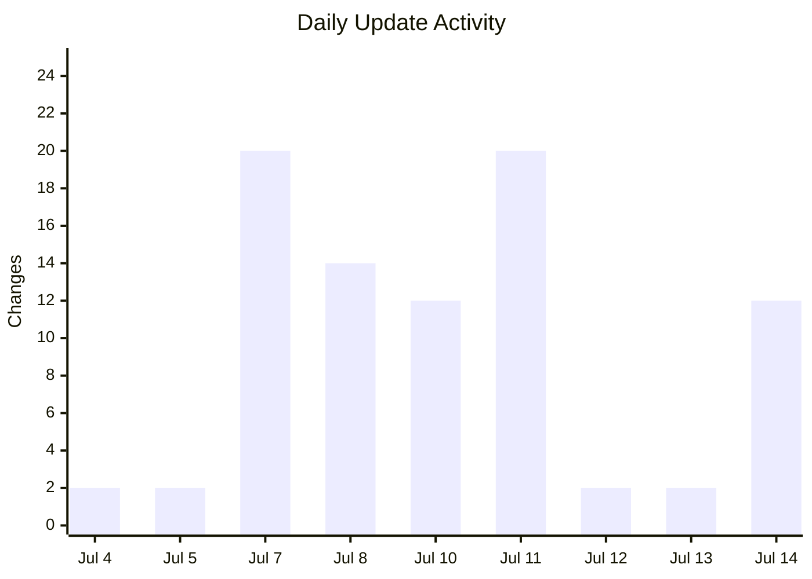
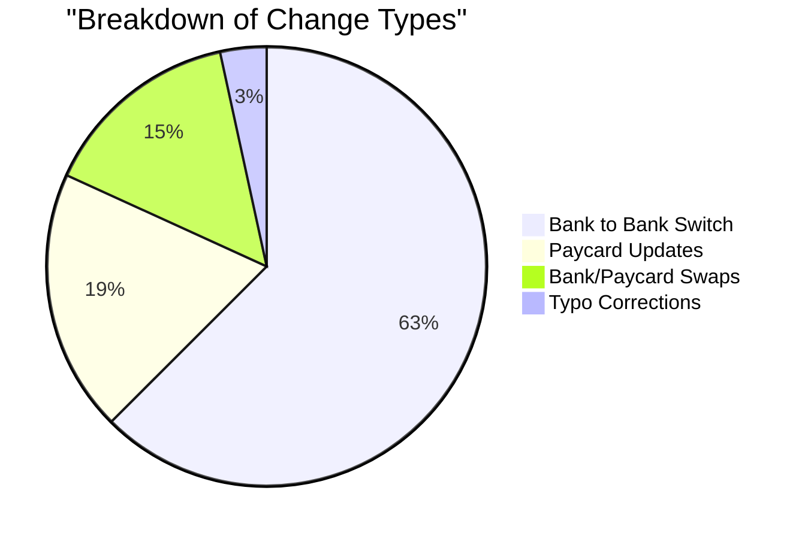

# 🏦 Direct Deposit Change Report (July 4–14, 2026)

This report summarizes the **88 updates** employees made to their direct deposit settings over the last 10 days. Direct deposit is how employees choose where their paycheck is sent, whether to a traditional bank account or a prepaid paycard.

---

## 📅 Changes by Day
The following table shows how many employees updated their payment info each day. July 7 and July 11 were our busiest days, with 20 updates each.

| Date | Number of Changes |
| :--- | :--- |
| July 14 | 12 |
| July 13 | 2 |
| July 12 | 2 |
| July 11 | 20 |
| July 10 | 12 |
| July 8 | 14 |
| July 7 | 20 |
| July 5 | 2 |
| July 4 | 2 |

---

## 🔄 What Kind of Changes Were Made?
Most employees are switching between different banks. A significant portion also use **rapid! paycards**, which are prepaid cards used instead of a standard bank account.

| Change Type | Description | Count |
| :--- | :--- | :--- |
| **Bank Switch** | Moving money from one bank to a completely different one. | ~55 |
| **Paycard Update** | Fixing or updating a rapid! paycard account number. | ~17 |
| **Bank ↔ Paycard** | Switching between a bank account and a rapid! paycard. | ~13 |
| **Typo Fixes** | Small corrections at the same bank (like fixing a single digit). | ~3 |

---

## ✏️ Notable Patterns
We noticed a few interesting trends in the data:

*   **The "Oops" Factor:** On July 7, we saw several clear typo fixes. This happens when an employee enters their account number (the specific ID for their bank pile) and realizes a digit was missing or wrong.
*   **Late Night Updates:** On July 8, employees were busy updating their paycards in two main groups: one right around midnight and another late at night around 11pm.
*   **Full Deposits:** Every single record showed that employees are sending 100% of their paycheck to one single destination rather than splitting it between multiple accounts.

---

## ✅ What Does This Mean?
*   **Employees Value Choice:** The high number of bank-to-bank switches shows that people frequently move their money to find better banking options.
*   **Paycards are Popular:** About 1 in 5 changes involved a rapid! paycard, showing it's a vital tool for many of our workers.
*   **Accuracy Matters:** The typo fixes on July 7 remind us that entering long strings of numbers can be tricky. Even a single digit off by one means the money won't land in the right spot.

Overall, the system is helping employees keep their payment info current so their hard-earned money gets exactly where it needs to go. 💸
