# UKG Developer Hub — Complete Architecture Map

> A comprehensive guide to **developer.ukg.com**: APIs, tools, authentication, and ecosystem.

---

## Table of Contents

1. [High-Level Overview](#1-high-level-overview)
2. [Product Ecosystem](#2-product-ecosystem)
3. [UKG Pro HCM — Deep Dive](#3-ukg-pro-hcm--deep-dive)
4. [UKG Pro WFM — Deep Dive](#4-ukg-pro-wfm--deep-dive)
5. [Authentication Landscape](#5-authentication-landscape)
6. [Integration Tools](#6-integration-tools)
7. [Platform Services & Emerging APIs](#7-platform-services--emerging-apis)
8. [Specialty Solutions](#8-specialty-solutions)
9. [Documentation Structure](#9-documentation-structure)
10. [Quick-Start Decision Tree](#10-quick-start-decision-tree)

---

## 1. High-Level Overview

```mermaid
graph TB
    subgraph "UKG Developer Hub (developer.ukg.com)"
        direction TB

        GS[🚀 Getting Started<br/>Call Your First API<br/>Auth Guide<br/>API Overview]

        subgraph "UKG Pro — Enterprise"
            HCM[UKG Pro HCM<br/>Human Capital Management]
            WFM[UKG Pro WFM<br/>Workforce Management]
            PP[UKG Pro Platform<br/>Webhooks & Subscriptions]
        end

        subgraph "UKG Ready — SMB"
            RDY[UKG Ready REST API]
        end

        subgraph "Specialty Solutions"
            PD[People-Doc<br/>HR Service Delivery]
            TK[Talk<br/>Frontline Engagement]
            PF[People Fabric<br/>Suite-Wide Data (Beta)]
        end

        subgraph "Integration Tools"
            ID[Integrations Dashboard<br/>HCM]
            IH[Integrations Hub / iHub<br/>WFM]
            TIP[Turnkey Integration Platform<br/>WFM]
        end

        CH[📰 What's New<br/>Changelog]
        CM[🤝 Community & Support]
    end

    GS --> HCM
    GS --> WFM
    GS --> PP
    GS --> RDY
    GS --> PF

    HCM --> ID
    WFM --> IH
    WFM --> TIP

    PF --> HCM
    PF --> WFM
```

---

## 2. Product Ecosystem

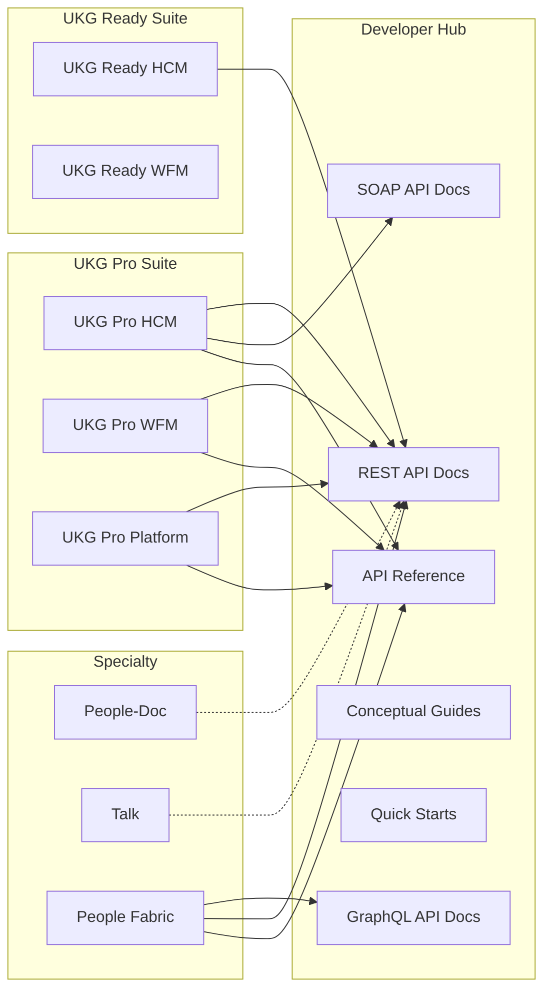

---

## 3. UKG Pro HCM — Deep Dive

### 3.1 REST API Domains

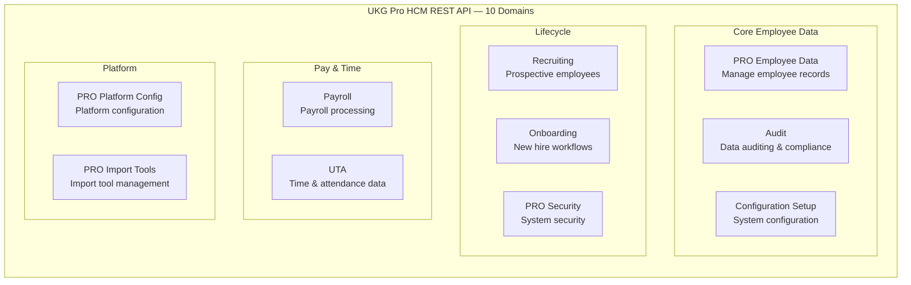

### 3.2 SOAP Services (20+ Services)

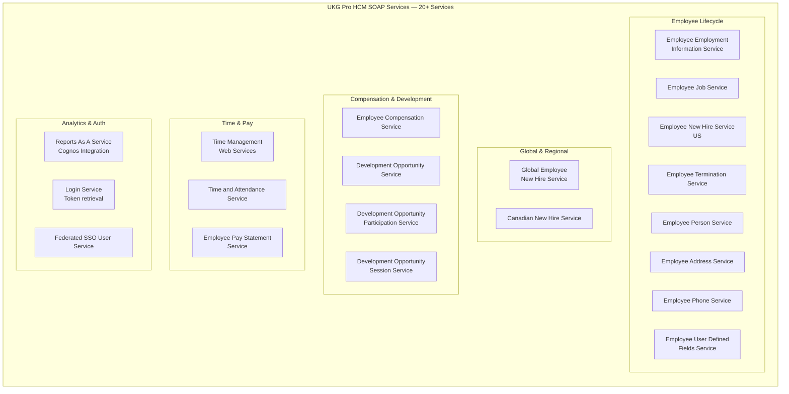

### 3.3 HCM Authentication Matrix

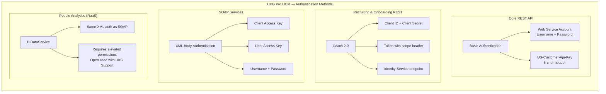

---

## 4. UKG Pro WFM — Deep Dive

### 4.1 REST API Domains (22 Domains)

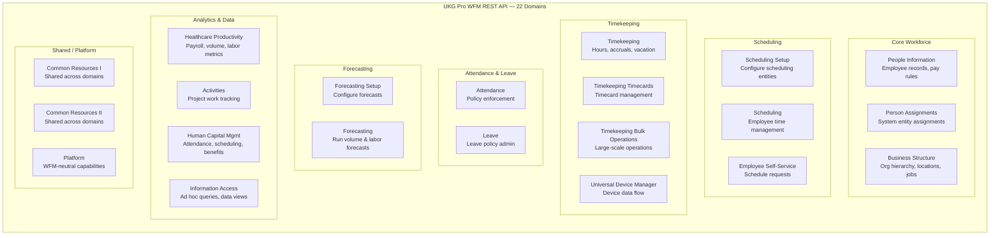

### 4.2 WFM Authentication Matrix

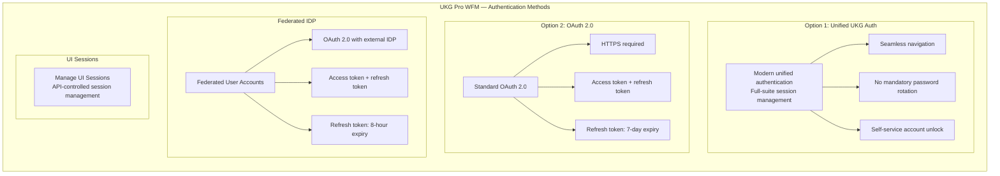

---

## 5. Authentication Landscape — Full Map

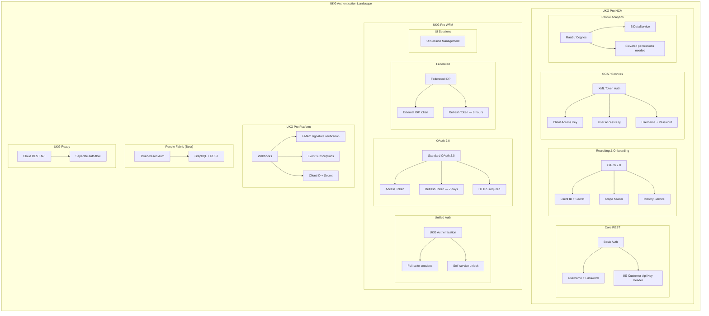

---

## 6. Integration Tools

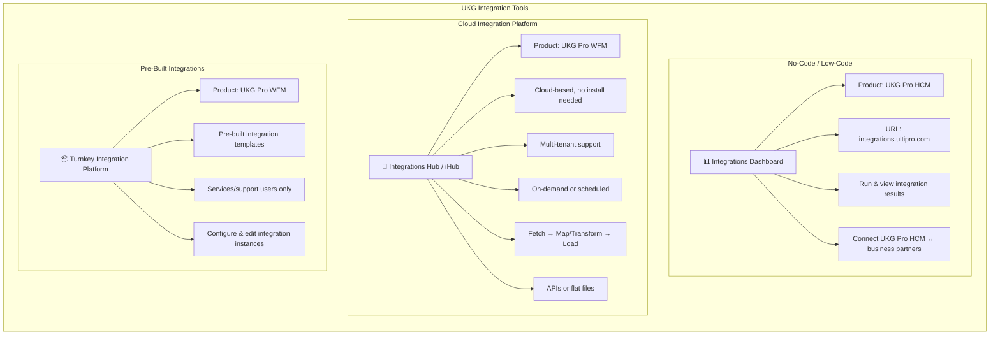

---

## 7. Platform Services & Emerging APIs

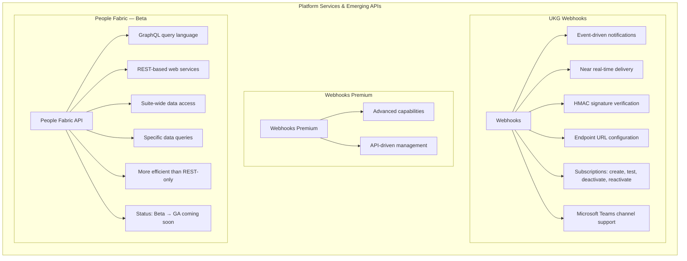

---

## 8. Specialty Solutions

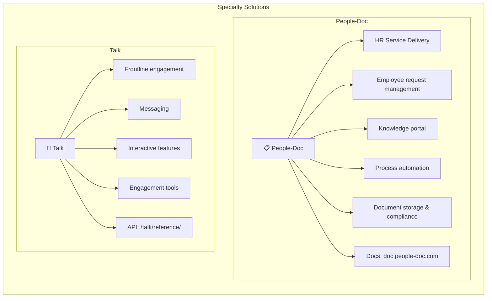

---

## 9. Documentation Structure

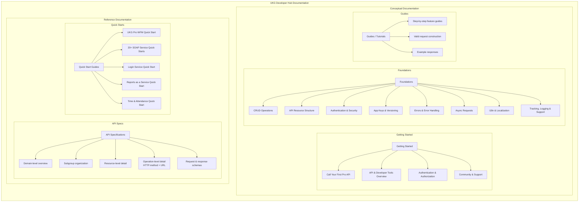

---

## 10. Quick-Start Decision Tree

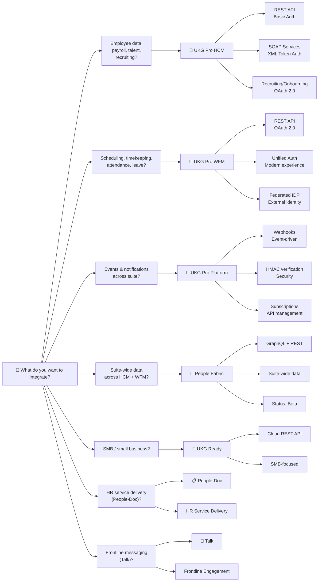

---

## Appendix: Key URLs

| Resource | URL |
|---|---|
| **Developer Hub** | `developer.ukg.com` |
| **HCM API Reference** | `developer.ukg.com/hcm/reference` |
| **WFM API Reference** | `developer.ukg.com/wfm/reference` |
| **Pro Platform** | `developer.ukg.com/proplatform/reference` |
| **People Fabric** | `developer.ukg.com/peoplefabric/reference` |
| **Talk API** | `developer.ukg.com/talk/reference` |
| **Integrations Dashboard** | `integrations.ultipro.com` |
| **Community Forum** | `community.ukg.com` |
| **Feature Requests** | `ukg.ideas.aha.io` |
| **Marketplace** | `marketplace.ukg.com` |
| **People-Doc Docs** | `doc.people-doc.com` |

---

## Appendix: Domain Quick Reference

### HCM REST Domains (10)

`Audit` · `Configuration Setup` · `Onboarding` · `Payroll` · `PRO Platform Config` · `PRO Security` · `PRO Employee Data` · `PRO Import Tools` · `Recruiting` · `UTA`

### HCM SOAP Services (20+)

`Employee Employment Information` · `Employee Job` · `Employee New Hire (US)` · `Employee Contacts` · `Employee User Defined Fields` · `Federated SSO User` · `Development Opportunity` · `Employee Compensation` · `Global Employee New Hire`
 · `Employee Termination` · `Employee Phone` · `Development Opportunity Participation` · `Development Opportunity Session` · `Login` · `Employee Pay Statement` · `Time Management WS` · `Employee Person` · `Time and Attendance` · `Reports
As A Service` · `Employee Address` · `Canadian New Hire`

### WFM REST Domains (22)

`Activities` · `Attendance` · `Business Structure` · `Common Resources I` · `Common Resources II` · `Employee Self-Service` · `Forecasting Setup` · `Forecasting` · `Healthcare Productivity` · `Human Capital Management` · `Information Acce
ss` · `Leave` · `People` · `Person Assignments` · `Platform` · `Scheduling Setup` · `Scheduling` · `Timekeeping Bulk Operations` · `Timekeeping Timecards` · `Timekeeping` · `Universal Device Manager`

---

*Last reviewed: 2025 · Source: [developer.ukg.com](https://developer.ukg.com)*

