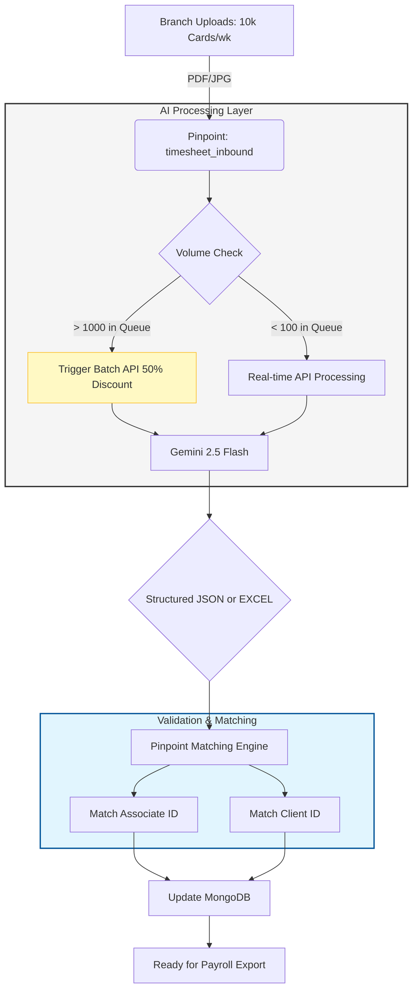
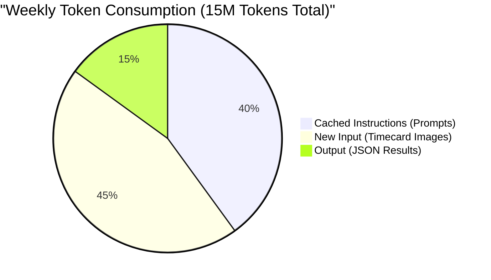
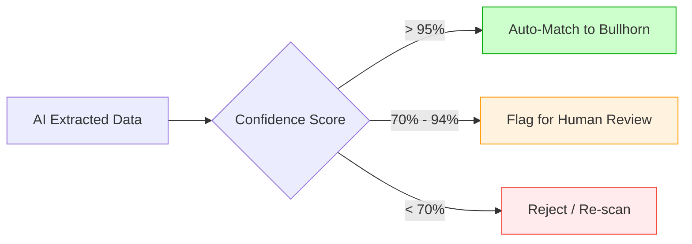

# 🚀 Scalability Blueprint: AI Timecard Processing
### **Volume: 10,000 Timecards / Week**

Processing 10,000 handwritten timecards weekly at the branch level represents a massive operational bottleneck if done manually. By leveraging **Gemini 2.5 Flash**, we shift from a labor-intensive manual entry model to a high-speed automated validation model.

---

## 1. 💰 Financial Impact Analysis (Weekly)

At 10,000 cards per week, the cost-benefit ratio is staggering. Manual entry is typically calculated at roughly **$1.50 per card** (accounting for labor, errors, and correction time).

| Metric | Manual Processing | AI Standard (Real-time) | AI Batch (Optimized) |
| :--- | :--- | :--- | :--- |
| **Processing Time** | ~500 Hours | ~2.5 Hours (Total Compute) | ~2.5 Hours (Total Compute) |
| **Cost per Card** | $1.50 | $0.0019 | **$0.00095** |
| **Weekly Total** | **$15,000.00** | **$19.00** | **$9.50** |
| **Annual Savings** | — | **$779,012** | **$779,506** |

---

## 2. 🏗️ Scalable Processing Architecture

At this volume, we move away from "Single-Threaded" processing to a **Parallel Batch Architecture**. This prevents Friday afternoon "bottlenecks" when branch offices typically upload their files.

---

## 3. 📉 Cost Breakdown: Tokens & Caching

To achieve the **$9.50/week** target, we utilize **Context Caching**. This stores the "Instructions" (the prompt) in Google's cache so we don't pay for those tokens in every individual timecard request.

*   **Caching Benefit:** Reduces per-request input costs by ~40%.
*   **Batch Benefit:** Reduces remaining costs by an additional 50%.

---

## 4. 🛠️ Technical Strategy for 10k/Week

### **A. Parallel Consumer Pattern**
To process 10,000 cards quickly, the RabbitMQ consumer should be scaled to multiple "workers."
*   **Recommendation:** Deploy 5–10 concurrent Node.js workers.
*   **Speed:** At 2 seconds per card (Gemini Flash speed), 5 workers can process the entire weekly volume of 10,000 cards in **~1.1 hours**.

### **B. Matching Strategy (Bullhorn/PeopleSoft)**
With 10k records, "Fuzzy Matching" becomes risky. We implement a **Tiered Confidence Score**:

### **C. Database Optimization**
At 40,000+ records a month, the `timesheets` collection in MongoDB will grow fast.
*   **Retention Policy:** Move images to Cold Storage (S3/GCS) after 60 days.
*   **Indexing:** Ensure `clientId`, `associateId`, and `weekEnding` are indexed to keep the Angular 18 UI snappy.

---

## 5. 📅 Roadmap to Scale

| Phase | Volume | Target | Focus |
| :--- | :--- | :--- | :--- |
| **Phase 1** | 1,000/wk | Prototype | Logic Accuracy & Webhook reliability. |
| **Phase 2** | 5,000/wk | Pilot | **Context Caching** implementation & RabbitMQ scaling. |
| **Phase 3** | 10,000/wk | Production | **Batch API** integration & Auto-matching to Bullhorn. |

### **Final Verdict**
At 10,000 cards per week, the **AI cost ($9.50)** is essentially "noise" compared to the value of the **500 hours of labor saved**. The primary engineering focus should be on the **Accuracy of the Matching Engine** (linking names to Bullhorn IDs) rather than the cost of the AI itself.
