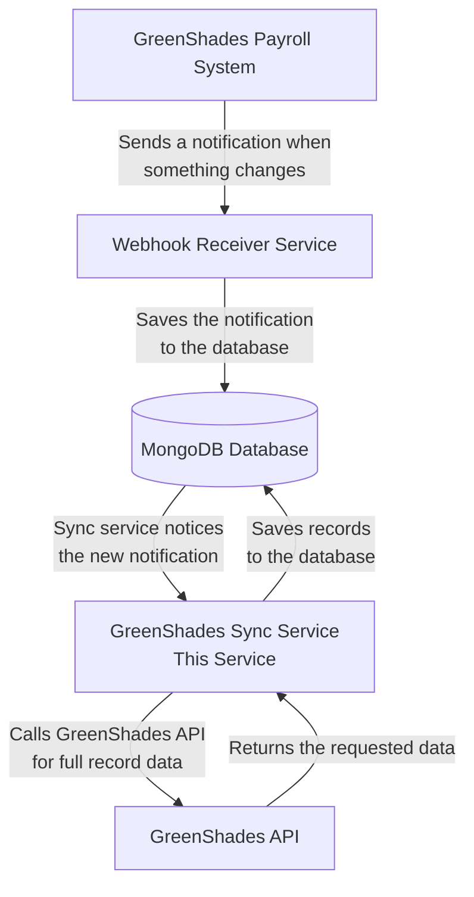
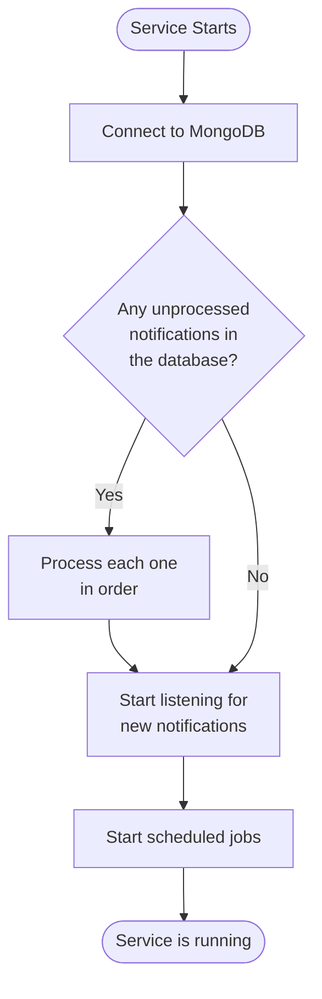
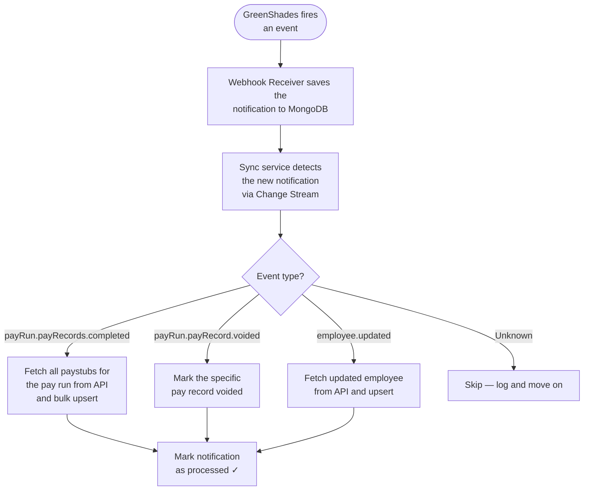
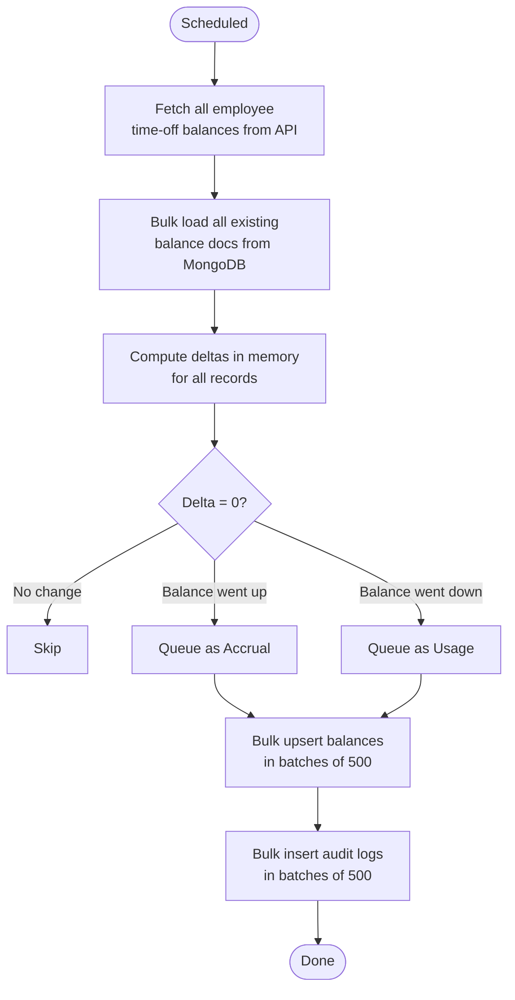
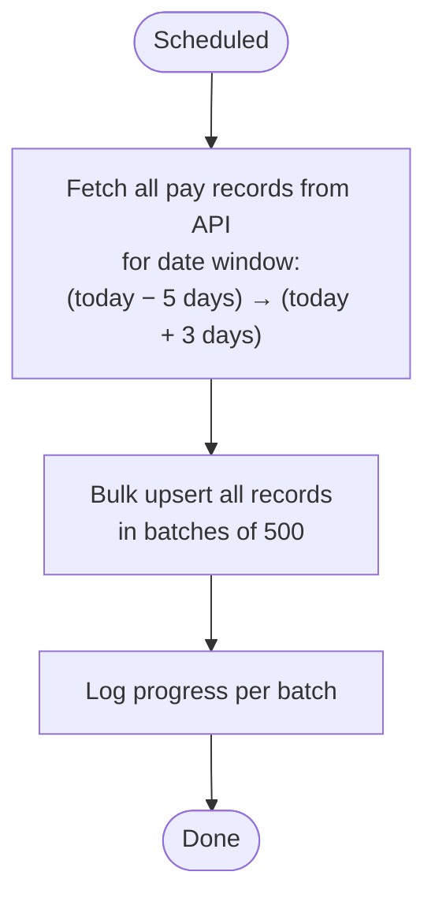
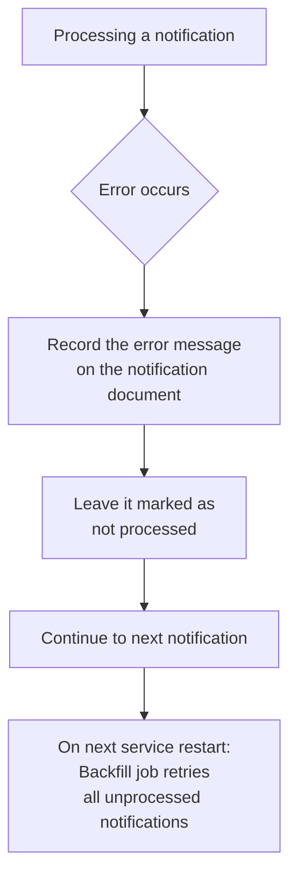
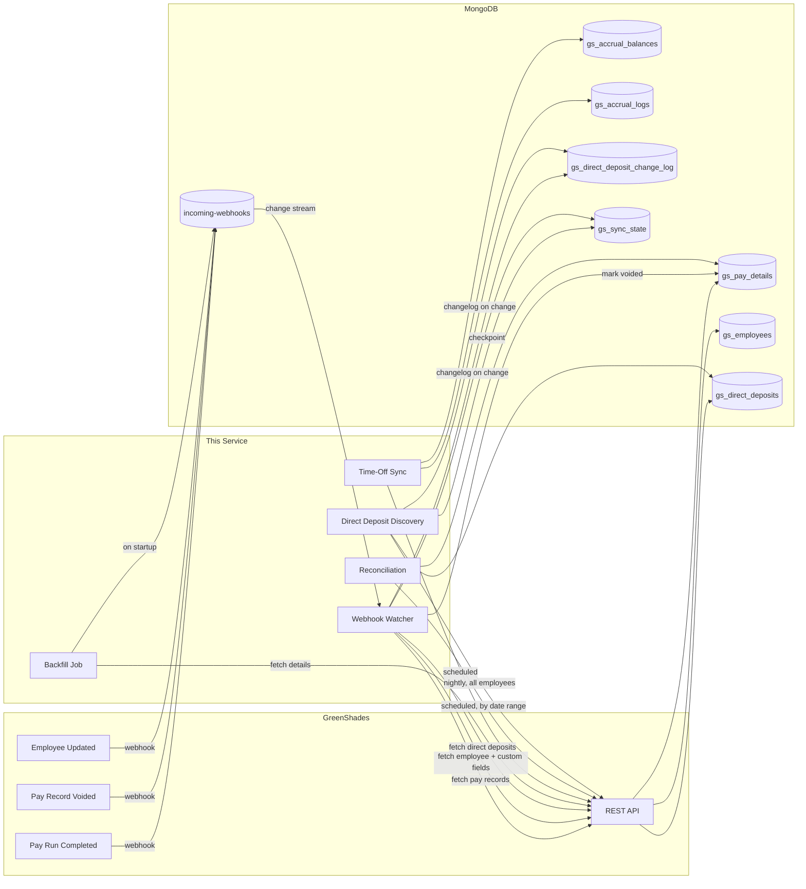
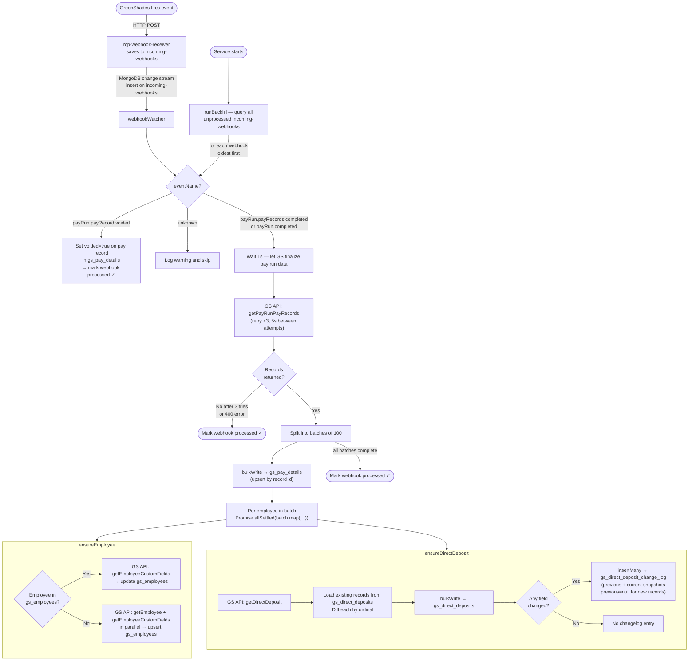
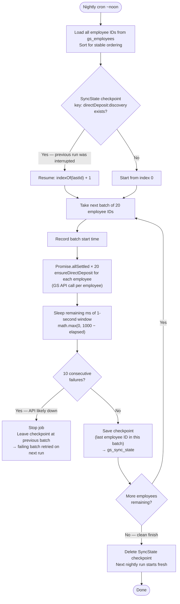

# RCP GreenShades Sync Service
> AI agent? Load [README.AI.md](./README.AI.md) for a token-efficient version of this file.

This service keeps our internal database automatically up to date with data from GreenShades (our payroll system). Instead of someone manually running a report and importing it every week, this service listens for activity from GreenShades and updates our records on its own.

---

## What Problem Does This Solve?

Previously, keeping our database current with GreenShades required:

1. Manually running a report in GreenShades
2. Downloading the result as a JSON file
3. Running an import script by hand
4. Hoping nothing was missed between runs

This service replaces all of that. It reacts to GreenShades events the moment they happen, and runs scheduled checks to catch anything that slipped through.

---

## How It Works — Big Picture

---

## When the Service Starts Up

Every time this service starts (or restarts), it checks whether any notifications were missed while it was offline, and processes them before doing anything else.

---

## Real-Time Event Handling

This is the core of the service. GreenShades sends a small notification — called a **webhook** — when key payroll events occur. The service handles three event types:

| Event | What it does |
|---|---|
| `payRun.payRecords.completed` | Fetches all paystubs for the completed pay run and upserts them |
| `payRun.payRecord.voided` | Marks the individual pay record as `voided: true` in the database |
| `employee.updated` | Fetches the updated employee record and upserts it |

> **What is a Change Stream?** It's a feature of MongoDB that lets the service be instantly notified when a new notification document is saved — without having to check the database on a timer.

> **What is a Resume Token?** If the service crashes mid-stream, it saves a bookmark (resume token) in the database so it knows exactly where it left off when it restarts — no events are missed or replayed.

---

## Scheduled Jobs

Two jobs run automatically on a schedule (configurable via environment variables).

### 1. Time-Off Balance Sync

GreenShades doesn't send webhooks for sick leave balance changes, so we pull those on a schedule. With ~55k records returned by the API (including past employees), the sync is done efficiently: one bulk read of all existing balances, delta computation in memory, then batched bulk writes — no per-record transactions.

Every change is written to an audit log (`gs_accrual_logs`) so there's a full history of when hours were earned and used.

### 2. Reconciliation

This job acts as a safety net. Rather than comparing pay run lists, it directly fetches all pay records from GreenShades for a rolling date window (5 days back through 3 days ahead) and bulk upserts them — catching any gaps or stale records in one pass.

---

## Health Check

The service exposes two simple URLs to confirm it's running:

| URL | What it shows |
|-----|--------------|
| `/health` | Is the service alive? When did it last process something? |
| `/status` | How many notifications are waiting to be processed? What are the cron schedules? |

---

## Error Handling

Failed notifications are never silently dropped. They stay in the database with their error message attached, and will be retried automatically the next time the service restarts.

---

## Data Flow Summary

---

## Webhook Event Processing — Detailed Flow

Both the real-time change stream watcher and the startup backfill job run the same event handlers. The difference is how they discover events to process.

---

## Nightly Direct Deposit Discovery — Detailed Flow

Runs every night against all 80,000+ employees to catch direct deposit changes that were not triggered by a webhook. Rate-limited to 20 requests/second, resumable via checkpoint, and protected by a circuit breaker.

