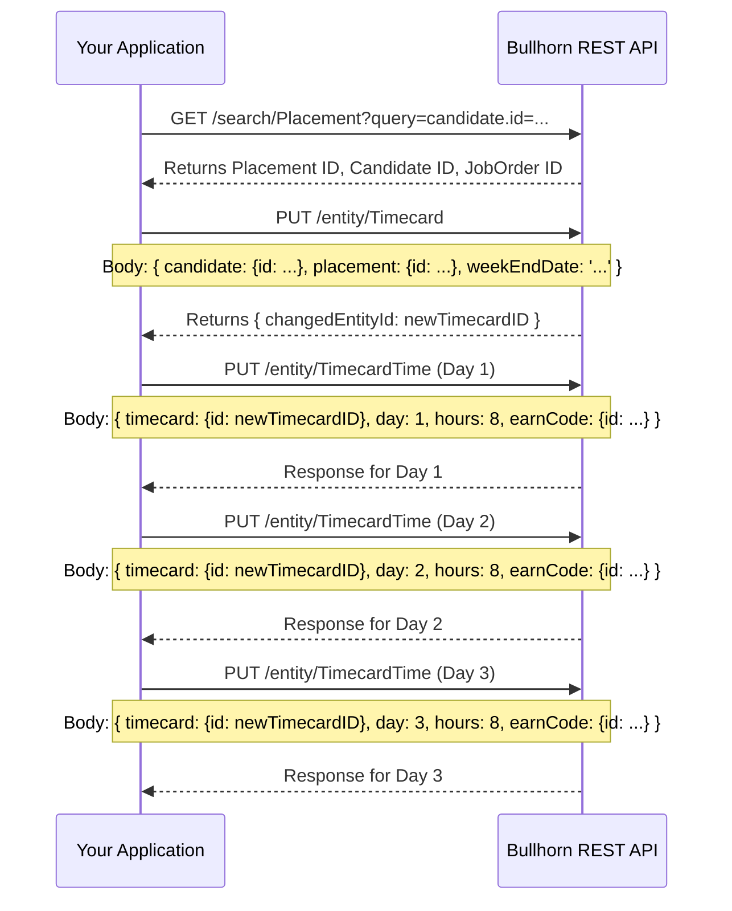

# Bullhorn API Integration: Candidates, Timecards, and Payroll
### Prompted and edited by Lawrence Ham

## 1. Bullhorn API Fundamentals

Before interacting with specific entities, it's crucial to understand the API's structure and authentication mechanism.

### 1.1. API Structure & Endpoint

The base URL for the Bullhorn REST API is dynamic and provided to you after you authenticate. It typically looks like this:

```
https://rest{cluster}.bullhornstaffing.com/rest-services/{corpToken}/
```

-   `{cluster}`: The specific data center cluster your instance is on (e.g., `21`, `90`).
-   `{corpToken}`: Your unique corporation token.

You receive both the `restUrl` and a session key (`BhRestToken`) after a successful login.

### 1.2. Authentication (OAuth 2.0)

Bullhorn uses the OAuth 2.0 authorization code flow. The process is a three-step dance:

1.  **Get Authorization Code**: Redirect the user to Bullhorn's `/oauth/authorize` endpoint. After they log in and approve, Bullhorn redirects them back to your specified `redirect_uri` with a temporary `code` in the query string.
2.  **Get Access/Refresh Tokens**: Exchange the authorization `code` for an `access_token` and a `refresh_token` by making a POST request to the `/oauth/token` endpoint.
3.  **Login and Get Session Token**: Use the `access_token` to call the `/login` endpoint. This is the crucial step that returns the `restUrl` and the `BhRestToken` (session token) you'll use for all subsequent API calls.

The `BhRestToken` must be included as a header in every API request:

```json
{
  "BhRestToken": "YOUR_SESSION_TOKEN_HERE"
}
```

### Node.js Example: Full Authentication Flow

```javascript
// Node.js 22 - Using built-in fetch

// Credentials (should be stored securely, e.g., in environment variables)
const config = {
    authUrl: 'https://auth.bullhornstaffing.com/oauth',
    apiUrl: 'https://rest.bullhornstaffing.com/rest-services', // Base, will be replaced
    clientId: 'YOUR_CLIENT_ID',
    clientSecret: 'YOUR_CLIENT_SECRET',
    username: 'YOUR_API_USERNAME',
    password: 'YOUR_API_PASSWORD'
};

async function getBullhornSession() {
    try {
        // Step 1 & 2 are combined for a non-interactive flow using password grant
        // Note: For user-facing apps, use the authorization_code grant.
        // For server-to-server, password grant is common.
        console.log('Step 1: Getting Access Token...');
        const tokenResponse = await fetch(`${config.authUrl}/token?grant_type=password&client_id=${config.clientId}&client_secret=${config.clientSecret}&username=${config.username}&password=${config.password}`, {
            method: 'POST',
        });

        if (!tokenResponse.ok) {
            throw new Error(`Failed to get access token: ${tokenResponse.statusText}`);
        }

        const tokenData = await tokenResponse.json();
        const accessToken = tokenData.access_token;
        console.log('Access Token received.');

        // Step 3: Login to get BhRestToken and REST URL
        console.log('Step 2: Logging in to get session token...');
        const loginUrl = `${config.apiUrl}/login?version=*&access_token=${accessToken}`;
        const loginResponse = await fetch(loginUrl, { method: 'POST' });

        if (!loginResponse.ok) {
            throw new Error(`Failed to log in: ${loginResponse.statusText}`);
        }
        
        const loginData = await loginResponse.json();
        console.log('Login successful. Session is active.');

        return {
            BhRestToken: loginData.BhRestToken,
            restUrl: loginData.restUrl
        };

    } catch (error) {
        console.error('Authentication failed:', error);
        throw error;
    }
}

// Example usage:
// getBullhornSession().then(session => console.log(session));
```

## 2. Core Entities for Payroll Workflow

The process of creating a timecard involves several interconnected entities. Understanding their relationships is key.

### 2.1. Candidate

The `Candidate` entity represents a person in your Bullhorn system. They are the ones performing the work.

**Key Fields:**
-   `id`: The unique Bullhorn ID for the candidate.
-   `firstName`, `lastName`: Name.
-   `email`, `phone`: Contact information.
-   `status`: (e.g., 'New Lead', 'Actively Looking', 'Placed').
-   `owner`: The user who owns the candidate record.
-   `customText1`...`customText40`: Custom fields for additional data.

**Node.js: Query a Candidate by Email**
```javascript
async function findCandidateByEmail(session, email) {
    const { restUrl, BhRestToken } = session;
    const fields = 'id,firstName,lastName,email,status';
    // Use a 'where' clause for searching. Note the single quotes around the email.
    const url = `${restUrl}search/Candidate?query=email:'${email}'&fields=${fields}`;

    const response = await fetch(url, {
        headers: { 'BhRestToken': BhRestToken }
    });

    if (!response.ok) throw new Error(`API Error: ${response.statusText}`);
    
    const data = await response.json();
    return data.data[0]; // The search endpoint returns an array
}
```

### 2.2. JobOrder

A `JobOrder` represents a specific job opening at a client company.

**Key Fields:**
- `id`: The unique ID for the job.
- `title`: The job title.
- `clientCorporation`: A to-one association to the `ClientCorporation` entity.
- `status`: (e.g., 'Open', 'Filled', 'Cancelled').
- `startDate`, `endDate`: The duration of the job.

### 2.3. Placement

The `Placement` is the most critical entity in this workflow. **It is the record that connects a specific `Candidate` to a specific `JobOrder`**. It contains the financial details of the assignment.

**Key Fields:**
-   `id`: The unique ID for the placement.
-   `candidate`: A to-one association to the `Candidate`.
-   `jobOrder`: A to-one association to the `JobOrder`.
-   `dateBegin`, `dateEnd`: The start and end dates of the assignment.
-   `status`: (e.g., 'Submitted', 'Approved', 'Completed').
-   `payRate`: The rate the candidate is paid per hour/day/year.
-   `billRate`: The rate the client is billed per hour/day/year.
-   `employmentType`: (e.g., 'Contract', 'Permanent').

**Node.js: Find a Candidate's Active Placement**
```javascript
async function findActivePlacementForCandidate(session, candidateId) {
    const { restUrl, BhRestToken } = session;
    const fields = 'id,jobOrder,dateBegin,payRate,billRate';
    const query = `candidate.id=${candidateId} AND status='Approved'`; // Find approved, active placements
    const url = `${restUrl}search/Placement?query=${query}&fields=${fields}`;
    
    const response = await fetch(url, {
        headers: { 'BhRestToken': BhRestToken }
    });

    if (!response.ok) throw new Error(`API Error: ${response.statusText}`);

    const data = await response.json();
    // A candidate might have multiple placements, you may need logic to find the correct one
    return data.data[0];
}
```

### 2.4. Timecard

A `Timecard` acts as a header or a container for a specific work period (usually a week). It does **not** contain the actual hours worked.

**Key Fields:**
-   `id`: The unique ID for the timecard header.
-   `candidate`: Association to the `Candidate`.
-   `placement`: Association to the `Placement`.
-   `weekEndDate`: The date of the last day of the work week (e.g., a Sunday).
-   `status`: (e.g., 'New', 'Submitted', 'Approved', 'Processed').
-   `comments`: Any notes related to the timecard.

### 2.5. TimecardTime (Timecard Entry)

This is the "line item" of a `Timecard`. Each `TimecardTime` record represents the hours worked on a specific day for a specific pay type.

**Key Fields:**
-   `id`: The unique ID for this time entry.
-   `timecard`: **Crucial association** to the parent `Timecard` record.
-   `day`: A number representing the day of the week (e.g., 1 for Monday, 2 for Tuesday...). The exact mapping can vary; check your Bullhorn configuration.
-   `hours`: The number of hours worked.
-   `earnCode`: Association to an `EarnCode` entity (see below).
-   `payRate`, `billRate`: The rates for this specific entry. These are often inherited from the `Placement` but can be overridden.

### 2.6. EarnCode

An `EarnCode` defines the type of pay. This allows you to differentiate between regular hours, overtime, holiday pay, etc.

**Key Fields:**
- `id`: The unique ID.
- `title`: (e.g., 'Regular', 'Overtime', 'Holiday').
- `type`: The type of code.

You will need the `id` of the appropriate `EarnCode` when creating `TimecardTime` entries.

## 3. The Timecard Insertion Process

Creating a timecard in Bullhorn is a multi-step process. You cannot create a timecard and its time entries in a single API call.

1.  **Gather IDs**: Find the `id` for the `Candidate` and their active `Placement`.
2.  **Create the Timecard Header**: Send a `PUT` request to the `entity/Timecard` endpoint to create the main record for the week.
3.  **Capture the New Timecard ID**: The response from step 2 will contain the `id` of the newly created `Timecard`.
4.  **Create TimecardTime Entries**: For each day worked, send a separate `PUT` request to the `entity/TimecardTime` endpoint. In the body of each request, you must associate it with the `timecard.id` you received in step 3.

### Mermaid.js Diagram: Timecard Insertion Flow



### Node.js 22: Full Timecard Insertion Code

This function ties all the concepts together.

```javascript
// Assumes you have a 'session' object from the getBullhornSession() function
// Assumes you have the ID for the 'Regular' EarnCode

async function createTimecardForPlacement(session, placementId, weekEndDate, dailyHours, regularEarnCodeId) {
    const { restUrl, BhRestToken } = session;

    // A helper for making authenticated Bullhorn API calls
    const bullhornFetch = async (endpoint, options = {}) => {
        const url = `${restUrl}${endpoint}`;
        const defaultOptions = {
            headers: {
                'BhRestToken': BhRestToken,
                'Content-Type': 'application/json'
            }
        };
        const response = await fetch(url, { ...defaultOptions, ...options });
        if (!response.ok) {
            const errorBody = await response.text();
            throw new Error(`Bullhorn API Error on ${endpoint}: ${response.statusText} - ${errorBody}`);
        }
        return response.json();
    };

    try {
        // Step 1: Get Placement details (we need the candidate.id from it)
        console.log(`Fetching details for Placement ID: ${placementId}`);
        const placementData = await bullhornFetch(`entity/Placement/${placementId}?fields=candidate`);
        const candidateId = placementData.data.candidate.id;
        if (!candidateId) {
            throw new Error(`Could not find a candidate associated with Placement ${placementId}`);
        }
        console.log(`Found Candidate ID: ${candidateId}`);
        
        // Step 2: Create the Timecard header
        // NOTE: Bullhorn uses PUT for both create and update.
        // For creation, you omit the entity ID from the URL.
        console.log(`Creating Timecard header for week ending ${weekEndDate}...`);
        const timecardBody = {
            candidate: { id: candidateId },
            placement: { id: placementId },
            weekEndDate: weekEndDate,
            status: 'New' // Initial status
        };

        const timecardResponse = await bullhornFetch('entity/Timecard', {
            method: 'PUT',
            body: JSON.stringify(timecardBody)
        });

        const newTimecardId = timecardResponse.changedEntityId;
        if (!newTimecardId) {
            throw new Error('Failed to create Timecard header or get its ID.');
        }
        console.log(`Successfully created Timecard with ID: ${newTimecardId}`);

        // Step 3: Create a TimecardTime entry for each day with hours
        console.log('Creating daily TimecardTime entries...');
        const timeEntriesPromises = [];

        for (const [day, hours] of Object.entries(dailyHours)) {
            if (hours > 0) {
                const timeEntryBody = {
                    timecard: { id: newTimecardId },
                    day: parseInt(day, 10), // Ensure day is a number
                    hours: hours,
                    earnCode: { id: regularEarnCodeId }
                };

                console.log(`  - Adding ${hours} hours for day ${day}`);
                const promise = bullhornFetch('entity/TimecardTime', {
                    method: 'PUT',
                    body: JSON.stringify(timeEntryBody)
                });
                timeEntriesPromises.push(promise);
            }
        }
        
        await Promise.all(timeEntriesPromises);
        console.log('All daily time entries created successfully.');

        return { success: true, timecardId: newTimecardId };

    } catch (error) {
        console.error('Error in createTimecardForPlacement:', error);
        return { success: false, error: error.message };
    }
}

// --- Example Usage ---
async function main() {
    try {
        const session = await getBullhornSession();
        
        const PLACEMENT_ID = 12345; // The ID of the candidate's active assignment
        const REGULAR_EARN_CODE_ID = 1; // The ID for 'Regular' pay type
        const WEEK_END_DATE = '2023-10-29'; // Typically a Sunday
        
        const hoursWorked = {
            1: 8, // Monday
            2: 8, // Tuesday
            3: 8, // Wednesday
            4: 8, // Thursday
            5: 8, // Friday
            6: 0, // Saturday
            7: 0, // Sunday
        };

        const result = await createTimecardForPlacement(
            session,
            PLACEMENT_ID,
            WEEK_END_DATE,
            hoursWorked,
            REGULAR_EARN_CODE_ID
        );

        console.log('Final Result:', result);

    } catch (error) {
        console.error('Main process failed.');
    }
}

// main(); // Uncomment to run
```

## 4. Other Related Payroll Entities

While the `Placement` -> `Timecard` -> `TimecardTime` flow is the most common, other entities are used for more complex payroll scenarios like expenses and adjustments.

### 4.1. PayableCharge & BillableCharge

These entities are used to record expenses, bonuses, commissions, or other financial transactions that aren't based on hourly work.

-   **`PayableCharge`**: Money that needs to be **paid** to the candidate.
-   **`BillableCharge`**: Money that needs to be **billed** to the client.

They are often created in pairs but don't have to be. For example, a non-reimbursable expense might only have a `BillableCharge`.

**Key Fields:**
- `id`: The charge ID.
- `placement`: The `Placement` this charge is associated with.
- `transactionDate`: When the charge occurred.
- `quantity`, `rate`: The amount of the charge (e.g., quantity=50, rate=1 for a $50 expense).
- `description`: A text description of the charge.
- `billable`, `payable`: Boolean flags.

These charges are typically processed alongside timecards to generate a complete invoice for the client and a full paystub for the candidate.

## Conclusion

Successfully integrating with Bullhorn's API for payroll requires a solid understanding of its entity relationships. The `Placement` entity is the central hub, connecting the `Candidate` and `JobOrder` and providing the financial context for `Timecard` creation. The process is granular, requiring separate API calls to first create the `Timecard` header and then populate it with `TimecardTime` entries. By following the structured approach outlined in this document, developers can build robust and reliable integrations.

For the most up-to-date and exhaustive list of all entity fields, always refer to the official [Bullhorn REST API Reference](https://bullhorn.github.io/rest-api-docs/).
