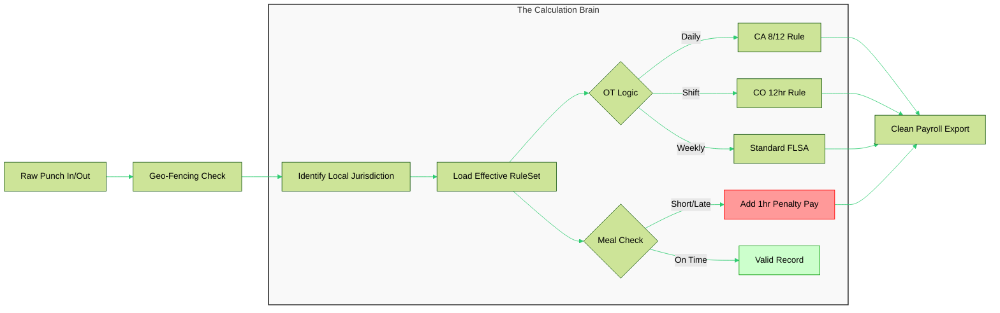
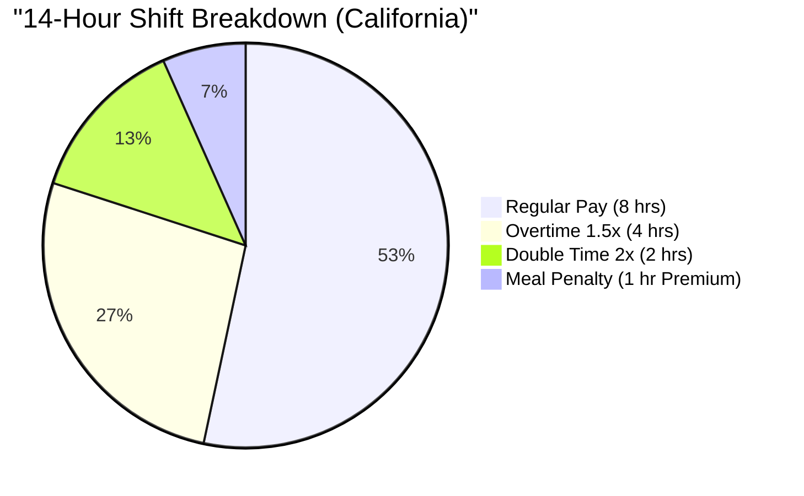
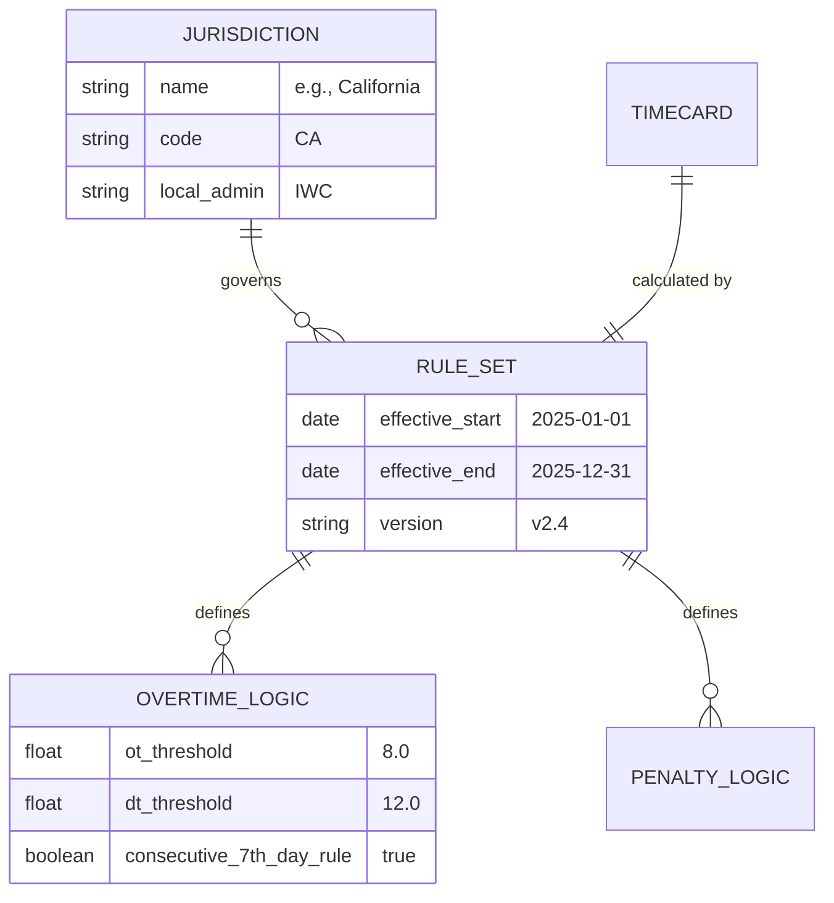
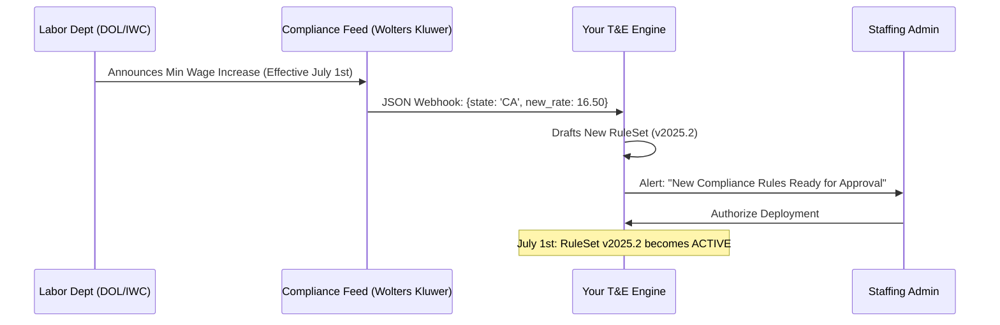

# 🛡️ Next-Gen Compliance Architecture: T&E Engine
### *A Technical Blueprint for Multi-State Labor Law Automation*

Moving from a "data entry tool" to a **"Legal Compliance Engine."** In the U.S. staffing industry, the software is the first line of defense against class-action labor lawsuits.

---

## 1. 🗺️ The Jurisdictional Trigger Matrix
State laws are not uniform. Your system must dynamically toggle logic based on the **Work Site Geolocation**.

| State | 🟠 Daily OT (1.5x) | 🔴 Double Time (2.0x) | 🍱 Meal/Rest Penalties | ⚖️ Key Statute |
| :--- | :---: | :---: | :---: | :--- |
| **California** | > 8 hrs | > 12 hrs | **1 hr Premium Pay** | IWC Wage Orders |
| **Nevada** | > 8 hrs | N/A | Mandatory Breaks | NRS 608.018 |
| **Alaska** | > 8 hrs | N/A | N/A | AS 23.10.060 |
| **Colorado** | > 12 hrs | N/A | 10m Rest / 30m Meal | COMPS Order #38 |
| **New York** | 40 hrs Weekly | N/A | **Spread of Hours** | NYCRR 142-2.4 |

> **💡 The "Spread of Hours" Rule (NY):** If a candidate's workday starts at 8:00 AM and ends at 7:00 PM (11-hour spread), they are owed an **additional hour of pay at minimum wage**, even if they only worked 8 hours total.

---

## 2. 🧠 The "Smart-Punch" Logic Flow
The system doesn't just record a timestamp; it evaluates it against a versioned rule set.

---

## 3. 📊 Visualizing the "Pay Bucket" Distribution
In a complex state like California, a 14-hour shift is not just "14 hours." It is fragmented into four distinct financial buckets. Your database must store these as separate line items for PeopleSoft/BTE.

---

## 4. 🗄️ Database Schema: Effective-Dated Architecture
To handle laws that change mid-year (e.g., Minimum Wage hikes on July 1st), you must use **Versioned RuleSets**.

---

## 5. 🔄 The Compliance Lifecycle (Staying Up-To-Date)
Automation of "Law Updates" is what makes your software professional. You should integrate with legal data feeds to trigger updates.

---

## 6. 🛡️ The "Audit-Proof" Attestation
One of BTE’s strongest features is the **Employee Attestation**. This is the data that stops lawsuits. Before submitting a timecard, the employee must digitally sign a statement.

**Data variables to store per timecard:**
*   `attestation_id`: Unique hash of the legal text shown to the user.
*   `ip_address`: Where they signed from.
*   `meal_period_waived`: `Boolean` (Critical for CA).
*   `injury_reported`: `Boolean`.

### 🚀 Summary of the "Winning" Strategy
To win against Bullhorn/BTE, your software should offer **"Compliance-as-a-Service."** 
1. **Never** let a user "build" a California rule from scratch. 
2. **Always** provide a "Verified Template" that your legal researchers have vetted.
3. **Automatically** flag "At-Risk" timecards (e.g., a worker with 4.9 hours and no lunch) in real-time before the shift even ends.
