# 🌐 VeloCloud Orchestrator Configuration Guide
## Connecting Printers at Remote Locations to Cloud-Hosted Server

---

## 📋 Table of Contents

1. [Architecture Overview](#architecture-overview)
2. [Prerequisites](#prerequisites)
3. [VeloCloud Orchestrator Configuration](#velocloud-orchestrator-configuration)
4. [Network Configuration](#network-configuration)
5. [Printer Setup at Each Location](#printer-setup-at-each-location)
6. [Cloud Server Configuration](#cloud-server-configuration)
7. [Testing & Troubleshooting](#testing--troubleshooting)

---

## 🏗️ Architecture Overview

```mermaid
graph TB
    subgraph "Cloud Infrastructure"
        CS[☁️ Cloud Server<br/>Print Management]
        VCO[🎛️ VeloCloud Orchestrator<br/>Central Management]
    end
    
    subgraph "VeloCloud Gateway Layer"
        VCG1[🌉 VeloCloud Gateway<br/>Region 1]
        VCG2[🌉 VeloCloud Gateway<br/>Region 2]
    end
    
    subgraph "Branch Location 1"
        VCE1[📦 VeloCloud Edge<br/>10.1.0.1]
        SW1[🔀 Switch]
        P1[🖨️ Printer 1<br/>10.1.10.10]
        P2[🖨️ Printer 2<br/>10.1.10.11]
    end
    
    subgraph "Branch Location 2"
        VCE2[📦 VeloCloud Edge<br/>10.2.0.1]
        SW2[🔀 Switch]
        P3[🖨️ Printer 3<br/>10.2.10.10]
        P4[🖨️ Printer 4<br/>10.2.10.11]
    end
    
    subgraph "Branch Location 3"
        VCE3[📦 VeloCloud Edge<br/>10.3.0.1]
        SW3[🔀 Switch]
        P5[🖨️ Printer 5<br/>10.3.10.10]
    end
    
    CS <-->|IPSec Tunnels| VCG1
    CS <-->|IPSec Tunnels| VCG2
    VCO -.->|Management| VCE1
    VCO -.->|Management| VCE2
    VCO -.->|Management| VCE3
    
    VCG1 <-->|Encrypted| VCE1
    VCG2 <-->|Encrypted| VCE2
    VCG1 <-->|Encrypted| VCE3
    
    VCE1 --> SW1
    SW1 --> P1
    SW1 --> P2
    
    VCE2 --> SW2
    SW2 --> P3
    SW2 --> P4
    
    VCE3 --> SW3
    SW3 --> P5
    
    style CS fill:#e1f5ff
    style VCO fill:#fff4e1
    style VCE1 fill:#e8f5e9
    style VCE2 fill:#e8f5e9
    style VCE3 fill:#e8f5e9
```

### 🎯 Key Components

| Component | Purpose | Location |
|-----------|---------|----------|
| **VeloCloud Orchestrator** | Centralized management console | Cloud/Hosted |
| **VeloCloud Gateway (VCG)** | Cloud-based traffic optimization | Multiple regions globally |
| **VeloCloud Edge (VCE)** | Branch appliance/CPE | Each branch location |
| **Cloud Server** | Print management application | Cloud provider (AWS/Azure/GCP) |
| **Network Printers** | Print devices | Each branch LAN |

---

## ✅ Prerequisites

### 📌 Required Information

Before starting configuration, gather:

- ✔️ VeloCloud Orchestrator URL and credentials
- ✔️ Activation keys for each Edge device
- ✔️ Cloud server public IP address
- ✔️ Subnet ranges for each branch location
- ✔️ Printer IP addresses (static recommended)
- ✔️ Network topology documentation

### 🔧 Hardware Requirements

- **VeloCloud Edge devices** at each branch (Edge 500/600/3000 series)
- **Network printers** with Ethernet connectivity
- **Managed switches** (recommended for printer VLANs)

### 🌐 Network Planning


**Recommended Subnet Structure:**
- Management: `10.x.0.0/24`
- User devices: `10.x.1.0/24`
- Printers: `10.x.10.0/24`
- Servers: `10.x.20.0/24`

---

## 🎛️ VeloCloud Orchestrator Configuration

### Step 1: Initial Setup & Login

1. **Access the Orchestrator**
   ```
   https://your-orchestrator-url.velocloud.net
   ```

2. **Navigate to:** `Configure > Edges`

### Step 2: Add Edge Devices

#### 📦 For Each Branch Location:


**Configuration Steps:**

1. **Add New Edge Device**
   - Go to `Configure > Edges`
   - Click **"New Edge"**
   - Fill in details:
     - **Name:** `Branch-1-Edge`
     - **Model:** Select your Edge model
     - **Site:** Branch Location 1
     - **Profile:** Create/Select profile

2. **Generate Activation Key**
   - Click on the newly created Edge
   - Navigate to **"Device"** tab
   - Copy the **Activation Key**
   - Note: Keys expire in 24 hours

### Step 3: Configure Edge Profiles

#### 🔧 Create a Standard Branch Profile

Navigate to: `Configure > Profiles > Create New Profile`

**Profile Settings:**

| Setting | Value | Notes |
|---------|-------|-------|
| **Name** | `Branch-Standard` | Template for all branches |
| **Type** | Branch | Not Hub |
| **Bandwidth** | Per location | Match internet capacity |

#### 🌐 Interface Configuration

```mermaid
graph TD
    subgraph "VeloCloud Edge Interfaces"
        GE1[GE1 - WAN Primary<br/>DHCP/Static]
        GE2[GE2 - WAN Backup<br/>Optional]
        GE3[GE3 - LAN<br/>10.x.0.1/16]
        GE4[GE4 - Printers<br/>10.x.10.1/24]
    end
    
    INT[🌐 Internet] --> GE1
    GE1 --> VCG[VeloCloud Gateway]
    GE3 --> LAN[💻 User Devices]
    GE4 --> PRINT[🖨️ Printers]
    
    style GE1 fill:#e3f2fd
    style GE3 fill:#e8f5e9
    style GE4 fill:#fff3e0
```

**LAN Interface Configuration:**

1. Go to `Configure > Profiles > [Your Profile] > Device`
2. Under **"LAN Interfaces"**, configure:

```yaml
Interface: GE3
  Mode: Routed
  Addressing:
    Type: Static
    IP: 10.x.0.1
    Subnet: 255.255.0.0 (/16)
  DHCP Server: Enabled
    Range: 10.x.1.100 - 10.x.1.200
  
Interface: GE4 (Printer VLAN)
  Mode: Routed
  Addressing:
    Type: Static
    IP: 10.x.10.1
    Subnet: 255.255.255.0 (/24)
  DHCP Server: Disabled (use reservations)
```

### Step 4: Configure Business Policies

#### 🚦 Traffic Rules for Print Services

Navigate to: `Configure > Profiles > [Your Profile] > Business Policy`

**Create Print Traffic Rule:**


**Rule Configuration:**

| Parameter | Setting | Purpose |
|-----------|---------|---------|
| **Name** | `Print-Traffic` | Identify print jobs |
| **Match** | Destination Port: 515, 631, 9100 | Common print protocols |
| **Application** | Custom - Printing | Tag traffic type |
| **Priority** | Medium | Balance with other traffic |
| **Link Steering** | Auto | Let DMPO optimize |
| **Firewall** | Allow | Permit print traffic |

**Add the rule:**

```
1. Click "New Rule"
2. Set Match Criteria:
   - Type: Port
   - Protocol: TCP
   - Destination Port: 515,631,9100
3. Set Action:
   - Priority: Medium
   - Link: Auto (DMPO)
   - Firewall: Allow
4. Save Rule
```

### Step 5: Configure Firewall Rules

#### 🔒 Security Configuration

Navigate to: `Configure > Profiles > [Your Profile] > Firewall`

**Inbound Rules (from Cloud Server to Printers):**

```mermaid
graph TD
    A[☁️ Cloud Server] -->|1. Print Job| B{VeloCloud Gateway}
    B -->|2. IPSec Tunnel| C{VeloCloud Edge}
    C -->|3. Firewall Check| D{Rule Match?}
    D -->|✅ Allow| E[🖨️ Printer]
    D -->|❌ Block| F[🚫 Drop]
    
    style D fill:#fff9c4
    style E fill:#c8e6c9
    style F fill:#ffcdd2
```

**Create Firewall Rules:**

**Rule 1: Allow Cloud Server to Printers**
```yaml
Name: Cloud-to-Printers
Match:
  Source: <Cloud Server IP>
  Destination: 10.0.0.0/8 (all branch subnets)
  Ports: 515, 631, 9100
  Protocol: TCP
Action: Allow
Direction: Inbound
```

**Rule 2: Allow Printer Management (SNMP)**
```yaml
Name: Printer-Management
Match:
  Source: <Cloud Server IP>
  Destination: 10.0.0.0/8
  Ports: 161, 162
  Protocol: UDP
Action: Allow
Direction: Inbound
```

**Rule 3: Block Inter-Branch Printer Access** (optional)
```yaml
Name: Block-Cross-Site-Printing
Match:
  Source: 10.1.0.0/16
  Destination: 10.2.0.0/16, 10.3.0.0/16
  Ports: 515, 631, 9100
Action: Deny
Direction: Any
```

### Step 6: Configure Cloud Gateway Connection

#### ☁️ Connect to Your Cloud Server


**Option A: Connect to Existing VPN**

If your cloud server is in AWS/Azure/GCP:

1. Navigate to: `Configure > Edges > [Your Edge] > Device`
2. Under **"Cloud VPN"**, click **"Add"**
3. Configure:

```yaml
Type: IKEv2 IPSec
Peer IP: <Your Cloud Server Public IP>
Pre-Shared Key: <Generate strong key>
Local Subnets: 10.1.0.0/16, 10.2.0.0/16, 10.3.0.0/16
Remote Subnets: <Cloud Server Subnet>
Encryption: AES-256
Authentication: SHA-256
```

**Option B: Use VeloCloud Gateway as Proxy**

1. Configure cloud server to route through VeloCloud Gateway
2. No direct IPSec needed
3. Traffic flows: Cloud Server → VCG → VCE → Printer

### Step 7: Configure Routing

#### 🛣️ Static Routes

Navigate to: `Configure > Profiles > [Your Profile] > Device > Routing`

**Add Static Routes for Printer Subnets:**

```
Route 1:
  Destination: 10.1.10.0/24
  Gateway: Local (Branch 1 printers)
  Interface: GE4
  
Route 2:
  Destination: 10.2.10.0/24
  Gateway: Via VPN (Branch 2 printers)
  Next Hop: VeloCloud Gateway
  
Route 3:
  Destination: 10.3.10.0/24
  Gateway: Via VPN (Branch 3 printers)
  Next Hop: VeloCloud Gateway
```

---

## 🌐 Network Configuration

### VLAN Setup (If Using VLANs)

```mermaid
graph TB
    subgraph "Branch Network with VLANs"
        VCE[VeloCloud Edge<br/>Trunk Port]
        SW[Managed Switch]
        
        subgraph "VLAN 10 - Management"
            V10[10.x.0.0/24]
        end
        
        subgraph "VLAN 20 - Users"
            V20[10.x.1.0/24]
        end
        
        subgraph "VLAN 30 - Printers"
            V30[10.x.10.0/24]
            P1[🖨️ Printer 1]
            P2[🖨️ Printer 2]
        end
    end
    
    VCE --> SW
    SW --> V10
    SW --> V20
    SW --> V30
    V30 --> P1
    V30 --> P2
    
    style V30 fill:#ffe0b2
    style P1 fill:#ffccbc
    style P2 fill:#ffccbc
```

**VeloCloud VLAN Configuration:**

1. Go to: `Configure > Profiles > [Your Profile] > Device > Segments`
2. Create Printer Segment:

```yaml
Segment Name: Printers
Segment ID: 30
Type: Regular
Subnet: 10.x.10.0/24
VLAN ID: 30
Interface: GE3 or GE4
```

### Zero Touch Provisioning (ZTP)

```mermaid
graph LR
    A[📦 Unbox Edge] --> B[🔌 Connect Power & Internet]
    B --> C[⏱️ Wait 5-10 min]
    C --> D[🔍 Edge auto-discovers VCO]
    D --> E[📥 Downloads config]
    E --> F[✅ Ready to use]
    
    style A fill:#e3f2fd
    style F fill:#c8e6c9
```

**ZTP Process:**
1. Physically install Edge device at branch
2. Connect WAN port (GE1) to internet
3. Connect LAN ports to local switch
4. Power on device
5. Edge automatically contacts Orchestrator using activation key
6. Configuration pushed from VCO
7. Edge becomes operational (5-10 minutes)

---

## 🖨️ Printer Setup at Each Location

### Network Printer Configuration

#### 📝 Recommended Settings

For each printer at your branch locations:

**1. Assign Static IP Address**

```
IP Address: 10.x.10.10 (first printer)
            10.x.10.11 (second printer)
Subnet Mask: 255.255.255.0
Gateway: 10.x.10.1 (VeloCloud Edge)
DNS: 8.8.8.8, 8.8.4.4
```

**2. Enable Required Protocols**

| Protocol | Port | Purpose | Enable? |
|----------|------|---------|---------|
| **LPR/LPD** | 515 | Line Printer Daemon | ✅ Yes |
| **IPP** | 631 | Internet Printing Protocol | ✅ Yes |
| **RAW TCP** | 9100 | Direct printing | ✅ Yes |
| **SNMP** | 161/162 | Management & monitoring | ✅ Yes |
| **Web UI** | 80/443 | Web-based management | ⚠️ Optional |

**3. Document Printer Details**

Create an inventory spreadsheet:

| Location | Printer Name | IP Address | MAC Address | Model | Protocols |
|----------|--------------|------------|-------------|-------|-----------|
| Branch 1 | BR1-PR-01 | 10.1.10.10 | 00:11:22:33:44:55 | HP LaserJet | LPR, IPP |
| Branch 1 | BR1-PR-02 | 10.1.10.11 | 00:11:22:33:44:56 | Canon MX | LPR, IPP |
| Branch 2 | BR2-PR-01 | 10.2.10.10 | 00:11:22:33:44:57 | Xerox 3600 | RAW, SNMP |

### Firewall Configuration on Printers

If printers have built-in firewalls:

```
Allow from: 10.x.0.0/16 (local subnet)
Allow from: <Cloud Server IP> (via VPN)
Block: All other sources
```

---

## ☁️ Cloud Server Configuration

### Network Setup

**1. Cloud Server Requirements**

```mermaid
graph TD
    subgraph "Cloud Server Setup"
        A[☁️ Cloud Instance]
        B[🔒 Security Group/NSG]
        C[🌐 Public IP]
        D[🔑 VPN Config]
    end
    
    A --> B
    A --> C
    A --> D
    
    B --> E[Outbound: 515, 631, 9100]
    B --> F[Inbound: VPN 500, 4500]
    
    style A fill:#e1f5ff
    style B fill:#ffebee
```

**2. Security Group/Firewall Rules**

**Outbound Rules:**
```yaml
Rule 1: LPR Protocol
  Protocol: TCP
  Port: 515
  Destination: 10.0.0.0/8
  
Rule 2: IPP Protocol
  Protocol: TCP
  Port: 631
  Destination: 10.0.0.0/8
  
Rule 3: RAW Printing
  Protocol: TCP
  Port: 9100
  Destination: 10.0.0.0/8
  
Rule 4: SNMP Monitoring
  Protocol: UDP
  Ports: 161, 162
  Destination: 10.0.0.0/8
```

**Inbound Rules (for VPN):**
```yaml
Rule 1: IKE
  Protocol: UDP
  Port: 500
  Source: VeloCloud Gateway IPs
  
Rule 2: NAT-T
  Protocol: UDP
  Port: 4500
  Source: VeloCloud Gateway IPs
  
Rule 3: ESP
  Protocol: ESP (50)
  Source: VeloCloud Gateway IPs
```

### TypeScript/Node.js Integration

#### 📦 Example Print Service Architecture

```mermaid
graph TB
    subgraph "Node.js Print Service"
        API[Express API<br/>Port 3000]
        QUEUE[Print Queue<br/>MongoDB]
        WORKER[Worker Service]
        LOGGER[Winston Logger]
    end
    
    subgraph "Printer Communication"
        IPP[IPP Client<br/>ipp-printer]
        RAW[RAW TCP<br/>net.Socket]
        LPR[LPR Client<br/>lpr-command]
    end
    
    APP[📱 Client App] --> API
    API --> QUEUE
    QUEUE --> WORKER
    WORKER --> IPP
    WORKER --> RAW
    WORKER --> LPR
    
    IPP --> P1[🖨️ 10.1.10.10]
    RAW --> P2[🖨️ 10.2.10.10]
    LPR --> P3[🖨️ 10.3.10.10]
    
    WORKER --> LOGGER
    
    style API fill:#e3f2fd
    style QUEUE fill:#f3e5f5
    style WORKER fill:#fff3e0
```

#### 💻 Sample Code Structure

**Package Dependencies:**
```json
{
  "dependencies": {
    "express": "^4.18.0",
    "ipp": "^2.0.0",
    "pdf-to-printer": "^5.0.0",
    "node-printer": "^1.0.0",
    "mongoose": "^8.0.0",
    "winston": "^3.11.0"
  }
}
```

**Basic Print Service Example:**

```typescript
// printerService.ts
import * as ipp from 'ipp';
import * as net from 'net';

interface PrinterConfig {
  location: string;
  ip: string;
  port: number;
  protocol: 'ipp' | 'raw' | 'lpr';
}

const printers: PrinterConfig[] = [
  { location: 'Branch-1', ip: '10.1.10.10', port: 631, protocol: 'ipp' },
  { location: 'Branch-2', ip: '10.2.10.10', port: 9100, protocol: 'raw' },
  { location: 'Branch-3', ip: '10.3.10.10', port: 515, protocol: 'lpr' }
];

export async function printToLocation(
  location: string, 
  documentBuffer: Buffer
): Promise<boolean> {
  const printer = printers.find(p => p.location === location);
  
  if (!printer) {
    throw new Error(`Printer not found for location: ${location}`);
  }
  
  switch(printer.protocol) {
    case 'ipp':
      return await printViaIPP(printer, documentBuffer);
    case 'raw':
      return await printViaRaw(printer, documentBuffer);
    case 'lpr':
      return await printViaLPR(printer, documentBuffer);
  }
}

async function printViaIPP(
  printer: PrinterConfig, 
  data: Buffer
): Promise<boolean> {
  return new Promise((resolve, reject) => {
    const printerUri = `ipp://${printer.ip}:${printer.port}/ipp/print`;
    
    const msg = {
      "operation-attributes-tag": {
        "requesting-user-name": "cloud-print-service",
        "document-format": "application/pdf"
      },
      data: data
    };
    
    ipp.request(printerUri, msg, (err, res) => {
      if (err) {
        reject(err);
      } else {
        resolve(true);
      }
    });
  });
}

async function printViaRaw(
  printer: PrinterConfig, 
  data: Buffer
): Promise<boolean> {
  return new Promise((resolve, reject) => {
    const client = new net.Socket();
    
    client.connect(printer.port, printer.ip, () => {
      client.write(data);
      client.end();
    });
    
    client.on('close', () => resolve(true));
    client.on('error', (err) => reject(err));
  });
}
```

---

## 🧪 Testing & Troubleshooting

### Connectivity Testing Flow

```mermaid
graph TD
    A[Start Testing] --> B{Can ping VCE?}
    B -->|No| C[Check WAN connection]
    B -->|Yes| D{Can ping printer?}
    
    D -->|No| E[Check LAN config]
    D -->|Yes| F{Can print via telnet?}
    
    F -->|No| G[Check firewall rules]
    F -->|Yes| H[✅ Test successful]
    
    C --> I[Verify internet<br/>Check VCO status]
    E --> J[Verify VLAN config<br/>Check routing]
    G --> K[Review Business Policy<br/>Check Firewall]
    
    style H fill:#c8e6c9
    style C fill:#ffcdd2
    style E fill:#ffcdd2
    style G fill:#ffcdd2
```

### Step-by-Step Testing

#### 🔍 1. Test VeloCloud Edge Connectivity

From VeloCloud Orchestrator:

```
1. Go to: Monitor > Edges
2. Select your Edge device
3. Check status indicators:
   ✅ Edge Status: Connected
   ✅ Tunnel Status: Up
   ✅ Link Status: Active
```

#### 🔍 2. Test Printer Reachability

From your cloud server:

```bash
# Test ICMP (if allowed)
ping 10.1.10.10

# Test LPR port
telnet 10.1.10.10 515

# Test IPP port
telnet 10.1.10.10 631

# Test RAW port
telnet 10.1.10.10 9100

# Test with curl (IPP)
curl -v ipp://10.1.10.10:631/ipp/print
```

#### 🔍 3. Send Test Print Job

```bash
# Using LPR (Linux/Mac)
echo "Test Page" | lpr -H 10.1.10.10 -P printer

# Using netcat (RAW)
echo "Test Page" | nc 10.1.10.10 9100

# Using IPP (with ipptool)
ipptool -tv ipp://10.1.10.10:631/ipp/print get-printer-attributes.test
```

### Common Issues & Solutions

| Issue | Symptoms | Solution |
|-------|----------|----------|
| 🔴 **Edge Offline** | Edge shows offline in VCO | Check internet connection, verify activation key |
| 🔴 **Tunnel Down** | Can't reach remote subnets | Verify firewall rules, check IPSec config |
| 🔴 **Printer Unreachable** | Timeout when connecting to printer | Check LAN routing, verify printer IP/subnet |
| 🔴 **Print Jobs Fail** | Jobs sent but don't print | Check printer protocols enabled, verify ports |
| 🔴 **Slow Performance** | Print jobs delayed | Review QoS settings, check bandwidth utilization |

### Monitoring & Diagnostics

#### 📊 VeloCloud Orchestrator Monitoring

```mermaid
graph LR
    A[📊 Monitor Dashboard] --> B[Edge Health]
    A --> C[Link Quality]
    A --> D[Application Performance]
    
    B --> B1[CPU Usage]
    B --> B2[Memory]
    B --> B3[Tunnel Status]
    
    C --> C1[Latency]
    C --> C2[Packet Loss]
    C --> C3[Jitter]
    
    D --> D1[Print Traffic]
    D --> D2[Throughput]
    D --> D3[QoS Metrics]
    
    style A fill:#e1f5ff
```

**Key Metrics to Monitor:**

1. **Edge Health**
   - Navigate to: `Monitor > Edges > [Your Edge]`
   - Check: CPU, Memory, Uptime

2. **Link Quality**
   - Navigate to: `Monitor > Links`
   - Check: Latency < 50ms, Packet Loss < 1%

3. **Application Performance**
   - Navigate to: `Monitor > Applications`
   - Filter by: Print Traffic (ports 515, 631, 9100)

### Packet Capture

For deep troubleshooting:

```
1. Go to: Monitor > Edges > [Your Edge]
2. Click "Remote Diagnostics"
3. Select "Packet Capture"
4. Filter:
   - Protocol: TCP
   - Port: 515 or 631 or 9100
5. Start capture (max 2 minutes)
6. Download PCAP file
7. Analyze with Wireshark
```

---

## 📚 Additional Resources

### 🔗 Useful Links

- **VeloCloud Documentation:** [VMware SD-WAN Docs](https://docs.vmware.com/en/VMware-SD-WAN/)
- **Perfect Packet Support:** [Contact Perfect Packet](https://www.perfect-packet.com/)
- **IPP Specification:** [RFC 8011](https://tools.ietf.org/html/rfc8011)
- **Network Printer Protocols:** Industry standards documentation

### 📖 Best Practices Summary

✅ **DO:**
- Use static IP addresses for all network printers
- Implement separate VLANs for printer traffic when possible
- Configure QoS policies to prioritize business-critical traffic over printing
- Enable SNMP for centralized printer monitoring
- Document all printer IP addresses, MAC addresses, and locations
- Test failover scenarios (WAN link down, Edge device failure)
- Implement logging and monitoring for print job tracking
- Use IPSec encryption for all site-to-site traffic
- Schedule regular firmware updates for Edge devices during maintenance windows
- Create standardized naming conventions (BR1-PR-01, BR2-PR-01, etc.)

❌ **DON'T:**
- Don't use DHCP for printers without MAC address reservations
- Don't route all print traffic through the cloud unnecessarily
- Don't forget to configure firewall rules for bidirectional communication
- Don't ignore bandwidth constraints at branch locations
- Don't expose printer management interfaces to the public internet
- Don't forget to backup VeloCloud configurations regularly
- Don't use weak pre-shared keys for IPSec tunnels
- Don't mix printer management traffic with user data traffic without QoS

### 🎯 Performance Optimization Tips

```mermaid
graph LR
    subgraph "Optimization Strategies"
        A[🎯 Strategy] --> B[Local Processing]
        A --> C[QoS Configuration]
        A --> D[Link Aggregation]
        A --> E[Caching]
    end
    
    B --> B1[Keep print jobs<br/>local to site]
    C --> C1[Prioritize critical<br/>applications]
    D --> D1[Use multiple WAN<br/>links for redundancy]
    E --> E1[Cache printer<br/>configurations]
    
    style A fill:#fff3e0
    style B1 fill:#c8e6c9
    style C1 fill:#c8e6c9
    style D1 fill:#c8e6c9
    style E1 fill:#c8e6c9
```

**Recommended Optimizations:**

1. **Local Print Server Model** (Best Performance)
   - Deploy lightweight print servers at each branch
   - Cloud server only sends print job metadata and documents
   - Local server handles actual printer communication
   - Reduces WAN bandwidth by 80-90%

2. **Direct IP Printing** (Good Balance)
   - Cloud server sends jobs directly to printers via VPN
   - Use job compression before transmission
   - Implement retry logic for failed jobs
   - Monitor bandwidth usage per branch

3. **Hybrid Model** (Maximum Flexibility)
   - Small jobs: Direct to printer (< 1MB)
   - Large jobs: Stage at local cache first
   - Fallback to local queue if WAN is down

### 🔐 Security Considerations


**Security Checklist:**

| Layer | Control | Implementation |
|-------|---------|----------------|
| **Transport** | IPSec VPN | AES-256 encryption between all sites |
| **Network** | Firewall | Restrict access to specific IPs/ports |
| **Access** | Authentication | API keys for cloud server access |
| **Data** | Encryption at rest | Encrypt stored print jobs |
| **Logging** | Audit trail | Log all print activities with timestamps |
| **Monitoring** | Intrusion detection | Alert on suspicious traffic patterns |

**VeloCloud Security Features to Enable:**

```yaml
1. IPSec Encryption:
   - Cipher: AES-256-GCM
   - Authentication: SHA-256
   - Perfect Forward Secrecy: Enabled
   
2. Firewall:
   - Default Policy: Deny All
   - Explicit Allow Rules: Only required services
   - Geo-blocking: Block countries not in use
   
3. IDS/IPS (if available):
   - Signature Updates: Weekly
   - Actions: Alert + Block
   
4. Application Control:
   - Whitelist: Known printing protocols
   - Blacklist: Unnecessary services
```

---

## 🚀 Advanced Configuration

### Multi-Region Deployment

```mermaid
graph TB
    subgraph "Global Architecture"
        CS1[☁️ Cloud Server<br/>US-East]
        CS2[☁️ Cloud Server<br/>EU-West]
        LB[⚖️ Load Balancer<br/>GeoDNS]
    end
    
    subgraph "North America"
        VCG1[VeloCloud Gateway<br/>US]
        B1[Branch US-1]
        B2[Branch US-2]
    end
    
    subgraph "Europe"
        VCG2[VeloCloud Gateway<br/>EU]
        B3[Branch EU-1]
        B4[Branch EU-2]
    end
    
    subgraph "Asia Pacific"
        VCG3[VeloCloud Gateway<br/>APAC]
        B5[Branch APAC-1]
        B6[Branch APAC-2]
    end
    
    LB --> CS1
    LB --> CS2
    
    CS1 --> VCG1
    CS2 --> VCG2
    CS2 --> VCG3
    
    VCG1 --> B1
    VCG1 --> B2
    VCG2 --> B3
    VCG2 --> B4
    VCG3 --> B5
    VCG3 --> B6
    
    style LB fill:#fff3e0
    style CS1 fill:#e1f5ff
    style CS2 fill:#e1f5ff
```

**Benefits:**
- 🌍 Reduced latency through geographic proximity
- 🔄 Automatic failover between regions
- 📈 Improved scalability
- ⚡ Faster print job delivery

### High Availability Configuration

```mermaid
graph LR
    subgraph "HA Setup at Branch"
        VCE1[VCE Primary<br/>10.1.0.1]
        VCE2[VCE Backup<br/>10.1.0.2]
        VRRP[VRRP VIP<br/>10.1.0.254]
    end
    
    subgraph "Printers"
        P1[🖨️ Printer 1<br/>Gateway: 10.1.0.254]
        P2[🖨️ Printer 2<br/>Gateway: 10.1.0.254]
    end
    
    VCE1 -.->|Backup| VCE2
    VCE1 --> VRRP
    VCE2 --> VRRP
    VRRP --> P1
    VRRP --> P2
    
    style VCE1 fill:#c8e6c9
    style VCE2 fill:#e0e0e0
    style VRRP fill:#fff9c4
```

**HA Configuration Steps:**

1. **Deploy Two Edge Devices**
   ```
   Primary Edge: 10.1.0.1
   Secondary Edge: 10.1.0.2
   Virtual IP (VRRP): 10.1.0.254
   ```

2. **Configure Clustering**
   - Go to: `Configure > Profiles > [Profile] > Device`
   - Enable **"Edge HA"**
   - Set cluster priority (Primary: 100, Secondary: 50)

3. **Update Printer Gateways**
   - Change printer gateway to VRRP IP: `10.1.0.254`
   - Automatic failover in < 5 seconds

### Cloud-Native Integration

#### AWS Integration Example

```typescript
// AWS Lambda function for print job processing
import { S3 } from 'aws-sdk';
import { printToLocation } from './printerService';

export const handler = async (event: any) => {
  const s3 = new S3();
  
  // Get print job from S3
  const params = {
    Bucket: 'print-jobs-bucket',
    Key: event.Records[0].s3.object.key
  };
  
  const data = await s3.getObject(params).promise();
  const printJob = JSON.parse(data.Body?.toString() || '{}');
  
  // Route to appropriate branch
  const result = await printToLocation(
    printJob.location,
    Buffer.from(printJob.document, 'base64')
  );
  
  // Update job status in DynamoDB
  // ... status tracking code
  
  return { statusCode: 200, body: JSON.stringify(result) };
};
```

#### Azure Integration Example

```typescript
// Azure Function for print management
import { Context, HttpRequest } from '@azure/functions';
import { BlobServiceClient } from '@azure/storage-blob';

export default async function (
  context: Context, 
  req: HttpRequest
): Promise<void> {
  
  const blobServiceClient = BlobServiceClient.fromConnectionString(
    process.env.AZURE_STORAGE_CONNECTION_STRING
  );
  
  const containerClient = blobServiceClient.getContainerClient('printjobs');
  const blobClient = containerClient.getBlobClient(req.body.jobId);
  
  // Download print job
  const downloadResponse = await blobClient.download();
  const document = await streamToBuffer(downloadResponse.readableStreamBody);
  
  // Send to printer
  await printToLocation(req.body.location, document);
  
  context.res = {
    status: 200,
    body: { success: true }
  };
}
```

### Monitoring Dashboard Setup

#### Real-Time Monitoring Stack

```mermaid
graph TB
    subgraph "Monitoring Infrastructure"
        A[Prometheus<br/>Metrics Collection]
        B[Grafana<br/>Visualization]
        C[AlertManager<br/>Notifications]
    end
    
    subgraph "Data Sources"
        D[VeloCloud API<br/>Edge metrics]
        E[SNMP<br/>Printer status]
        F[Application Logs<br/>Print jobs]
    end
    
    D --> A
    E --> A
    F --> A
    
    A --> B
    A --> C
    
    C --> N1[📧 Email]
    C --> N2[💬 Slack]
    C --> N3[📱 PagerDuty]
    
    style A fill:#e3f2fd
    style B fill:#f3e5f5
    style C fill:#fff3e0
```

**Key Metrics to Track:**

```typescript
// Example metrics for monitoring
interface PrinterMetrics {
  location: string;
  printerIp: string;
  
  // Connectivity
  isReachable: boolean;
  lastSeen: Date;
  tunnelStatus: 'up' | 'down';
  
  // Performance
  jobsCompleted: number;
  jobsFailed: number;
  averageJobTime: number;
  queueLength: number;
  
  // Health
  paperLevel: number;
  tonerLevel: number;
  errorState: string | null;
  
  // Network
  latency: number;
  packetLoss: number;
  bandwidth: number;
}
```

**Sample Grafana Queries:**

```sql
-- Jobs per location (last 24h)
SELECT 
  location,
  COUNT(*) as total_jobs,
  SUM(CASE WHEN status = 'completed' THEN 1 ELSE 0 END) as successful,
  SUM(CASE WHEN status = 'failed' THEN 1 ELSE 0 END) as failed
FROM print_jobs
WHERE timestamp > NOW() - INTERVAL '24 hours'
GROUP BY location;

-- Average print time by location
SELECT 
  location,
  AVG(completion_time - submission_time) as avg_time
FROM print_jobs
WHERE status = 'completed'
GROUP BY location;

-- Printer health status
SELECT 
  printer_ip,
  location,
  paper_level,
  toner_level,
  last_error
FROM printer_status
WHERE paper_level < 20 OR toner_level < 20;
```

---

## 📋 Configuration Checklist

### Pre-Deployment Checklist


**Use this checklist before starting:**

- [ ] **Network Planning**
  - [ ] IP address scheme documented
  - [ ] Subnet allocation planned
  - [ ] VLAN design (if applicable)
  - [ ] Routing plan created
  - [ ] Firewall rules documented

- [ ] **Hardware Preparation**
  - [ ] VeloCloud Edge devices ordered
  - [ ] Edge devices received and tested
  - [ ] Network switches configured
  - [ ] Printers inventoried
  - [ ] Printer firmware updated

- [ ] **VeloCloud Orchestrator**
  - [ ] VCO URL and credentials obtained
  - [ ] User accounts created
  - [ ] Activation keys generated
  - [ ] Profile templates created
  - [ ] Business policies defined

- [ ] **Cloud Server**
  - [ ] Server provisioned
  - [ ] Security groups configured
  - [ ] VPN endpoint configured
  - [ ] Application deployed
  - [ ] Monitoring tools installed

- [ ] **Security**
  - [ ] IPSec pre-shared keys generated
  - [ ] Firewall rules reviewed
  - [ ] Access control lists defined
  - [ ] Encryption settings verified
  - [ ] Audit logging enabled

### Deployment Checklist

- [ ] **Phase 1: VCO Configuration**
  - [ ] Edge devices added to VCO
  - [ ] Profiles configured
  - [ ] Business policies created
  - [ ] Firewall rules implemented
  - [ ] VPN tunnels configured

- [ ] **Phase 2: Edge Deployment**
  - [ ] Edge devices physically installed
  - [ ] WAN connectivity verified
  - [ ] LAN interfaces configured
  - [ ] Edge registration confirmed
  - [ ] Tunnel status verified

- [ ] **Phase 3: Printer Configuration**
  - [ ] Static IPs assigned
  - [ ] Protocols enabled
  - [ ] Connectivity tested
  - [ ] SNMP configured
  - [ ] Documentation updated

- [ ] **Phase 4: Cloud Server**
  - [ ] VPN connectivity verified
  - [ ] Print service deployed
  - [ ] API tested
  - [ ] Monitoring configured
  - [ ] Alerts configured

- [ ] **Phase 5: Testing**
  - [ ] Connectivity tests passed
  - [ ] Print job tests successful
  - [ ] Failover testing completed
  - [ ] Performance validated
  - [ ] Security audit passed

- [ ] **Phase 6: Go-Live**
  - [ ] User training completed
  - [ ] Documentation distributed
  - [ ] Support contacts shared
  - [ ] Monitoring dashboard active
  - [ ] Backup procedures verified

### Post-Deployment Checklist

- [ ] **Week 1**
  - [ ] Monitor all Edge devices daily
  - [ ] Review print job success rates
  - [ ] Address any connectivity issues
  - [ ] Collect user feedback
  - [ ] Fine-tune QoS policies

- [ ] **Week 2-4**
  - [ ] Review bandwidth utilization
  - [ ] Optimize print job routing
  - [ ] Update documentation
  - [ ] Conduct performance review
  - [ ] Plan optimization improvements

- [ ] **Monthly**
  - [ ] Review security logs
  - [ ] Update firmware if needed
  - [ ] Audit printer inventory
  - [ ] Review monitoring dashboards
  - [ ] Conduct backup tests

---

## 🆘 Support & Troubleshooting Guide

### Quick Reference Troubleshooting

| Symptom | Quick Fix | Detailed Solution |
|---------|-----------|-------------------|
| 🔴 Edge offline | Restart device, check WAN | Verify internet, check VCO, review activation |
| 🔴 Can't ping printer | Check routing, verify IP | Review firewall, check VLAN config |
| 🔴 Jobs not printing | Verify protocol, check queue | Test telnet, review printer settings |
| 🟡 Slow printing | Check bandwidth, review QoS | Optimize policies, reduce job size |
| 🟡 Intermittent failures | Monitor tunnel status | Review link quality, check for packet loss |

### VeloCloud Support Contacts

**Perfect Packet (Partner Support)**
- Website: [perfect-packet.com](https://www.perfect-packet.com/)
- Support for deployment and configuration
- SASE management services

**VMware SD-WAN Support**
- Technical documentation
- Software updates
- Enterprise support (if applicable)

### Useful Commands

**VeloCloud Edge CLI (SSH Access):**
```bash
# Check Edge status
show edge

# View tunnel status
show overlay-flows

# Check interface statistics
show interfaces

# View routing table
show ip route

# Check active connections
show connections

# Packet capture
tcpdump -i eth0 port 515 or port 631 or port 9100
```

**Cloud Server Testing:**
```bash
# Test printer reachability
nmap -p 515,631,9100 10.1.10.10

# Check VPN tunnel
ipsec status

# Monitor print jobs
tail -f /var/log/print-service.log

# Test raw printing
echo "Test" | nc -w 3 10.1.10.10 9100

# Check network route
traceroute 10.1.10.10
```

---

## 📊 Sample Configuration Files

### Complete Branch Profile (YAML Format)

```yaml
# Branch Standard Profile
profile_name: Branch-Standard
type: branch
description: Standard branch profile for remote offices with printers

# WAN Configuration
wan_interfaces:
  - interface: GE1
    name: Primary-Internet
    type: dhcp
    public_ip: auto
    overlay: enabled
    
  - interface: GE2
    name: Backup-LTE
    type: dhcp
    public_ip: auto
    overlay: enabled
    backup: true

# LAN Configuration
lan_interfaces:
  - interface: GE3
    name: User-Network
    ip: 10.x.0.1
    subnet: 255.255.0.0
    dhcp:
      enabled: true
      range_start: 10.x.1.100
      range_end: 10.x.1.200
      
  - interface: GE4
    name: Printer-Network
    ip: 10.x.10.1
    subnet: 255.255.255.0
    dhcp:
      enabled: false

# Business Policy Rules
business_policy:
  - name: Print-Traffic
    match:
      destination_port: [515, 631, 9100]
      protocol: tcp
    action:
      priority: medium
      link_steering: auto
      firewall: allow
      
  - name: Management-Traffic
    match:
      destination_port: [22, 443, 161, 162]
      protocol: any
    action:
      priority: high
      link_steering: auto
      firewall: allow

# Firewall Rules
firewall_rules:
  - name: Allow-Cloud-to-Printers
    direction: inbound
    source: <CLOUD_SERVER_IP>
    destination: 10.0.0.0/8
    ports: [515, 631, 9100]
    protocol: tcp
    action: allow
    
  - name: Allow-Printer-Management
    direction: inbound
    source: <CLOUD_SERVER_IP>
    destination: 10.0.0.0/8
    ports: [161, 162]
    protocol: udp
    action: allow
    
  - name: Block-Inter-Branch
    direction: any
    source: 10.1.0.0/16
    destination: [10.2.0.0/16, 10.3.0.0/16]
    action: deny

# VPN Configuration
vpn:
  ipsec:
    enabled: true
    peer_ip: <CLOUD_SERVER_PUBLIC_IP>
    preshared_key: <STRONG_PSK>
    encryption: aes256-gcm
    authentication: sha256
    dh_group: 14
    lifetime: 28800
```

---

## 🎓 Training Materials

### Administrator Quick Start

**Day 1: Understanding the Architecture**
1. Review network topology
2. Understand VeloCloud components
3. Learn Orchestrator interface
4. Practice basic navigation

**Day 2: Configuration Basics**
1. Create Edge profiles
2. Configure business policies
3. Set up firewall rules
4. Test connectivity

**Day 3: Printer Integration**
1. Configure printer subnets
2. Set up routing
3. Test print jobs
4. Monitor performance

**Day 4: Monitoring & Troubleshooting**
1. Use monitoring tools
2. Interpret logs
3. Resolve common issues
4. Create runbooks

---

## 📝 Conclusion

This guide provides a comprehensive overview of configuring VeloCloud Orchestrator for printer connectivity from a cloud-hosted server to multiple branch locations. The key takeaways:

✅ **Plan thoroughly** - Document your network topology and IP addressing scheme
✅ **Use Zero Touch Provisioning** - Simplifies Edge device deployment
✅ **Implement proper segmentation** - Separate printer traffic from user traffic
✅ **Configure QoS** - Ensure critical applications get priority
✅ **Monitor continuously** - Set up dashboards and alerts
✅ **Test extensively** - Validate connectivity and failover scenarios
✅ **Document everything** - Maintain up-to-date configuration records

### Next Steps

1. 📋 Complete the pre-deployment checklist
2. 🎯 Set up a pilot site first
3. 🧪 Conduct thorough testing
4. 📈 Monitor and optimize
5. 🚀 Roll out to remaining sites
