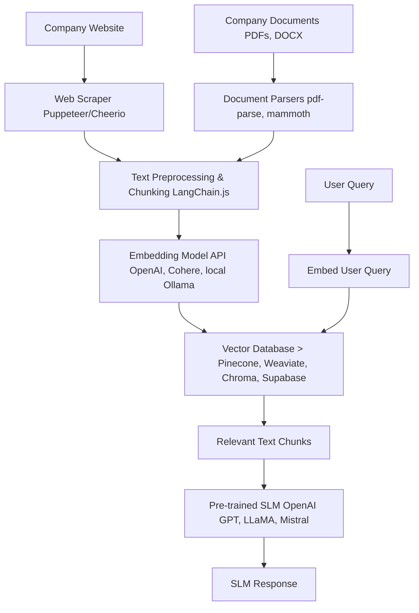

Directly "training" (i.e., fine-tuning) a language model from scratch or performing complex deep learning tasks on GPUs is typically done using Python frameworks like PyTorch or TensorFlow, which have mature ecosystems for this. Node.js is not the primary language for heavy-duty machine learning model training.

However, for a company's website and documents, the most practical and common approach is **Retrieval Augmented Generation (RAG)**, which effectively teaches an existing Small Language Model (SLM) about your company's specific information *without retraining the model itself*. This is highly feasible with Node.js.

### What is RAG and why is it the best approach here?

RAG involves:
1.  **Ingesting and processing your data:** Scraping your website, parsing documents, and breaking them into smaller chunks.
2.  **Generating embeddings:** Converting these text chunks into numerical representations (vectors) using an embedding model.
3.  **Storing embeddings:** Placing these vectors into a specialized database called a vector database.
4.  **Retrieval:** When a user asks a question, their query is also converted into an embedding. This embedding is used to search the vector database for the most relevant text chunks.
5.  **Augmentation:** The retrieved relevant chunks are then fed as context into the prompt of a pre-trained SLM (like GPT-3.5, LLaMA 2, Mistral, etc.).
6.  **Generation:** The SLM uses this context to generate an informed answer.

**Why RAG is ideal for your use case:**

*   **No Model Retraining Needed:** You don't need to fine-tune or re-train a large model, which saves immense computational resources, time, and complexity.
*   **Real-time Updates:** When your website or documents change, you just re-process and update your vector database, no SLM "retraining" necessary.
*   **Node.js Friendly:** Node.js excels at web scraping, file processing, making API calls (to embedding models and SLMs), and interacting with databases.

### High-Level Architecture for RAG with Node.js



### Step-by-Step Implementation with Node.js

We'll primarily use `LangChain.js` as it provides excellent abstractions for RAG components.

#### Prerequisites:

1.  **Node.js and npm installed.**
2.  **API Keys:**
    *   An API key for an embedding model (e.g., OpenAI API key).
    *   An API key for your chosen SLM (e.g., OpenAI API key for GPT-3.5, or a local setup like Ollama).
    *   A Vector Database API key/setup (e.g., Pinecone API key, or set up ChromaDB locally).

#### Install Necessary Packages:

```bash
npm init -y
npm install puppeteer cheerio pdf-parse @langchain/core @langchain/community @langchain/openai @pinecone-database/pinecone dotenv
# For local LLMs/embeddings with Ollama:
# npm install @langchain/ollama
```

#### 1. Data Acquisition & Preprocessing

**a. Web Scraping (e.g., using Puppeteer and Cheerio)**

```javascript
// scrapeWebsite.js
const puppeteer = require('puppeteer');
const cheerio = require('cheerio');
const fs = require('fs');

async function scrapeWebsite(url) {
    const browser = await puppeteer.launch();
    const page = await browser.newPage();
    await page.goto(url, { waitUntil: 'networkidle2' });

    const htmlContent = await page.content();
    const $ = cheerio.load(htmlContent);

    // Extract relevant text from common elements (adjust selectors as needed)
    const textContent = $('p, h1, h2, h3, li, a').map((i, el) => $(el).text()).get().join('\n');

    await browser.close();
    return textContent;
}

// Example usage:
// (async () => {
//     const websiteText = await scrapeWebsite('https://www.example.com/about-us');
//     fs.writeFileSync('company_website_content.txt', websiteText);
//     console.log('Website content scraped and saved.');
// })();
```

**b. Document Parsing (e.g., PDF files)**

```javascript
// parseDocuments.js
const fs = require('fs');
const pdf = require('pdf-parse');

async function parsePdf(filePath) {
    const dataBuffer = fs.readFileSync(filePath);
    const data = await pdf(dataBuffer);
    return data.text;
}

// Example usage:
// (async () => {
//     const pdfText = await parsePdf('./company_report.pdf');
//     fs.writeFileSync('company_document_content.txt', pdfText);
//     console.log('PDF content parsed and saved.');
// })();
```

*   **For other document types (DOCX, PPTX):** You'd need specific libraries. `mammoth` for `.docx`, or consider converting to PDF first.

#### 2. Data Chunking

Once you have raw text from websites and documents, you need to break it into smaller, manageable chunks suitable for embedding. `RecursiveCharacterTextSplitter` from LangChain.js is excellent for this.

```javascript
// indexData.js
require('dotenv').config(); // Load environment variables
const fs = require('fs');
const { RecursiveCharacterTextSplitter } = require('langchain/text_splitter');
const { OpenAIEmbeddings } = require('@langchain/openai'); // Or use @langchain/ollama for local
const { Pinecone } = require('@pinecone-database/pinecone'); // Or your chosen vector DB

// --- Assuming you have scraped/parsed text in a file ---
// For demonstration, let's create a dummy combined text file
const combinedText = `
    Welcome to ExampleCorp! We are a leading innovator in sustainable energy solutions.
    Founded in 2005, our mission is to provide affordable, clean energy globally.
    Our flagship product, the EcoGen 5000, converts solar energy with 95% efficiency.
    We also offer consulting services for businesses looking to reduce their carbon footprint.
    Our head office is located in San Francisco, CA.
    Contact us at info@examplecorp.com or call (123) 456-7890.
    Latest financial report shows 20% growth in Q3 2023.
    New initiatives include Project GreenThumb, focusing on community solar farms.
`;
fs.writeFileSync('company_data.txt', combinedText);
// --------------------------------------------------------

async function indexCompanyData() {
    const rawText = fs.readFileSync('company_data.txt', 'utf-8');

    // 1. Initialize Text Splitter
    const splitter = new RecursiveCharacterTextSplitter({
        chunkSize: 1000,     // Max characters per chunk
        chunkOverlap: 200,   // Overlap to maintain context between chunks
    });

    const documents = await splitter.createDocuments([rawText]);
    console.log(`Split text into ${documents.length} chunks.`);

    // 2. Initialize Embeddings Model (using OpenAI here, but can be Ollama/etc.)
    // Make sure OPENAI_API_KEY is set in your .env file
    const embeddings = new OpenAIEmbeddings();
    // For Ollama (ensure Ollama server is running with an embedding model like 'nomic-embed-text'):
    // const embeddings = new OllamaEmbeddings({ model: "nomic-embed-text" });

    // 3. Initialize Vector Database (using Pinecone here)
    // Make sure PINECONE_API_KEY, PINECONE_ENVIRONMENT, PINECONE_INDEX are set in .env
    const pinecone = new Pinecone({
        apiKey: process.env.PINECONE_API_KEY,
        environment: process.env.PINECONE_ENVIRONMENT,
    });
    const index = pinecone.Index(process.env.PINECONE_INDEX); // Your Pinecone index name

    // 4. Generate Embeddings and Upsert to Vector DB
    console.log('Generating embeddings and upserting to Pinecone...');
    // LangChain.js provides helpers for this
    await index.upsert(
        await Promise.all(
            documents.map(async (doc) => ({
                id: Math.random().toString(36).substring(7), // Unique ID for each chunk
                values: await embeddings.embedQuery(doc.pageContent),
                metadata: { text: doc.pageContent }, // Store original text in metadata
            }))
        )
    );
    // Note: LangChain.js has more direct integration like PineconeStore.fromDocuments()
    // but the above shows the manual steps for clarity.

    console.log('Company data indexed successfully in Pinecone!');
}

// Call the indexing function
// (async () => {
//     await indexCompanyData();
// })();
```

**.env file example:**

```
OPENAI_API_KEY=your_openai_api_key_here
PINECONE_API_KEY=your_pinecone_api_key_here
PINECONE_ENVIRONMENT=your_pinecone_environment_here
PINECONE_INDEX=your_pinecone_index_name_here
```

#### 3. Querying and RAG Chain

Now, let's create a function that takes a user query, retrieves relevant context, and uses an SLM to answer.

```javascript
// querySlm.js
require('dotenv').config();
const { OpenAIEmbeddings, ChatOpenAI } = require('@langchain/openai'); // Or @langchain/ollama
const { Pinecone } = require('@pinecone-database/pinecone');
const { RetrievalQAChain } = require('langchain/chains');
const { ChatPromptTemplate } = require('@langchain/core/prompts');

async function queryCompanySlm(query) {
    // 1. Initialize Embeddings Model
    const embeddings = new OpenAIEmbeddings();
    // For Ollama:
    // const embeddings = new OllamaEmbeddings({ model: "nomic-embed-text" });

    // 2. Initialize Vector Database (Pinecone)
    const pinecone = new Pinecone({
        apiKey: process.env.PINECONE_API_KEY,
        environment: process.env.PINECONE_ENVIRONMENT,
    });
    const pineconeIndex = pinecone.Index(process.env.PINECONE_INDEX);

    // Create a retriever from the Pinecone index
    // This will search the index for relevant chunks
    const retriever = {
        getRelevantDocuments: async (question) => {
            const queryVector = await embeddings.embedQuery(question);
            const queryResults = await pineconeIndex.query({
                vector: queryVector,
                topK: 5, // Retrieve top 5 most similar chunks
                includeMetadata: true, // Make sure to get the actual text back
            });
            return queryResults.matches.map(match => ({ pageContent: match.metadata.text }));
        },
    };


    // 3. Initialize SLM (e.g., OpenAI GPT-3.5-turbo)
    // Make sure OPENAI_API_KEY is set in .env
    const llm = new ChatOpenAI({
        modelName: "gpt-3.5-turbo",
        temperature: 0.7, // Creativity level
    });
    // For Ollama (ensure Ollama server is running with a model like 'llama2'):
    // const llm = new ChatOllama({ model: "llama2", temperature: 0.7 });

    // 4. Define the prompt template for the SLM
    const promptTemplate = ChatPromptTemplate.fromMessages([
        ["system", "You are a helpful AI assistant for ExampleCorp. Use the following context to answer the user's question. If you don't know the answer, just say that you don't have enough information."],
        ["human", "Context: {context}\nQuestion: {question}"],
    ]);


    // 5. Create a RAG Chain
    const ragChain = RetrievalQAChain.fromLLM(llm, retriever, {
        prompt: promptTemplate,
        returnSourceDocuments: true, // Optionally return the source chunks
    });

    console.log(`Querying SLM with: "${query}"`);
    const result = await ragChain.call({ query: query });

    console.log("\nSLM Response:");
    console.log(result.text);

    if (result.sourceDocuments && result.sourceDocuments.length > 0) {
        console.log("\nSource Documents Used:");
        result.sourceDocuments.forEach((doc, i) => {
            console.log(`Chunk ${i + 1}: ${doc.pageContent.substring(0, 150)}...`);
        });
    }
}

// Example usage:
(async () => {
    // First, run the indexData.js script once to populate your vector DB
    // await indexCompanyData(); // Uncomment if you want to run indexing before query

    await queryCompanySlm("What services does ExampleCorp offer?");
    await queryCompanySlm("Where is ExampleCorp located?");
    await queryCompanySlm("What is the EcoGen 5000?");
    await queryCompanySlm("What is the weather like in New York?"); // Should say it doesn't know
})();
```

### Considerations and Limitations

1.  **"Small SLM" Choice:**
    *   **Cloud-based (e.g., OpenAI GPT-3.5-turbo):** Easiest to use, powerful, but involves API costs and sending data externally.
    *   **Local (e.g., LLaMA 2, Mistral via Ollama/Llama.cpp):** More complex to set up (requires running a local server), uses your machine's resources (CPU/GPU), but is free after setup and keeps data local. For a truly "small" SLM, models like `llama2:7b` or `mistral:7b` via Ollama are good candidates.
    *   Node.js itself won't directly run these models for inference, but it can easily interact with local `ollama` or `llama.cpp` servers.

2.  **Data Quality:** The quality of your scraped website content and parsed documents directly impacts the SLM's answers. Clean, well-structured data is key.

3.  **Scalability:**
    *   **Web Scraping:** Be mindful of rate limits and terms of service. For large sites, distribute scraping, use proxies.
    *   **Vector Database:** Choose a vector database that scales with your data size (Pinecone, Weaviate, Chroma, Qdrant are good options). For truly small datasets, in-memory options might work but aren't persistent.
    *   **LLM Inference:** Cloud APIs scale automatically. Local LLMs are limited by your server's resources.

4.  **Cost:** OpenAI (and other cloud LLM providers) charge per token. Embedding generation also has a cost. Factor this into your budget.

5.  **Security & Privacy:** If your company documents contain sensitive information, ensure your vector database and LLM provider comply with your data privacy requirements. Using local LLMs/embeddings can help keep data on-premise.

6.  **"Training" vs. "RAG":** Remember, with RAG, the base SLM isn't fundamentally "learning" new facts or changing its weights based on your company data. It's simply given relevant context at inference time. If you truly need the model's internal knowledge to be updated (e.g., to adopt a specific brand tone, or learn very nuanced domain-specific reasoning), then true fine-tuning would be required, which is typically *not* done in Node.js.

### Conclusion

Node.js is an excellent choice for building the entire RAG pipeline for your company's website and documents, encompassing data acquisition, preprocessing, interaction with embedding models, vector databases, and SLMs. This approach provides a powerful and flexible way to make your company's knowledge accessible via an AI, without the prohibitive cost and complexity of direct SLM fine-tuning.
