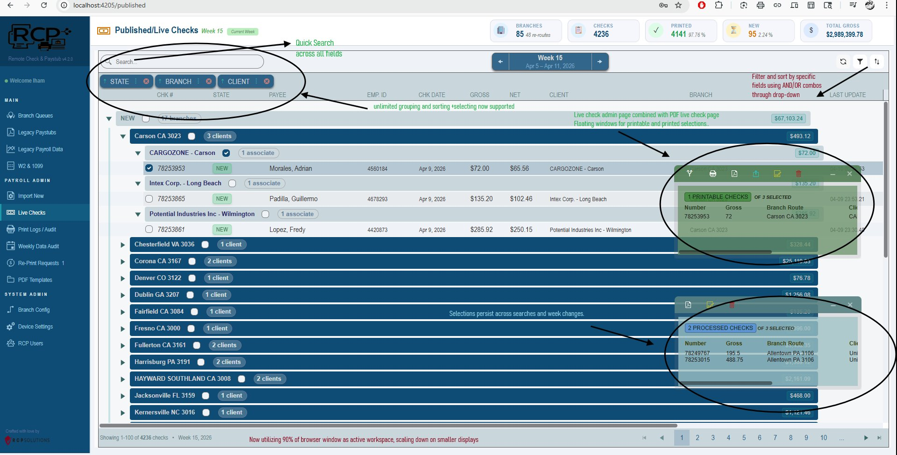
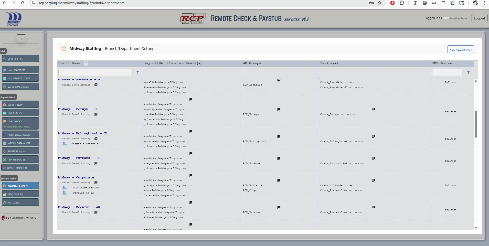
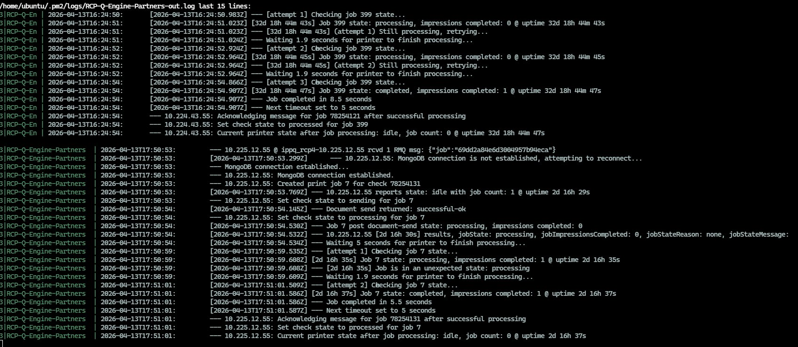
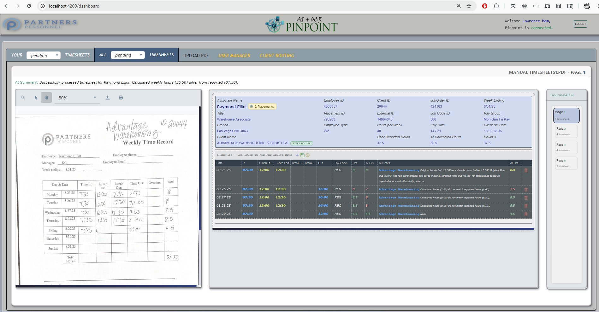
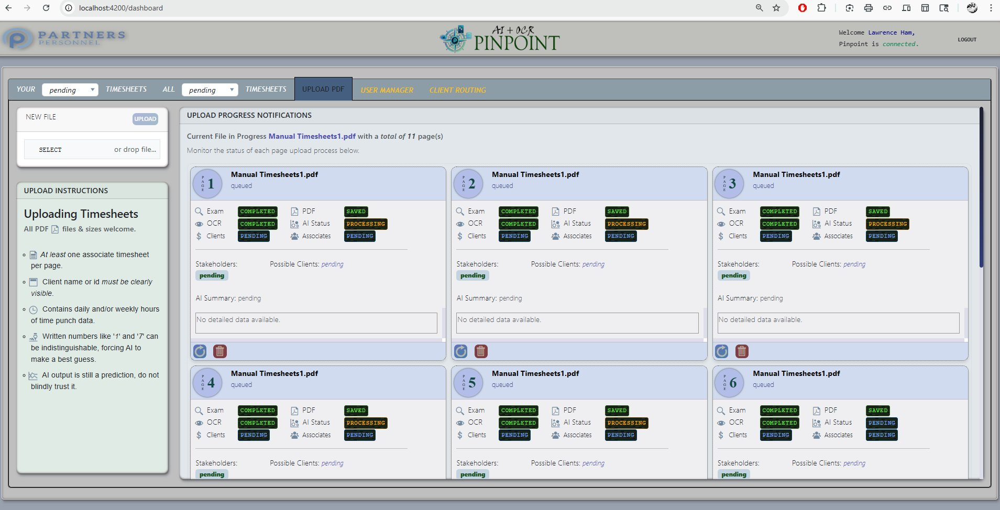
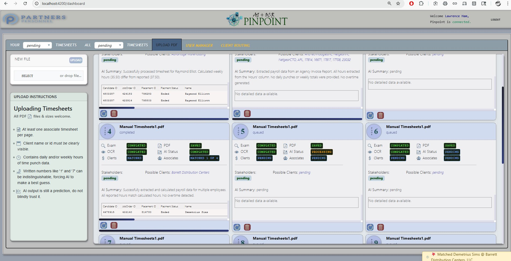
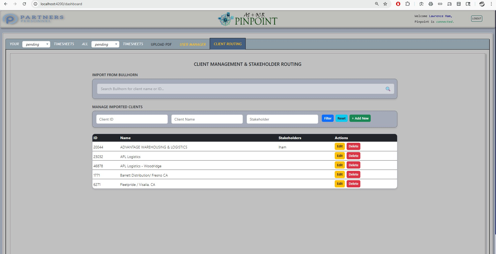

# Lawrence Ham
### Full-Stack Developer · Albuquerque, NM · RCP Solutions

---

> *Building payroll & workforce automation software that processes millions of dollars weekly.*

I design and develop full-stack enterprise applications for staffing and payroll operations — from real-time check management dashboards to AI-powered timesheet processing systems. My work sits at the intersection of complex business logic, performance-critical backends, and intuitive operator interfaces.

**Core Stack**

| Frontend | Backend | Data | Infrastructure |
|---|---|---|---|
| Angular 21 | Node.js / Fastify | MongoDB | Linux / WSL |
| TypeScript | Socket.io | MS-SQL | SD-WAN / VeloCloud |
| Kendo UI | RabbitMQ / PM2 | PDF Generation | AI / OCR Integration |

---
---

## Project 01 — Remote Check & Paystub
`RCP Solutions` · *Enterprise payroll distribution platform · v4.2*

A full-stack payroll management platform used by staffing agencies nationwide to print, distribute, and audit physical checks and paystubs remotely. Handles thousands of checks per week across 85+ branch locations, with real-time status tracking, PDF template management, and multi-level grouping and filtering.

*Live Checks dashboard — Week 15, 4,236 checks across 85 branches totalling $2.98M*

---

*PDF Template Overlay Editor — pixel-precise field mapping*

---

*Branch/Department configuration — multi-client, multi-device routing*

---

*RCP-Q-Engine — Linux PM2 process log showing RMQ message ingestion, MongoDB reconnection, printer job lifecycle, and impression confirmation across multiple branch devices*

---

### Features

**🟥 Real-time Operations**
Live check status updates across all branches with floating selection windows and persistent cross-session selections.

**🟥 PDF Template Engine**
Visual overlay editor for mapping dynamic payroll data fields onto existing PDF check templates with pixel-level precision.

**🟥 Multi-tenant Architecture**
Supports dozens of staffing clients simultaneously, each with isolated branch configs, device assignments, and AD group routing.

**🟥 Queue Engine (Linux)**
Node.js PM2 worker processes RabbitMQ messages, manages printer job state machines, handles MongoDB reconnection, and confirms impressions per device — running 32+ days continuous uptime.

### Stack
`Angular 21` `Node.js` `MongoDB` `Socket.io` `RabbitMQ` `PM2` `PDF Rendering` `Kendo UI` `TypeScript` `Linux`

---
---

## Project 02 — Pinpoint AI + OCR
`Partners Personnel` · *Intelligent timesheet processing system*

An AI-powered document processing platform that ingests handwritten and digital timesheets via PDF upload, runs OCR extraction, applies Claude AI for intelligent data interpretation, matches employees to placements in Bullhorn ATS, and routes completed records to stakeholders — replacing a fully manual data entry workflow.

*Timesheet detail — side-by-side PDF viewer with AI-extracted punch data and discrepancy notes*

---

*Batch upload progress — real-time per-page pipeline status (OCR → AI → Match)*

---

*Processing results — AI summaries, matched placements, and extracted punch tables*

---

*Client Management & Stakeholder Routing — Bullhorn ATS integration for client/placement lookup*

---

### Features

**🟩 AI Document Understanding**
Claude AI interprets handwritten timesheets, flags discrepancies between reported and calculated hours, and generates human-readable summaries.

**🟩 OCR + ATS Matching**
Tesseract OCR extracts raw data; matched against live Bullhorn placement records to identify the correct employee and job order automatically.

**🟩 Pipeline Observability**
Per-page real-time status dashboard showing each stage — Exam, OCR, PDF save, AI processing, client match, and associate identification.

### Stack
`Angular` `Node.js` `Claude AI API` `Tesseract OCR` `Bullhorn ATS` `MongoDB` `Socket.io` `TypeScript`

---

*© 2026 Lawrence Ham · RCP Solutions LLC · Albuquerque, NM*
