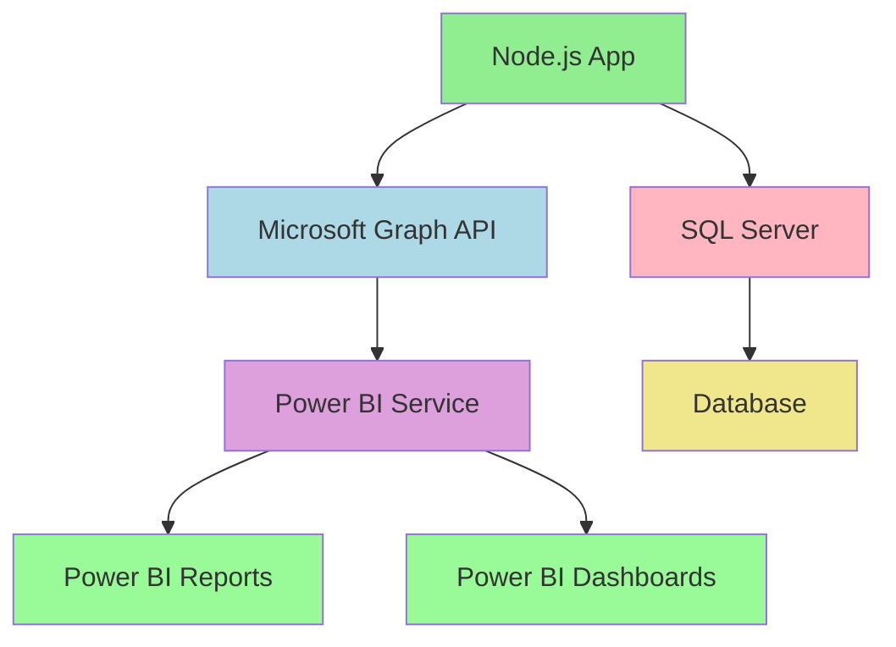
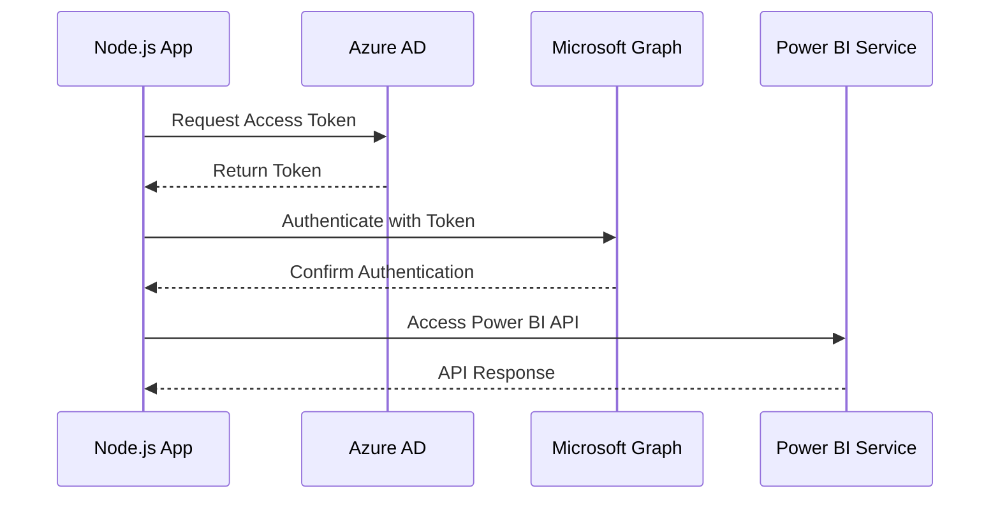
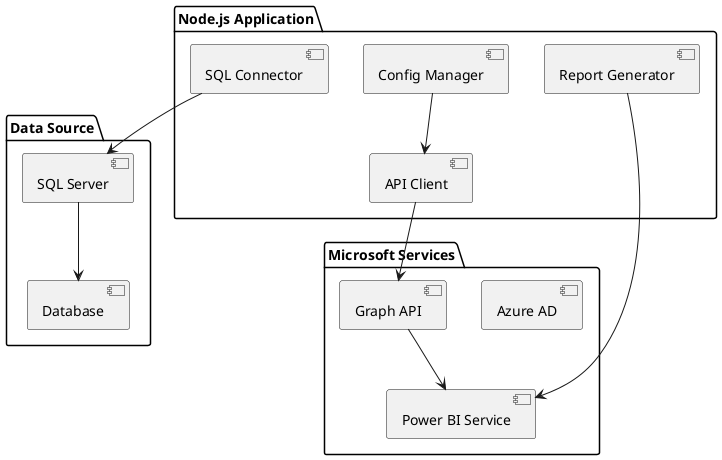
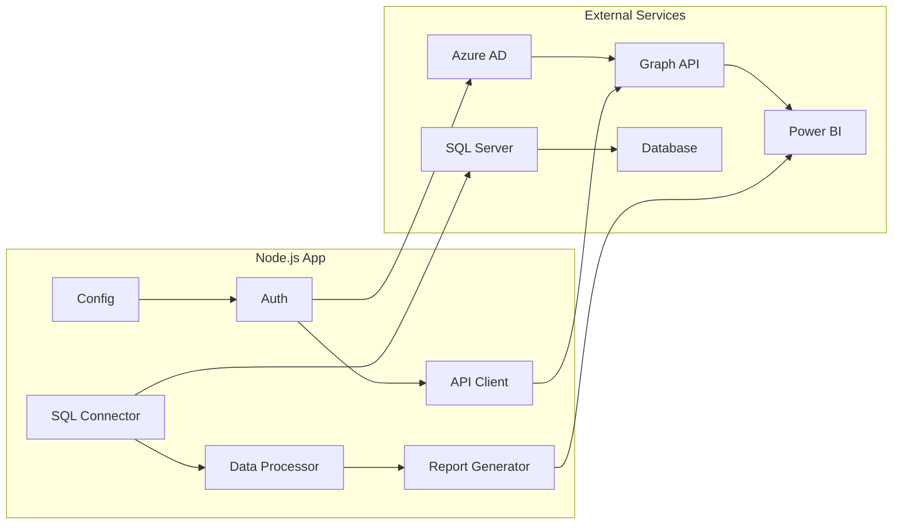
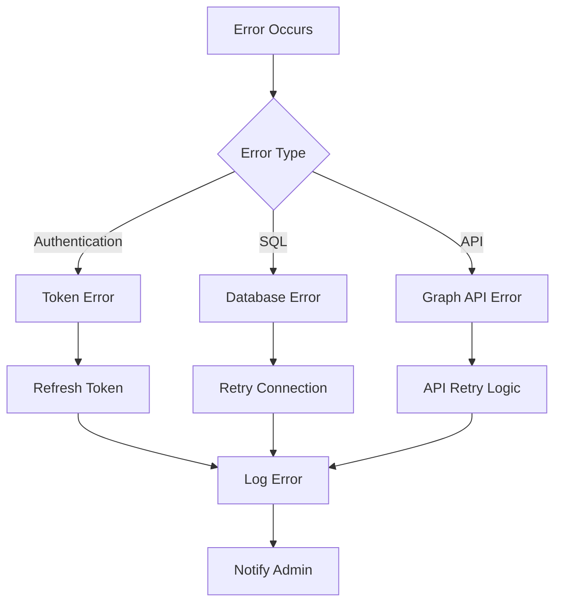
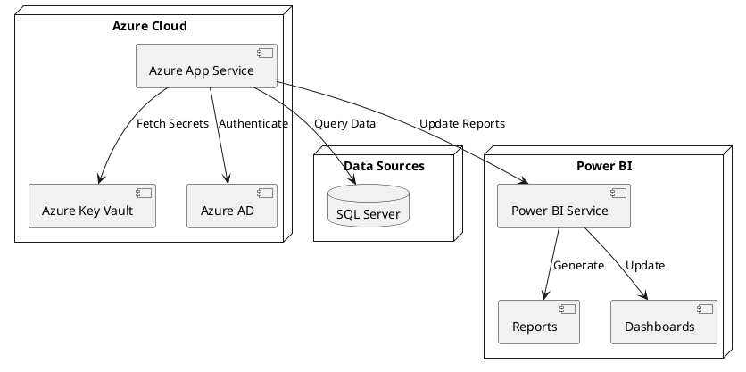
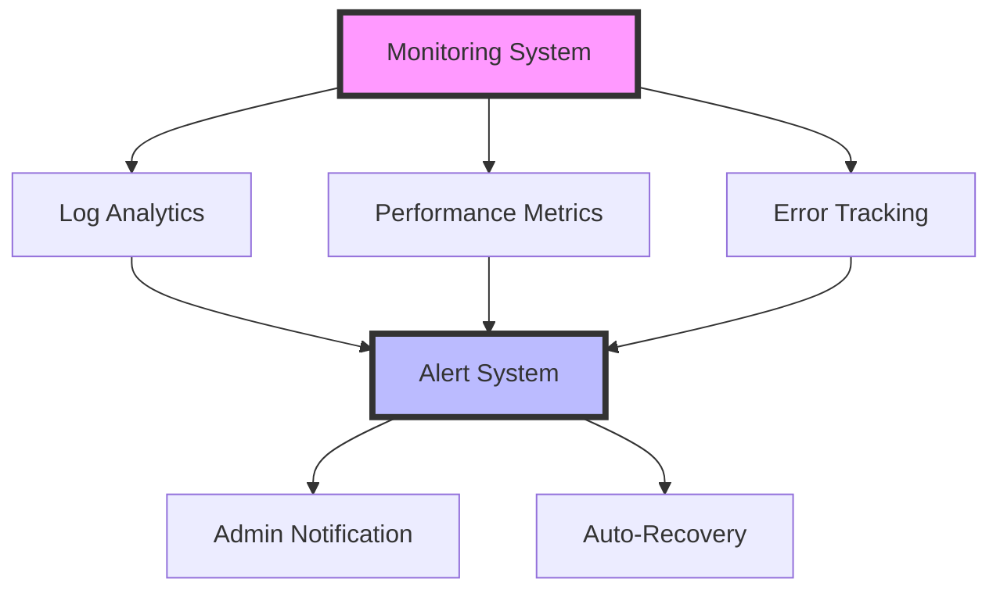

# Partner's Personnel: Project MS-SQL -> PowerBi -> RCP v4

## Overview
Partners Personnel: This document is a rough draft demonstrating the steps and softeware necessary to connect Partners' MS-SQL Logship to MS PowerBi using Azure and Microsoft Graph API. This solution enables automated data refresh and report generation based on client needs

## Architecture Overview



## Authentication Flow



## System Components



## Implementation Steps

### 1. Project Setup

```bash
# Install required dependencies
npm install @microsoft/microsoft-graph-client mssql @azure/identity dotenv
```

### 2. Environment Configuration

Create a `.env` file:

```env
AZURE_CLIENT_ID=your_client_id
AZURE_CLIENT_SECRET=your_client_secret
AZURE_TENANT_ID=your_tenant_id
SQL_SERVER=your_server
SQL_DATABASE=your_database
SQL_USER=your_username
SQL_PASSWORD=your_password
```

### 3. Database Connection

```javascript

const config = {
    user: process.env.SQL_USER,
    password: process.env.SQL_PASSWORD,
    server: process.env.SQL_SERVER,
    database: process.env.SQL_DATABASE,
    options: {
        encrypt: true
    }
};
```

### 4. Microsoft Graph Authentication

```javascript

const credential = new ClientSecretCredential(
    process.env.AZURE_TENANT_ID,
    process.env.AZURE_CLIENT_ID,
    process.env.AZURE_CLIENT_SECRET
);

const client = Client.init({
    authProvider: async (done) => {
        try {
            const token = await credential.getToken(['https://graph.microsoft.com/.default']);
            done(null, token.token);
        } catch (err) {
            done(err, null);
        }
    }
});

module.exports = { client };
```

## Data Flow Diagram



## Error Handling



## Best Practices

1. Security
   - Store credentials securely
   - Use managed identities when possible
   - Implement proper error handling
   - Regular token rotation

2. Performance
   - Implement connection pooling
   - Cache frequently used data
   - Use incremental refresh
   - Optimize SQL queries

3. Monitoring
   - Log all operations
   - Track API usage
   - Monitor refresh times
   - Set up alerts


## Deployment Architecture



## Monitoring and Maintenance



document prompted and slightly edited by lham 05/02/2025
