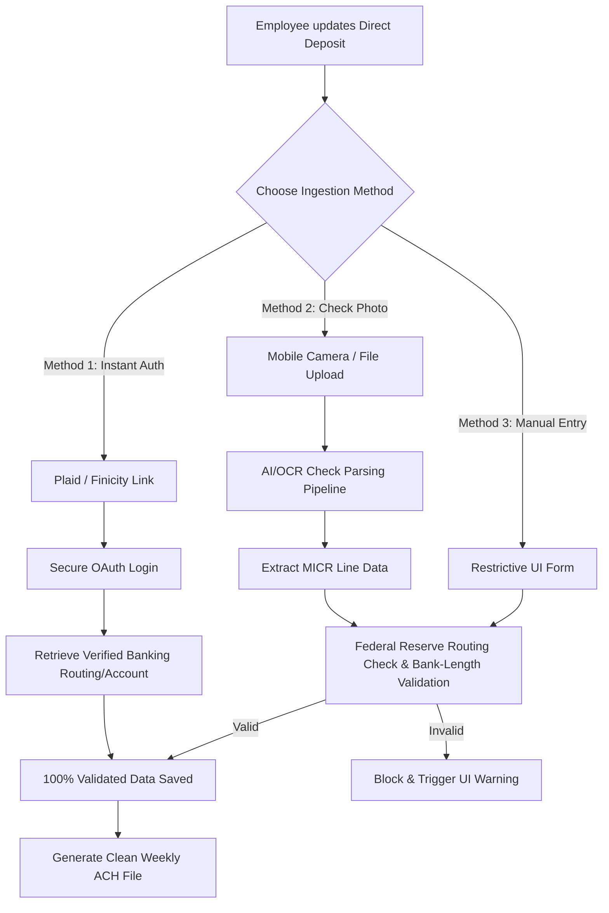

```markdown
# 🏦 Minimizing Failed ACH Direct Deposits: Technical Strategy & Architecture

With **15,000 direct deposits processed weekly**, even a nominal **1% error rate** on manual entry results in **150 failures per week**. At a penalty of **$35 per failed transfer**, this operational vulnerability costs your client **$5,250 weekly ($273,000 annually)** in NSF/bounce fees alone, alongside significant administrative overhead.

Because employees can update their account data on-demand within the payroll application, resolving this issue requires a robust, multi-tiered approach combining open banking protocols, programmatic input validation, optical recognition systems, and restrictive UI guardrails.

---

## 🏗️ Multi-Layered Validation Architecture

To drive failed transactions down to near-zero, a defensive engineering strategy should be deployed across four sequential boundaries:



---

## 🛠️ Implementation Strategy

### 1. Instant Account Authentication (The Gold Standard)

The most definitive method to eliminate human entry error is to replace manual typing with an Open Banking API link, such as **Plaid** or **Finicity**.

* **The Workflow:** The employee selects their banking institution via a secure OAuth interface natively inside your payroll app, authenticates using their bank credentials, and selects the desired account.
* **The Benefit:** The API securely hands off verified, highly accurate routing and account numbers directly to your backend databases. No manual typing means zero typos and complete elimination of bounce fees for supported institutions.

### 2. Optical Document Ingestion: Mobile Check Capture (High Engagement Fallback)

For employees using smaller localized institutions or those uncomfortable linking bank credentials, offering an **AI-powered check photo upload** provides an incredibly smooth, error-free alternative.

* **The Workflow:** The employee uses their mobile camera to snap a photo of a voided check.
* **The Technology:** The backend routes the image through an specialized document OCR engine (such as *Google Cloud Document AI* or an embedded *MICR line reader* tool). It instantly isolates the specialized Magnetic Ink Character Recognition (MICR) fonts at the bottom of the check to separate the routing number from the account string.
* **The Benefit:** It mirrors the familiar user experience of remote check deposit used by retail banking apps, converting a clumsy 20-digit manual typing task into a 2-second capture process that eliminates transcription typos.

### 3. Real-Time Routing Verification (The Manual Baseline)

For purely manual inputs, you must validate routing numbers instantly via an API matching the **Federal Reserve E-Payments Routing Directory**.

* **The Workflow:** As soon as the employee completes the 9-digit routing field, an asynchronous API call checks the number's validity.
* **Visual Confirmation:** Upon verification, dynamically render the associated financial institution's name on screen (e.g., *“Valid: JPMorgan Chase Bank”*). If an entry error was made but still formed a valid routing string, seeing the incorrect bank name alerts the user before submission.

### 4. Bank-Specific Account Constraints & Checksums

Standard bank accounts range broadly from 4 to 17 digits, making basic text input masks insufficient. However, major banking entities stick to highly precise, predictable structure rules.

* **Length Validation Matrix:** Using banking metadata services (like *ValidiFi* or *Giact*), you can cross-reference the verified routing number to enforce specific length parameters for the account field. For example, if the routing number maps to Chase, the account field should strictly enforce a length requirement of 9 or 11 digits.
* **Mathematical Check-Digits:** Many routing sequences and enterprise account ranges rely on basic mathematical checksum algorithms (such as Modulus 10 or Modulus 11). Run these algorithmic checks on the client-side to catch sequential transposition typos instantly.

### 5. Behavioral UI/UX Guardrails (Low Cost, High Immediate Yield)

Simple adjustments to your data entry interface can drastically intercept low-hanging user mistakes:

* **Explicitly Block Copy/Paste:** Disable clipboard operations on the "Confirm Account Number" input field. Forcing the user to manually type the sequence a second time disrupts repetitive mechanical muscle-memory errors.
* **Concealed Visual Masking:** Mask the primary account number field (`••••••5678`) once focus shifts to the confirmation input. If the confirmation field is clear, users cannot mirror a typo they visibly see in the first box.
* **Graphical Check Diagrams:** Embed a clear, interactive visual diagram of a standard check layout directly adjacent to the input forms. Many direct-deposit mistakes stem from users misidentifying where the routing number ends and where the unique account string begins.

---

## 📈 Impact Assessment & Next Steps

1. **Phase 1 (Immediate - 1 to 2 Weeks):** Block copy/paste functionality in the UI, apply input masking, and spin up an internal cache or API hook against the Federal Reserve Routing Directory. This baseline script will mitigate an estimated **60%** of low-hanging entry typos.
2. **Phase 2 (Mid-Term - 3 to 5 Weeks):** Roll out the open-banking **Plaid Link** client integration and introduce the **Mobile OCR Check-Scan tool**. Providing these modern digital ingestion workflows shifts the application away from human manual typing dependencies, mitigating the client's $35 recurring failure overhead to virtually zero.

```

```
