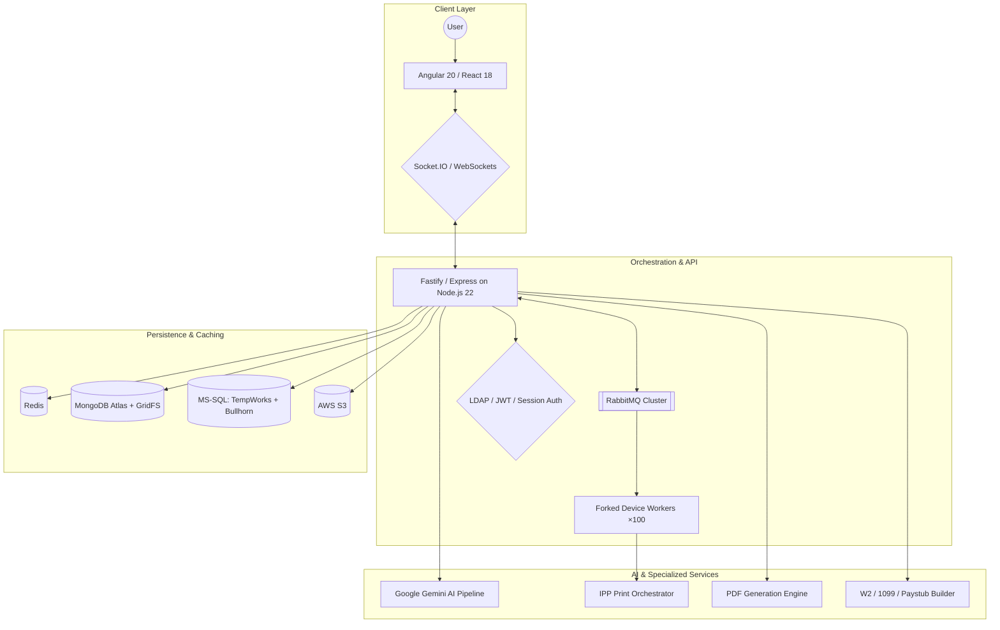

# Lawrence Ham III
**Senior Full-Stack Architect & Platform Engineer**

📍 Albuquerque, NM (Remote) | 📞 505.573.xxxx | ✉️ lham@netplug.me | 🌐 [rcpsolutions.net](https://rcpsolutions.net)

---

## 🚀 Professional Summary

Senior Architect with **10+ years** designing high-throughput microservices, real-time distributed systems, and AI-powered automation pipelines. Expert in **Node.js (v22)**, **Angular (v20)**, and **dual-database architectures** (MongoDB + MS-SQL). Proven success architecting multi-tenant SaaS platforms handling **20k+ monthly records** across 30+ organizations, and automating **90%** of enterprise document ingestion via Google Gemini AI and RabbitMQ — reducing manual labor by **~1,200 hours/year**. Deep domain expertise in payroll systems, tax document generation (W2/1099), and enterprise print infrastructure (IPP protocol).

---

## 🏗 System Architecture

---

## 🛠 Technical Ecosystem

| Category | Stack |
| :--- | :--- |
| **Architecture** | Microservices, Event-Driven (RabbitMQ), Multi-Tenancy, Orchestrator/Worker Patterns |
| **Frontend** | Angular 20/12, React 18, Ionic 4, MDB Bootstrap Pro, Tailwind CSS |
| **Backend** | Node.js 22 (Express, Fastify), Python (Flask), C |
| **Real-Time** | Socket.IO, WebSockets (Fastify WS), RabbitMQ pub/sub with confirm channels |
| **Data & AI** | Google Gemini (structured output), MongoDB Atlas, MS-SQL, Redis, GridFS |
| **PDF & Documents** | pdf-lib (W2, 1099, paystub generation), Ghostscript rasterization, Handlebars email templates, Canvas (MICR line generation) |
| **Auth & Security** | LDAP/AD, bcrypt, JWT, AES-256-CBC encryption, Redis sessions, API key auth, Helmet, rate limiting, RBAC |
| **Infrastructure** | Docker, Docker Compose, AWS (S3, EC2, Lambda), CI/CD, child_process forking |
| **Data Engineering** | IRS EFW2 fixed-width parsing (30+ states), 1099-MISC B-Record parsing, XML/CSV/XLSX import pipelines, MongoDB aggregation |
| **Protocols** | IPP (Create-Job, Send-Document, Get-Job-Attributes, Cancel-Job), LDAP bind/search |
| **Tooling** | CLI tools (Commander, Inquirer, Chalk), Nodemailer, ngrok, Ghostscript |

---

## 💼 Professional Experience

### **Senior Full-Stack Architect** | *Esperer Holdings / RCP Solutions LLC*
*Aug 2019 – Present*

#### 🤖 AI-Powered Document Ingestion Architecture

- Engineered a **Google Gemini AI pipeline** achieving **98% extraction accuracy** on handwritten timesheets, paired with a dual-database pattern (MongoDB for documents, MS-SQL for relational candidate matching) enabling sub-second employee-to-timesheet lookups
- Built a progressive fuzzy name-search with **cascading fallback queries** (prefix → contains → hyphenated-name split → first-initial) to maximize match rates against Bullhorn placement records
- Automated ingestion for **500+ contractors** with real-time WebSocket status broadcasting across OCR, AI, and PDF processing stages — reducing manual data entry by **~1,200 hours/year**

#### 💳 Multi-Tenant SaaS Platform (RCP v4)

- Architected a multi-tenant Express.js platform supporting **20k+ monthly records** across **30+ client organizations** with per-tenant theming, feature flags, integration keys, and RBAC
- Built Node.js CLI tools (Commander + Inquirer + Chalk) reducing tenant onboarding from **4 hours to 3 minutes** — interactive wizard for config creation, user provisioning, and integration key management
- Implemented **AES-256-CBC encrypted PDF pipelines** with decrypt-on-demand, presigned S3 uploads, GridFS streaming storage, and branch-scoped publishing with Handlebars email notifications
- Designed hybrid authentication: LDAP/AD bind with group-based permission parsing, Redis-backed session persistence, and bcrypt fallback for non-AD tenants

#### 🖨 Distributed Print Orchestrator (IPPQ Engine)

- Built an **orchestrator/worker architecture** using Node.js `child_process.fork()` to spawn **~100 independent device workers**, each consuming from dedicated RabbitMQ exchanges for per-printer job isolation with **99.9% delivery success rate**
- Implemented the full **IPP protocol lifecycle**: Create-Job → Send-Document → Get-Job-Attributes → Cancel-Job, with adaptive timeout polling, pre-flight device state checks, and automatic state reset on failure
- Optimized print throughput with optional **Ghostscript PDF-to-raster conversion** for incompatible printers, non-blocking I/O for heavy tax document workloads, and webhook callbacks for real-time UI state updates

#### 📄 Tax Document Generation & Compliance

- Developed programmatic **W2 and 1099-MISC PDF generation** using pdf-lib: IRS template loading, 40+ field mappings, font embedding, multi-page overflow for local taxes, watermark overlays, and read-only field locking
- Created a **paystub PDF builder** querying 9+ MS-SQL tables (payroll transactions, accruals, taxes, adjustments, YTD sums) via `Promise.allSettled`, rendering a JSON-driven template onto tri-fold check stock
- Built **IRS EFW2 fixed-width file parsers** for 30+ states, handling format variations including Indiana XML, Pennsylvania CSV, Alabama non-standard fixed-width, and Greenshades multi-sheet Excel imports
- Designed a **state quarterly wage aggregation pipeline** using MongoDB aggregation framework to combine quarterly SUTA/PIT data into annualized RS records for year-end W2 generation

---

## 🧪 Key Projects

| Project | Description |
| :--- | :--- |
| **RCP Timesheets API** | Node.js 22 / Fastify microservice with RabbitMQ, WebSockets, GridFS, and AI-driven OCR processing for real-time timesheet ingestion |
| **RCP Backend v4** | Multi-tenant Express.js platform: payroll, check distribution, W2/1099 retrieval, printer management, LDAP auth, Redis sessions, Socket.IO |
| **IPPQ Engine** | Distributed print queue orchestrator: ~100 forked workers, IPP protocol, AES-256 decryption, Ghostscript rasterization, RabbitMQ |
| **IPPQ Server** | JWT-authenticated API: W2/1099/paystub PDF generation, RabbitMQ job dispatch, IPP device monitoring, dual MS-SQL integration |
| **Tax Import Toolkit** | CLI parsers for IRS EFW2 (30+ states), 1099-MISC, XML W-2s, CSV/XLSX imports, quarterly wage aggregation pipelines |
| **Partners Up W2 Service** | Fastify microservice with API key auth, Helmet, rate limiting for secure W2 retrieval by candidate ID |
| **RCP Communicator** | Angular 12 SPA with JWT auth, route guards, reactive form CRUD, MDB Bootstrap Pro, Socket.IO integration |
| **MICR/Paystub Factory** | Express microservice: Canvas-based MICR line generation, JSON-driven PDF template engine with MS-SQL data binding |

---

## 🎓 Education & Certifications

- **AWS Certified Developer – Associate**
- **Computer Science Coursework** | Central New Mexico Community College (CNM)
