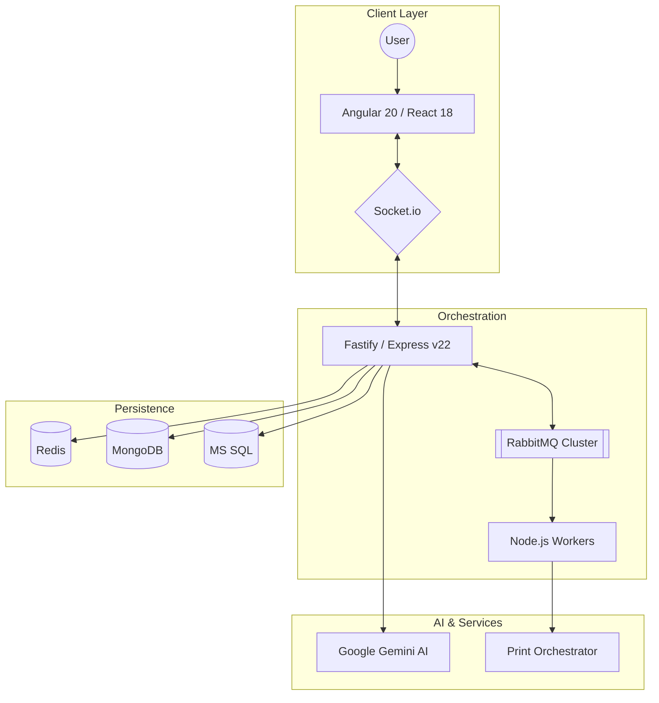

# Lawrence Ham III
**Senior Full Stack Developer | Website Architect**
📍 Albuquerque, NM (Remote) | 📞 505.573.xxxx | ✉️ lham@netplug.me | 🌐 [rcpsolutions.net](https://rcpsolutions.net)

---

## 🚀 Professional Summary
Senior Architect with **10+ years** designing high-throughput microservices and AI-automation. Expert in **Node.js (v22)** and **Angular (v20)**. Proven success architecting multi-tenant SaaS platforms and automating **90%** of enterprise ingestion pipelines via Google Gemini AI and RabbitMQ, reducing manual labor by **70%**.

---

## 🏗 System Architecture

## 🛠 Technical Ecosystem

| Category | Stack |
| :--- | :--- |
| **Architecture** | Microservices, Event-Driven (RabbitMQ), Multi-Tenancy |
| **Frontend** | Angular 20/12, React 18, Ionic 4, Tailwind CSS |
| **Backend** | Node.js (Express/Fastify), Python (Flask), WebSockets |
| **Data & AI** | Google Gemini (Structured), MongoDB, MS SQL, Redis |
| **Infra** | Docker, AWS (S3, EC2, Lambda), CI/CD |

---

## 💼 Professional Experience

### **Senior Full Stack Architect** | *Esperer Holdings*
*Aug 2019 – Present*

#### **🤖 AI-Powered Ingestion Architecture**
* **Design:** Engineered **Google Gemini AI pipeline** (98% accuracy) with **Dual-DB pattern** (Mongo/SQL) for sub-second lookups.
* **Impact:** Automated ingestion for 500+ contractors; reduced manual labor by **~1,200 hours/year**.

#### **💳 Multi-Tenant SaaS Platform (v4)**
* **Scale:** Architected system supporting **20k+ monthly records** across 30+ orgs with zero downtime.
* **Ops:** Built Node.js CLI tools reducing tenant onboarding from **4 hours to 3 minutes**.
* **Security:** Implemented **AES-256-CBC** encrypted PDF pipelines.

#### **🖨 Distributed Print Orchestrator**
* **Reliability:** Built **RabbitMQ-driven cluster** for distributed printing with **99.9% success rate**.
* **Performance:** Optimized non-blocking I/O using Node.js child processes for heavy tax workloads.

---

## 🧪 Key Projects

* **Polyglot Bridge:** Secure synchronization between **React 18** and **Flask** via centralized JWT & Redis.
* **Tax Toolkit:** High-performance Node.js CLI for parsing IRS EFW2 and XML schemas.
* **Hybrid Mobile:** **Ionic/Angular** app utilizing Google Maps SDK for real-time geo-fencing.

---

## 🎓 Education & Certifications

* **AWS Certified Developer – Associate**
* **Computer Science Coursework** | Central New Mexico Community College (CNM)
