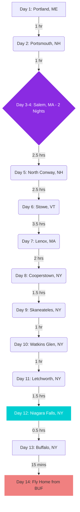

# 🍁 The Ultimate B&B Road Trip: Maine to Niagara
**Route:** Coastal Maine → Salem → White & Green Mountains → Finger Lakes → Niagara Falls  
**Pace:** Fast and fun. One-night stays everywhere (except for two nights in Salem). All drive times are well under your 6–8 hour limit.

---

## 🗺️ The Itinerary

### **Phase 1: Coasts, Lighthouses & Witches**
* **Day 1: Portland, ME** * **The Vibe:** Arrive, grab a lobster roll, and visit **Portland Head Light** to kick off the trip. 
    * **Stay:** *The Pomegranate Inn* (Portland, ME).
* **Day 2: Portsmouth, NH** * **The Vibe:** Drive 1 hour south along the coast. Stop at the **Nubble Lighthouse** in York, ME, on the way. Spend the afternoon exploring Portsmouth's historic downtown and waterfront.
    * **Stay:** *The Inn Downtown* (Portsmouth, NH).
* **Day 3: Salem, MA (Arrival)** * **The Vibe:** Drive 1 hour south to Salem. Settle in and take an atmospheric evening ghost tour. 
    * **Stay:** *The Daniels House* (Salem, MA) – *Night 1 of 2*.
* **Day 4: Salem, MA (Full Day)** * **The Vibe:** Park the car and walk the city. Hit the **House of the Seven Gables**, the **Witch Trials Memorial**, and soak in the September "Haunted Happenings" before the heavy October crowds arrive.
    * **Stay:** *The Daniels House* (Salem, MA) – *Night 2 of 2*.

### **Phase 2: The Ultimate Leaf-Peeping Mountain Loop**
* **Day 5: White Mountains, NH** * **The Vibe:** Drive 2.5 hours north into the mountains. Take the famous **Kancamagus Highway**—the higher elevation here brings out the absolute best early-season autumn leaves.
    * **Stay:** *Cranmore Inn* (North Conway, NH).
* **Day 6: Green Mountains, VT** * **The Vibe:** Drive 2.5 hours west across the state border to Vermont. Stop at local farms for fresh maple syrup and warm cider donuts.
    * **Stay:** *Green Mountain Inn* (Stowe, VT).
* **Day 7: The Berkshires, MA** * **The Vibe:** Drive 3.5 hours south through the mountains to Western Massachusetts. Enjoy the artsy, Gilded Age charm of the area and visit the Norman Rockwell Museum.
    * **Stay:** *Brook Farm Inn* (Lenox, MA).

### **Phase 3: Deep Woods & The Finger Lakes**
* **Day 8: Cooperstown, NY** * **The Vibe:** Drive 2 hours west into New York. Stop by the Baseball Hall of Fame or just enjoy the beautiful, quiet shores of Otsego Lake.
    * **Stay:** *The Landmark Inn* (Cooperstown, NY).
* **Day 9: Skaneateles, NY** * **The Vibe:** Drive 1.5 hours west into the Finger Lakes. Skaneateles is a picturesque lakeside town filled with boutique shopping and wine-tasting rooms.
    * **Stay:** *Sherwood Inn* (Skaneateles, NY).
* **Day 10: Watkins Glen, NY** * **The Vibe:** Drive 1 hour south to Seneca Lake. Hike the **Watkins Glen State Park** gorge trail, which takes you past 19 stunning waterfalls nestled in the autumn woods.
    * **Stay:** *Idlwilde Inn* (Watkins Glen, NY).

### **Phase 4: Canyons, Falls & Flights**
* **Day 11: Letchworth State Park, NY** * **The Vibe:** Drive 1 hour west. Known as the "Grand Canyon of the East," Letchworth offers massive waterfalls and incredible canyon foliage.
    * **Stay:** *Genesee Country Inn* (Mumford/Geneseo area).
* **Day 12: Niagara Falls, NY** * **The Vibe:** Drive 1.5 hours to the main event. Ride the **Maid of the Mist** and get up close to the roaring water at the **Cave of the Winds**.
    * **Stay:** *Butler House Bed & Breakfast* (Niagara Falls, NY).
* **Day 13: Buffalo, NY** * **The Vibe:** Drive 30 minutes to Buffalo. Spend your last day eating authentic Buffalo wings and checking out the historic architecture. Being in Buffalo sets you up perfectly for your morning flight.
    * **Stay:** *The Mansion on Delaware Avenue* (Buffalo, NY).
* **Day 14: Fly Home to ABQ** * **The Vibe:** Drive 15 minutes to **Buffalo Niagara International Airport (BUF)**, drop off your rental car, and catch your flight back to Albuquerque.

---

## 🚗 Travel Time Logic & Route Map

Here is a visual map of your daily drive times. This structure breaks the trip into bite-sized, incredibly manageable chunks, giving you maximum time out of the car.

---

## 🏡 B&B Summary Cheat Sheet
| Stop | Nights | Recommended B&B |
| :--- | :--- | :--- |
| **Portland, ME** | 1 | *The Pomegranate Inn* |
| **Portsmouth, NH** | 1 | *The Inn Downtown* |
| **Salem, MA** | 2 | *The Daniels House* |
| **North Conway, NH** | 1 | *Cranmore Inn* |
| **Stowe, VT** | 1 | *Green Mountain Inn* |
| **Lenox, MA** | 1 | *Brook Farm Inn* |
| **Cooperstown, NY** | 1 | *The Landmark Inn* |
| **Skaneateles, NY** | 1 | *Sherwood Inn* |
| **Watkins Glen, NY**| 1 | *Idlwilde Inn* |
| **Geneseo, NY** | 1 | *Genesee Country Inn* |
| **Niagara Falls, NY**| 1 | *Butler House Bed & Breakfast* |
| **Buffalo, NY** | 1 | *The Mansion on Delaware Avenue* | Route:** Portland, ME → Salem, MA → The Berkshires, MA → Finger Lakes, NY → Niagara Falls, NY  
**Focus:** Early autumn foliage, historic lighthouses, cozy Bed & Breakfasts, and short driving days (under 6 hours).

---
