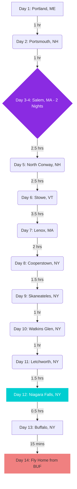
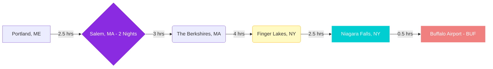

# 🍁 The Ultimate B&B Road Trip: Maine to Niagara
**Route:** Coastal Maine → Salem → White & Green Mountains → Finger Lakes → Niagara Falls  
**Pace:** Fast and fun. One-night stays everywhere (except for two nights in Salem). All drive times are well under your 6–8 hour limit.

---

## 🗺️ The Itinerary

### **Phase 1: Coasts, Lighthouses & Witches**
* **Day 1: Portland, ME** * **The Vibe:** Arrive, grab a lobster roll, and visit **Portland Head Light** to kick off the trip. 
    * **Stay:** *The Pomegranate Inn* (Portland, ME).
* **Day 2: Portsmouth, NH** * **The Vibe:** Drive 1 hour south along the coast. Stop at the **Nubble Lighthouse** in York, ME, on the way. Spend the afternoon exploring Portsmouth's historic downtown and waterfront.
    * **Stay:** *The Inn Downtown* (Portsmouth, NH).
* **Day 3: Salem, MA (Arrival)** * **The Vibe:** Drive 1 hour south to Salem. Settle in and take an atmospheric evening ghost tour. 
    * **Stay:** *The Daniels House* (Salem, MA) – *Night 1 of 2*.
* **Day 4: Salem, MA (Full Day)** * **The Vibe:** Park the car and walk the city. Hit the **House of the Seven Gables**, the **Witch Trials Memorial**, and soak in the September "Haunted Happenings" before the heavy October crowds arrive.
    * **Stay:** *The Daniels House* (Salem, MA) – *Night 2 of 2*.

### **Phase 2: The Ultimate Leaf-Peeping Mountain Loop**
* **Day 5: White Mountains, NH** * **The Vibe:** Drive 2.5 hours north into the mountains. Take the famous **Kancamagus Highway**—the higher elevation here brings out the absolute best early-season autumn leaves.
    * **Stay:** *Cranmore Inn* (North Conway, NH).
* **Day 6: Green Mountains, VT** * **The Vibe:** Drive 2.5 hours west across the state border to Vermont. Stop at local farms for fresh maple syrup and warm cider donuts.
    * **Stay:** *Green Mountain Inn* (Stowe, VT).
* **Day 7: The Berkshires, MA** * **The Vibe:** Drive 3.5 hours south through the mountains to Western Massachusetts. Enjoy the artsy, Gilded Age charm of the area and visit the Norman Rockwell Museum.
    * **Stay:** *Brook Farm Inn* (Lenox, MA).

### **Phase 3: Deep Woods & The Finger Lakes**
* **Day 8: Cooperstown, NY** * **The Vibe:** Drive 2 hours west into New York. Stop by the Baseball Hall of Fame or just enjoy the beautiful, quiet shores of Otsego Lake.
    * **Stay:** *The Landmark Inn* (Cooperstown, NY).
* **Day 9: Skaneateles, NY** * **The Vibe:** Drive 1.5 hours west into the Finger Lakes. Skaneateles is a picturesque lakeside town filled with boutique shopping and wine-tasting rooms.
    * **Stay:** *Sherwood Inn* (Skaneateles, NY).
* **Day 10: Watkins Glen, NY** * **The Vibe:** Drive 1 hour south to Seneca Lake. Hike the **Watkins Glen State Park** gorge trail, which takes you past 19 stunning waterfalls nestled in the autumn woods.
    * **Stay:** *Idlwilde Inn* (Watkins Glen, NY).

### **Phase 4: Canyons, Falls & Flights**
* **Day 11: Letchworth State Park, NY** * **The Vibe:** Drive 1 hour west. Known as the "Grand Canyon of the East," Letchworth offers massive waterfalls and incredible canyon foliage.
    * **Stay:** *Genesee Country Inn* (Mumford/Geneseo area).
* **Day 12: Niagara Falls, NY** * **The Vibe:** Drive 1.5 hours to the main event. Ride the **Maid of the Mist** and get up close to the roaring water at the **Cave of the Winds**.
    * **Stay:** *Butler House Bed & Breakfast* (Niagara Falls, NY).
* **Day 13: Buffalo, NY** * **The Vibe:** Drive 30 minutes to Buffalo. Spend your last day eating authentic Buffalo wings and checking out the historic architecture. Being in Buffalo sets you up perfectly for your morning flight.
    * **Stay:** *The Mansion on Delaware Avenue* (Buffalo, NY).
* **Day 14: Fly Home to ABQ** * **The Vibe:** Drive 15 minutes to **Buffalo Niagara International Airport (BUF)**, drop off your rental car, and catch your flight back to Albuquerque.

---

## 🚗 Travel Time Logic & Route Map

Here is a visual map of your daily drive times. This structure breaks the trip into bite-sized, incredibly manageable chunks, giving you maximum time out of the car.

---

## 🏡 B&B Summary Cheat Sheet
| Stop | Nights | Recommended B&B |
| :--- | :--- | :--- |
| **Portland, ME** | 1 | *The Pomegranate Inn* |
| **Portsmouth, NH** | 1 | *The Inn Downtown* |
| **Salem, MA** | 2 | *The Daniels House* |
| **North Conway, NH** | 1 | *Cranmore Inn* |
| **Stowe, VT** | 1 | *Green Mountain Inn* |
| **Lenox, MA** | 1 | *Brook Farm Inn* |
| **Cooperstown, NY** | 1 | *The Landmark Inn* |
| **Skaneateles, NY** | 1 | *Sherwood Inn* |
| **Watkins Glen, NY**| 1 | *Idlwilde Inn* |
| **Geneseo, NY** | 1 | *Genesee Country Inn* |
| **Niagara Falls, NY**| 1 | *Butler House Bed & Breakfast* |
| **Buffalo, NY** | 1 | *The Mansion on Delaware Avenue* | Route:** Portland, ME → Salem, MA → The Berkshires, MA → Finger Lakes, NY → Niagara Falls, NY  
**Focus:** Early autumn foliage, historic lighthouses, cozy Bed & Breakfasts, and short driving days (under 6 hours).

---

## 🗺️ The Itinerary 

### **Phase 1: Maine Lighthouses & The Coast**
* **Day 1: Portland, Maine (1 Night)**
    * **The Plan:** Arrive in Portland and pick up your rental car. Head straight to **Portland Head Light** in Cape Elizabeth to catch a classic New England lighthouse against the September sky. If time permits, drive 20 minutes south to **Two Lights State Park**.
    * **The Drive:** Airport to lighthouses is under 30 minutes. 
    * **Where to Stay:** *The Pomegranate Inn* (Portland). A vibrant, art-filled B&B in the historic West End.

### **Phase 2: The Witch City**
* **Day 2: Coastal Drive to Salem**
    * **The Plan:** Take the scenic route south along the coast (Route 1A) through Portsmouth, NH, and Newburyport, MA. September is the perfect time for Salem—you get the early fall foliage and "Haunted Happenings" vibes without the massive October crowds.
    * **The Drive:** ~2 to 3 hours (depending on scenic stops).
    * **Where to Stay:** *The Daniels House Inn* or *The Salem Inn*. Check in for a 2-night stay.
* **Day 3: Full Day in Salem, MA**
    * **The Plan:** Park the car and explore on foot. Walk the McIntire Historic District, visit the **House of the Seven Gables**, the **Salem Witch Trials Memorial**, and the **Peabody Essex Museum**.

### **Phase 3: Fall Foliage & Wine Country**
* **Day 4: Into the Berkshires**
    * **The Plan:** Head west into the Berkshire Mountains. Thanks to the higher elevation, the leaves here will be showing their vibrant reds and oranges earlier in the season. Visit the Norman Rockwell Museum in Stockbridge.
    * **The Drive:** ~2.5 to 3 hours via the Mass Pike.
    * **Where to Stay:** *Devonfield Inn* (Lee, MA). A classic English country house B&B. Check in for a 2-night stay.
* **Day 5: Explore the Berkshires**
    * **The Plan:** Drive up Mount Greylock for panoramic views of the changing leaves across three states, or explore the antique shops and local farm stands in Lenox and Great Barrington.
* **Day 6: Central New York & The Finger Lakes**
    * **The Plan:** Cross into New York and drive through the Mohawk Valley to the Finger Lakes region, famous for its deep blue lakes and autumn wine harvests.
    * **The Drive:** ~3.5 to 4 hours.
    * **Where to Stay:** *1795 Acorn Inn* (Canandaigua) or *Bella Rose B&B*. Check in for a 2-night stay.
* **Day 7: Finger Lakes Wine & Waterfalls**
    * **The Plan:** Spend the day wine tasting around Seneca or Cayuga Lake, or visit Watkins Glen State Park to hike through a gorge boasting 19 waterfalls nestled in the autumn woods. 

### **Phase 4: The Grand Finale**
* **Day 8: The Road to Niagara**
    * **The Plan:** Finish your westward trek. Arrive at Niagara Falls and check into your final B&B.
    * **The Drive:** ~2.5 hours.
    * **Where to Stay:** *Butler House Bed & Breakfast* (Niagara Falls, NY). Walkable to the state park. Check in for a 6-night stay to round out the 2 weeks.
* **Days 9–13: Experience Niagara Falls & Surrounds**
    * **The Plan:** Take the massive falls at your own pace. 
        * Take the **Maid of the Mist** boat tour.
        * Get up close to the Bridal Veil Falls at the **Cave of the Winds**.
        * Take a day trip 45 minutes south to **Letchworth State Park** (the "Grand Canyon of the East") for spectacular leaf-peeping.
        * Cross into Canada (bring your passport!) for a day trip to the charming town of **Niagara-on-the-Lake**.
* **Day 14: Fly Home to Albuquerque**
    * **The Plan:** Drive to **Buffalo Niagara International Airport (BUF)**, drop off your rental car, and catch your flight home to ABQ. BUF is a small, easy-to-navigate airport and your absolute best option for flying out of the Niagara region.
    * **The Drive:** ~30 to 40 minutes from the Falls to BUF.

---

## 🚗 Travel Time Logic & Route Map
Every driving leg is kept strictly under 4 hours, giving you a massive buffer well under your 6-to-8-hour limit.

## Fin.

